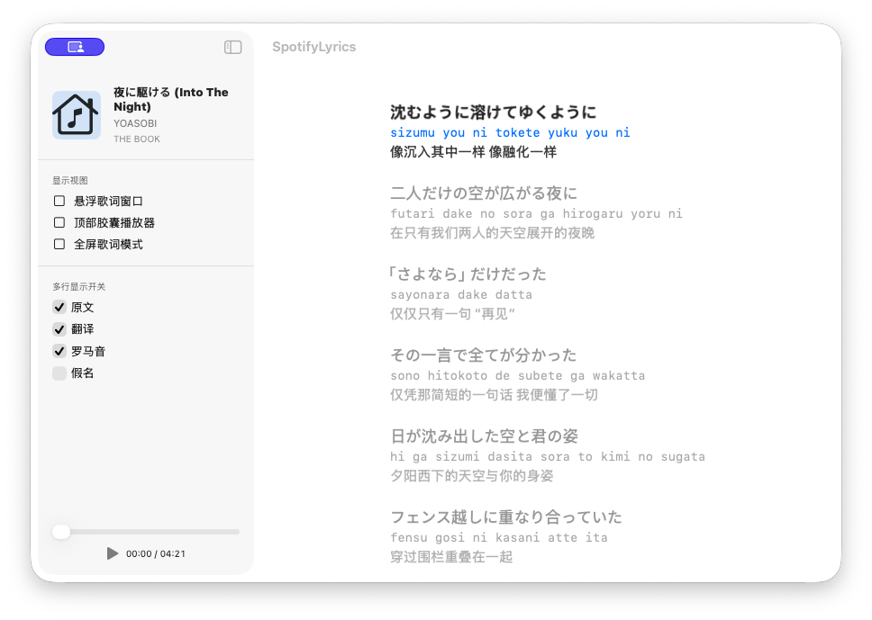
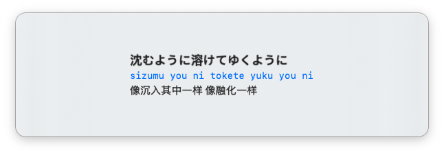
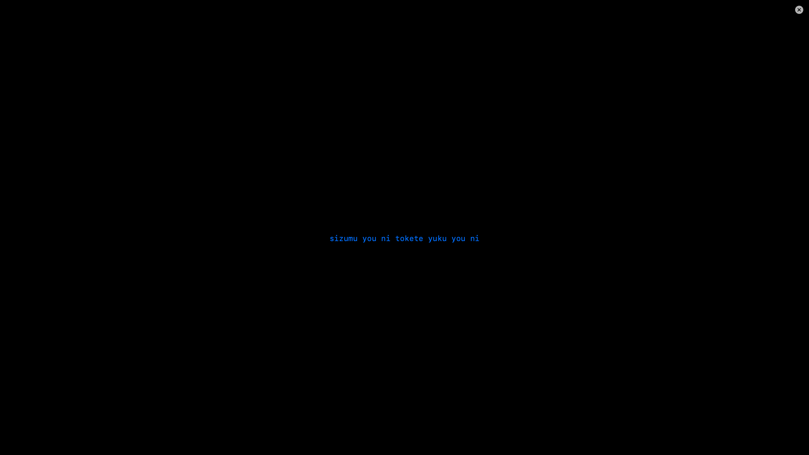

# SpotifyLyrics UI Reference Audit

审计日期：2026-07-26  
工作分支：`ui-reference-audit`  
基线：`e24fbb35ea8247f39d52e3a0772f34c4e8633454`  
范围：黑盒观察、公开资料整理、当前实现差异分析和独立视觉规划。

本轮没有修改 Swift 源码、`SpotifyLyrics.xcodeproj`、任何应用包或参考项目。这里的“当前实现”特指由标准 Xcode 构建产生的：

`/Users/apple/backup/sptifylyrics/DerivedData/Build/Products/Debug/SpotifyLyrics.app`

旧的手工产物 `/Users/apple/backup/sptifylyrics/build/SpotifyLyrics.app` 只作为路径对照，不作为本轮截图或 UI 结论来源。

## 1. 证据规则与资产

### 1.1 取证规则

- `/Applications/Dynamic Lyrics.app` 只做启动、操作、截图和 WindowServer 尺寸观察；没有修改、重签名、Patch、反编译或提取资源。
- `Lyricify-App-main/` 只读取 README、docs、images 和公开说明；没有复制源码、图标、品牌素材或专有图片。
- 无边框辅助窗不以应用自身裁剪截图作为唯一证据。辅助窗使用只读 WindowServer 的窗口 ID、frame、layer，再用 `screencapture -l` 保存截图。
- 观察到的最终帧不等同于动画实现。没有高帧率采样的地方，明确写作“未测得时长”，不臆测动画参数。

### 1.2 本轮资产

当前 Xcode 产物的证据截图：

| 资产 | 状态 | 备注 |
|---|---|---|
| `ui-reference-audit-assets/spotifylyrics-main-xcode.png` | 主歌词窗口 | WindowServer 主窗口截图，约 968×689，包含透明边缘和阴影 |
| `ui-reference-audit-assets/spotifylyrics-floating-xcode.png` | 悬浮歌词 | 由 600×180 窗口捕获，截图含圆角/阴影外扩 |
| `ui-reference-audit-assets/spotifylyrics-capsule-xcode.png` | 胶囊收起态 | 由 380×46 窗口捕获，截图含透明边缘 |
| `ui-reference-audit-assets/spotifylyrics-fullscreen-xcode.png` | 全屏覆盖歌词 | 2560×1440 |

参考应用的观察截图：

| 资产 | 状态 | 证据边界 |
|---|---|---|
| `ui-reference-audit-assets/dynamic-main-initial.png` | 主窗口初始状态 | 绿色/青色封面背景、歌词层级和底部控制 |
| `ui-reference-audit-assets/dynamic-main-paused.png` | 主窗口暂停状态 | 播放按钮和状态变化 |
| `ui-reference-audit-assets/dynamic-fullscreen.png` | 全屏歌词 | 画面截图来自当前显示器，尺寸与 WindowServer 的逻辑帧不同 |
| `ui-reference-audit-assets/dynamic-floating.png` | 辅助浮层对象 | 截图为空白/透明，只能证明该窗口状态存在，不能证明歌词内容可见 |

目录中还保留了先前手工产物观察时生成的同名旧截图；本报告的当前实现结论只引用带 `-xcode` 后缀的四个资产。

## 2. Dynamic Lyrics 黑盒观察

### 2.1 主歌词窗口

启动 `/Applications/Dynamic Lyrics.app` 后，AX 标题为本地化的“灵动歌词”。初始可见歌曲为 `フレグランス` / 茉ひる，进度约 `3:13 / 3:25`。AX 树包含封面、歌名/艺人、喜欢、更多、上一首、播放/暂停、下一首、滚动歌词区、翻译和搜索入口。

WindowServer 初始记录：主窗口约 `1000×650`、layer `0`、frame 约 `48,37,1000×650`。截图中左侧封面和歌曲信息嵌在半透明圆角材质上，主歌词列居中偏右；当前行是亮白大字，下一行和更远的歌词逐级降低透明度并增加模糊，翻译紧贴原文下方。背景取自封面，呈绿色/青色渐变和柔和纹理，而不是纯色填充。

“更多”菜单把歌词延时、歌词模糊、字体大小、左右/居中对齐、分享、报错和纯音乐标记收在上下文入口中。也就是说，主要画布不会长期被设置面板占据。

### 2.2 悬浮歌词和顶部辅助层

启动时 WindowServer 同时看到两个无标题辅助窗口：

- `610×200`、layer `27`
- `600×78`、layer `24`

它们会随显示器和状态改变位置，例如 `600×78` 曾从约 `1289,69` 移到 `534,88`。这说明辅助层使用独立窗口和置顶层级，不能用一个固定坐标或固定屏幕假设来设计。

本轮对其中一个辅助层保存的 `dynamic-floating.png` 是空白/透明画面。报告只记录“窗口对象存在、尺寸和层级已知”，不把它写成“已看到可用的浮动歌词”。胶囊收起/展开的具体内容和动画时长也没有从这次黑盒会话中可靠分离出来，故在比较表中标为“参考方向可用、具体态未完全验证”。

### 2.3 全屏歌词

点击系统全屏入口后，主窗口 WindowServer 帧扩大到 `2560×1440`，layer 仍为 `0`；辅助层仍然存在。屏幕级截图显示黑/灰色的封面模糊背景，左下有专辑/播放信息，中间偏右是歌词堆栈：当前行最亮、相邻行逐级退后。

AX 文本在退出全屏后可能恢复为“标准窗口”，但实际截图和 WindowServer frame 仍可能保持屏幕级布局。因此全屏判断必须同时使用窗口帧和视觉截图，不能只读 AX 标题。

### 2.4 交互和动画结论

- 主窗口、辅助窗和全屏层是分离的窗口对象。
- `Cmd+W` 关闭主窗口后，辅助窗口对象仍可能存在。
- 播放状态可以随外部媒体变化；观察期间歌曲从 `フレグランス` 切换到 `First Love`。
- 本轮没有高帧率计时，不能给出 Dynamic Lyrics 的动画毫秒数；只能确认状态切换不是单纯静态截图。
- 参考应用的 `Info.plist` 为 bundle ID `com.bing.lyrics`、版本 `1.9.9 (169)`、最低 macOS `14.6`、`LSUIElement=true`，并声明若干 URL scheme。读取仅用于识别公开窗口/资源边界，没有复用任何资源。

## 3. Lyricify 公开资料观察

以下均来自仓库内只读副本，不是实现移植：

| 公共资料 | 可参考的视觉/信息架构 | 不采用的部分 |
|---|---|---|
| `Lyricify-App-main/images/readme/func-lyrics-display.png` | 整面动态背景承载大字号歌词；当前行高亮，上下行降低透明度；翻译贴近原文；底部固定歌曲与控制栏 | 不复制截图、配色、图标或布局像素 |
| `images/readme/func-lyrics-dynamic-lyrics-island.png` | 顶部极简胶囊、收起/展开两种信息密度、媒体状态优先 | 不复制胶囊形状、图标和品牌样式 |
| `images/readme/func-lyrics-desktop.png` | 半透明桌面卡片、顶部歌曲条、歌词居中、背景仍可见 | 不把参考卡片当作当前项目素材 |
| `images/readme/func-lyrics-fulscreen.png` | 全屏动态渐变、当前行最大最亮、专辑信息和控制分置角落 | 不复制专有背景或截图 |
| `images/readme/func-lyrics-vertical.png` | 窄画布、底部播放卡片、移动端信息重排 | 当前 macOS 设计先保证窗口/悬浮/全屏三种桌面形态 |
| `docs/Lyricify 4/README.md` | 主界面导航、桌面歌词、全屏、字体和质量/性能开关，设置入口可按场景出现 | i18n 文案不是 UI 源码；不移植 WPF 主题或组件 |
| `docs/Lyricify 4/Lyrics.md` | LRC/QRC/YRC、逐行/逐词、背景声部和时间偏移等产品概念 | 本轮不接 Provider、数据库、AI 或自动排轴 |

公开资料最值得借鉴的是“当前歌词优先、邻行退后、设置按需出现”和“背景材质为歌词服务”，不是某个品牌的具体视觉。

## 4. 当前 SpotifyLyrics（标准 Xcode 产物）实况

### 4.1 产物身份

先退出了同名旧手工进程，避免相同 bundle ID 复用旧窗口。随后通过 Computer Use 启动：

`/Users/apple/backup/sptifylyrics/DerivedData/Build/Products/Debug/SpotifyLyrics.app`

`ps` 实际显示的可执行文件为该 DerivedData 路径下的 `Contents/MacOS/SpotifyLyrics`。主窗口 AX 标题为 `SpotifyLyrics`，歌曲是硬编码的 `夜に駆ける (Into The Night)` / YOASOBI / `THE BOOK`，歌词内容是六行 MockData。

### 4.2 主歌词窗口

WindowServer：`900×621`、layer `0`。左侧约四分之一是常驻 sidebar，包含歌曲信息、三个显示模式按钮、原文/翻译/罗马音/假名开关；右侧是白色歌词画布。底部侧栏内有进度 slider、Play 按钮和 `00:00 / 04:21`。

真实可见差异：

- 它仍然像测试面板，而不是“歌词是主角”的产品画布。
- 侧栏长期占据空间，显示模式和多行开关没有按需收起。
- 没有动态封面背景、取色、模糊或渐变材质。
- 当前原文略大，罗马音为蓝色等宽字，翻译为灰色；相邻行只降低颜色，没有稳定的字号、模糊和透明度阶梯。
- 播放控制集中在左下，和歌词列没有形成统一的底部控制层。

### 4.3 悬浮歌词

WindowServer：`600×180`、layer `3`。截图显示浅色大面积圆角卡片，内部只有当前原文、罗马音和翻译三行；外部为透明黑色。没有相邻歌词、封面、进度或按需出现的播放控制。它能作为独立窗口存在，但视觉上仍是“卡片包住文字”，而不是透明悬浮歌词。

### 4.4 顶部胶囊

WindowServer：`380×46`、layer `25`。可见左侧图标、中间歌曲标题和第二行文字、右侧播放按钮；整体为非常浅的胶囊。它是一个独立的 compact 窗口，但本轮没有观察到单独的展开按钮、展开 AX 树或第二个大尺寸窗口，因此“展开态”必须标记为未验证。当前也没有足够证据声称存在自然的弹性展开动画。

### 4.5 全屏歌词

WindowServer：`2560×1440`、layer `8`。这是覆盖整屏的无边框覆盖窗口，不是 macOS 原生 Space 全屏。截图中背景是纯黑色，只显示一行蓝色罗马音，右上有关闭圆钮；没有看到当前原文、翻译、相邻行、专辑信息、进度或控制栏。这正是当前实现与参考全屏层级差距最大的地方。

### 4.6 打开、关闭和重开

- 通过标准 Xcode 应用打开浮动歌词、顶部胶囊和全屏覆盖，WindowServer 分别出现 layer `3`、`25`、`8` 的独立窗口。
- 这三类辅助窗口的打开证据来自窗口 ID、frame、layer 和截图，不是进程存活推断。
- 退出 Xcode 进程后，再用 DerivedData 路径启动，主窗口重新可见；这是当前能稳定复现的应用级关闭/重开路径。
- 当辅助窗口同时存在时，`Cmd+W` 可能把焦点交给最前面的辅助窗；因此本轮不把一次没有让主窗口消失的按键误记为主窗口关闭成功。
- 没有高帧率录像，当前实现的展开/隐藏动画时长记为“未测得”；从最终帧看不到参考应用那种明确的内容层级过渡。

## 5. 逐项差异矩阵

| 项目 | 参考观察 | 当前 Xcode 实现 | 差距与优先级 |
|---|---|---|---|
| 1. 主歌词窗口 | 歌词占主画布，封面/背景和控制围绕歌词组织 | 常驻 sidebar + 白色测试画布 | 先移除测试面板感，P0 |
| 2. 透明悬浮歌词 | 文字与材质融合，邻行和背景保留层级 | `600×180` 浅色大卡片，仅三行文字 | 卡片过实、无邻行、无动态材质，P0 |
| 3. 胶囊收起态 | 极简、透明/深色材质，信息密度低 | `380×46` 很浅的独立胶囊，标题/副行/播放 | 方向可用；颜色过亮且缺少上下文，P1 |
| 4. 胶囊展开态 | 公开参考展示了收起到更宽内容态的产品概念 | 未观察到第二态或展开控件 | 需要先定义独立状态机和交互，P1 |
| 5. 全屏歌词 | 动态背景、当前行最大、邻行渐隐、角落信息和控制 | 黑色覆盖层 + 一行蓝色罗马音 | 不是可用的全屏歌词层级，P0 |
| 6. 当前/相邻歌词 | 当前行亮且大；邻行按距离逐级透明/模糊 | 当前行较深，邻行主要靠灰色，字号/模糊阶梯弱 | 建立统一 `LyricEmphasis` token，P0 |
| 7. 原文/翻译/罗马音/假名 | 原文主层，译文贴近，辅助读音退后且按设置显示 | 四项 checkbox 常驻；罗马音蓝色等宽，翻译灰色 | 将语言层级从设置面板和颜色偶然性中解耦，P1 |
| 8. 封面/取色/模糊/渐变 | 封面驱动背景色，材质和渐变承载内容 | 主窗、浮窗、全屏均缺少背景取色和模糊 | 引入可控 backdrop，不改变数据层，P1 |
| 9. 播放控制/进度 | 控制集中在底栏或悬停层，歌曲信息和控制同组 | slider/Play/时间挤在 sidebar 左下 | 重组为共享 `PlaybackBar`，P1 |
| 10. 打开/关闭/拖动/置顶/切换 | 独立窗口、层级明确，状态切换有连续感 | 可创建独立窗口，但动作像瞬时切换，胶囊展开未验证 | 先统一 window coordinator 和状态动画，P1 |

## 6. 独立视觉方案（设计规划，不是实现）

以下方案只借鉴“歌词优先”的产品目的，不使用任何参考应用的品牌名称、图标、专有图片、截图或像素级布局。

### 6.1 总体方向：Canvas-first Lyrics

- 主窗口以歌词画布为第一层，歌曲信息、显示模式和设置只在 toolbar、popover 或悬停层出现。
- 使用专辑封面计算低饱和主色和辅助色，生成可关闭的渐变 backdrop；歌词区域上方叠加可读性遮罩，避免背景抢过文字。
- 深色模式默认使用近黑蓝灰材质；浅色模式使用暖白/雾灰材质。两种主题共享间距和字号 token，不靠单独硬编码布局。

### 6.2 主窗口画布

- 默认尺寸 `1040×680`，最小尺寸 `760×520`。
- 顶部 toolbar 高 `64pt`：左侧封面缩略图和曲名，中央当前播放状态，右侧显示模式和设置入口；不再把四个 checkbox 长期放在侧栏。
- 中央歌词列最大宽度 `720pt`，上下留出安全边距；底部共享播放栏高 `64pt`，仅在鼠标接近底部或键盘焦点时展开。
- 画布保留封面材质，但歌词本体使用半透明可读性层；不使用大面积纯白卡片。

### 6.3 顶部胶囊三态

将胶囊定义成可解释的三个状态，而不是一个开关：

1. **收起态**：`360×52pt`，只显示封面色点/小图标、当前行短标题和播放状态。
2. **聚焦态**：`440×72pt`，鼠标悬停或键盘焦点时增加翻译/进度，仍保持单行或两行信息。
3. **展开态**：`560×116pt`，显示曲名/艺人、当前原文和翻译、进度条以及上一首/播放/下一首；离开焦点后回到收起态。

状态切换使用 `220ms` 的 ease-out 位移/透明度过渡，展开内容使用约 `320ms`、response `0.84`、damping fraction `0.82` 的 spring。展开应从胶囊中心和当前文本锚点生长，不用突然替换成另一张卡片。

### 6.4 悬浮歌词

- 默认 `680×164pt`，最小 `560×120pt`；圆角 `22pt`。
- 使用 `ultraThinMaterial` 或同等 AppKit 材质，叠加低强度 backdrop gradient；禁止不透明白色大卡片长期遮住背景。
- 当前原文置中；翻译紧跟其下；罗马音/假名作为更小的辅助层；邻行在上下方以更低透明度保留一到两行。
- 播放控制只在悬停或点击后出现，默认不和歌词争夺视觉焦点；窗口支持拖动和置顶状态，但置顶状态必须是明确的用户偏好。

### 6.5 全屏歌词

- 使用原生显示器尺寸，安全区域内中央歌词列宽 `1000–1200pt`。
- 当前原文 `60pt / 72pt`，翻译 `24pt / 32pt`；相邻行 `28–34pt`，按距离降到 `0.42` 和 `0.18` opacity，并分别施加约 `3pt`、`8pt` blur。
- 背景为封面取色渐变 + `18–26pt` 高斯模糊 + 边缘暗角；如果没有封面，使用中性深色渐变，不回退到一行黑屏文字。
- 左下显示封面、曲名和艺人；右下为进度/播放控制，默认透明，鼠标移动后 `180ms` 淡入。
- 关闭按钮和退出手势必须在视觉上可发现；全屏覆盖窗口不得吞掉其他模式的状态。

### 6.6 字体层级

以 macOS 系统字体为首选，CJK 使用 PingFang/系统 fallback；不依赖参考应用的字体文件：

| 层级 | 建议字号/行距 | 默认透明度 | 用途 |
|---|---:|---:|---|
| 当前原文 | `36/44pt`（全屏 `60/72pt`） | `1.0` | 主要阅读目标 |
| 当前翻译 | `16/24pt`（全屏 `24/32pt`） | `0.78` | 紧随原文的语义辅助 |
| 罗马音/假名 | `14/20pt` | `0.58` | 辅助读音，不使用强烈蓝色抢焦点 |
| 相邻一行 | `28/36pt` | `0.42` | 预读 |
| 远处相邻行 | `24/32pt` | `0.18` | 空间感和节奏 |

原文、翻译、罗马音和假名的显示开关放入“歌词层级” popover；关闭某一层时，剩余层级自动重新对齐，不留下空白占位。

### 6.7 圆角、间距和材质 token

- 基础间距使用 `8pt` 网格：`8 / 16 / 24 / 32 / 48`。
- 主窗口内容角 `18pt`；悬浮歌词 `22pt`；胶囊 `26pt`。
- 材质不透明度目标：深色 `0.68–0.78`、浅色 `0.72–0.84`；遮罩只服务于文字对比度。
- 阴影采用低扩散、低透明度的单层阴影，避免当前浮窗的“白卡片 + 黑背景”分离感。
- 深色主题文字为暖白而非纯白；浅色主题文字为近黑蓝灰；强调色由封面取色但限制饱和度。

### 6.8 窗口尺寸与层级

| 模式 | 默认尺寸 | 最小尺寸 | 层级/行为 |
|---|---:|---:|---|
| 主窗口 | `1040×680` | `760×520` | 普通文档窗口，可拖动/缩放 |
| 悬浮歌词 | `680×164` | `560×120` | 置顶偏好可选，加入当前 Space |
| 胶囊收起 | `360×52` | `320×48` | 非激活时低干扰，悬停转聚焦/展开 |
| 胶囊展开 | `560×116` | `480×96` | 由同一 window coordinator 连续变形 |
| 全屏歌词 | 原生屏幕尺寸 | 原生屏幕尺寸 | `fullScreenAuxiliary`，可发现退出 |

## 7. 推荐 SwiftUI/AppKit 组件拆分

这是未来实现边界，不在本轮创建或修改代码文件。

| 组件/协调器 | 责任 |
|---|---|
| `LyricsCanvasView` | 画布、背景材质、歌词滚动列和安全区域 |
| `LyricLineView` | 单行原文/翻译/读音、强调等级、可访问性标签 |
| `LyricEmphasisTokens` | 当前/相邻/远行的字号、透明度、blur、动画 token |
| `TrackHeaderView` | 封面、曲名、艺人和来源状态 |
| `PlaybackBar` | 进度、播放控制、时间文本和 hover 展开 |
| `DisplayModeSwitcher` | 主窗口、浮动、胶囊、全屏模式的意图，不承载视觉细节 |
| `BackdropMaterialView` | 封面取色、渐变、模糊、暗角和主题切换 |
| `LyricsPreferencesPopover` | 原文/翻译/罗马音/假名、对齐和字体大小设置 |
| `FloatingLyricsWindowController` | 悬浮窗 frame、拖动、置顶、Space 行为 |
| `CapsuleWindowController` | 三态尺寸、锚点、spring 动画和 hover/focus 状态 |
| `FullscreenLyricsWindowController` | 屏幕覆盖、退出按钮、辅助窗口层级和恢复状态 |
| `WindowStateStore` | 窗口位置、尺寸、显示模式和主题偏好；不包含 Spotify/歌词网络逻辑 |

## 8. 分阶段改造顺序与验收标准

### 阶段 0：画布和 token 基线

工作：建立字号、间距、圆角、材质和窗口尺寸 token；将 sidebar 的显示模式入口迁移为 toolbar/popover 设计。  
验收：主窗口在默认/最小尺寸都可读；设置不再长期占据歌词画布；没有修改数据源或播放模型。

### 阶段 1：歌词层级

工作：实现 `LyricLineView` 和当前/相邻/远行层级；统一原文、翻译、罗马音、假名的排版关系。  
验收：当前行始终最醒目；相邻行至少有两级字号/透明度/blur；关闭任一语言层不会产生空占位；滚动和键盘可访问性不退化。

### 阶段 2：背景材质和主题

工作：加入封面取色、渐变、模糊、暗角和深浅色 token；主窗口与浮窗共享 `BackdropMaterialView`。  
验收：有封面和无封面时均保持对比度；浅色/深色切换不改变布局尺寸；不引用第三方专有图片或字体文件。

### 阶段 3：浮动窗、胶囊和全屏

工作：拆出三个 AppKit window controller；实现胶囊三态和连续动画；补足全屏歌词堆栈、角落信息和可发现退出。  
验收：每个模式可打开、关闭、重新打开；WindowServer frame/layer 符合设计 token；胶囊收起/聚焦/展开能在 `220/320ms` 目标内完成；全屏不再是黑屏单行文本。

### 阶段 4：播放控件与设置入口

工作：共享 `PlaybackBar`，把显示选项、字体和对齐放入 popover；控制只在 hover/focus 时出现。  
验收：主窗口、悬浮、胶囊和全屏的播放控件语义一致；设置不遮挡当前行；Mock 播放状态仍能操作且不引入网络或数据库。

### 阶段 5：可视化回归

工作：固定窗口尺寸、主题、歌词长度和显示器布局，逐模式截图并做人工视觉核验。  
验收：提交前必须同时通过 AX 树、WindowServer frame/layer 和实际截图；不能只凭进程存在声称 UI 可用；Git diff 中不得出现未授权的 Swift、工程或应用包修改。

## 9. 未验证项和后续边界

- Dynamic Lyrics 的胶囊收起/展开具体内容和动画时长没有被本轮可靠分离；只记录了辅助窗口对象、尺寸、层级和位置变化。
- Dynamic 的 `dynamic-floating.png` 内容为空，不能作为浮动歌词视觉样本。
- 当前 SpotifyLyrics 的标准 Xcode 胶囊只观察到 `380×46` 单一 compact 窗口；展开态尚未存在可确认的 AX/WindowServer 证据。
- 当前全屏截图确认了黑色覆盖和单行罗马音，但没有把这一帧推断成数据层能力结论；本轮只做视觉审计。
- 没有进行 Spotify 接入、歌词 Provider、SQLite、AI、自动排轴、网络请求或产品功能开发；这些属于后续独立任务。

