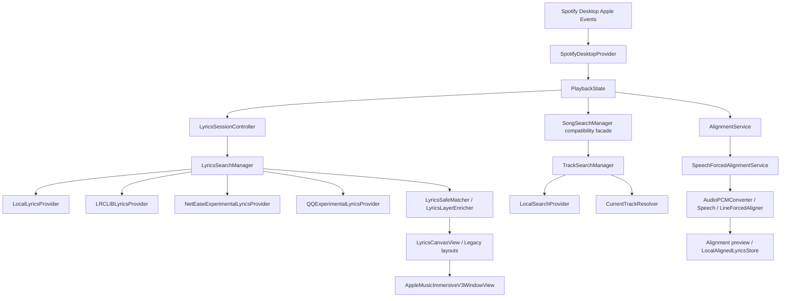

# SpotifyLyrics 真实项目状态审计

日期：2026-07-28（Asia/Shanghai）  
审计范围：当前仓库源码、`project.pbxproj`、Debug 构建产物、签名信息、真实 Spotify Desktop 运行链路。  
本轮结论不以 `progress.md`、旧规格或合同脚本单独作为依据；合同脚本只作为辅助证据。

## 0. 结论摘要

当前仓库 HEAD 已包含 `d3b30d6 Fix kana display modes and lyric refresh`。真实 App 可以：

- 通过 Spotify Desktop Apple Events 识别当前曲、封面、标题、艺人、专辑、时长、Spotify URL/ID，并同步外部切歌。
- 在真实 App 主路径中自动执行 `Local → LRCLIB → 网易云实验 → QQ 音乐实验`。
- 对真实日语歌曲 `恋風 / Lilas` 从 LRCLIB 自动取得 42 行同步歌词并显示。
- 对真实 `水曜日の約束 / Kawasaki.Rio` 从 QQ 自动取得正确的 32 行**纯文本**歌词，并进入 `alignmentQueued`，没有伪造时间轴。
- 对真实 `あやふや / みさき` 跑完整查询链后得到 `noMatch`；正确显示无歌词状态，没有用其他歌曲或 Mock 歌词回退。

当前不能声称已经完成：

- 任意关键词在线歌曲目录搜索；没有 Spotify Web API、OAuth/PKCE。
- 日语歌曲别名的完整持久化和完整查询矩阵运行接线。
- 真实歌曲的自动排轴验收。现有排轴代码、时长防护和 UI 预览存在，但没有通过真实对应完整音频验收；TTS/合成音频不能作为证据。
- SQLite、歌词编辑器、TXT/TTML 导入、持久化翻译、AI 翻译。

**最重要的边界：**“错误音频/时长防护已写入并有合同覆盖”不等于“自动排轴已完成”。

## 1. 仓库基线

```text
pwd
/Users/apple/backup/sptifylyrics

branch
ui-redesign-phase-1

HEAD
d3b30d6cb23d494482b5d8dde735fc13cb9ed97e
```

最近 15 个提交：

```text
d3b30d6 Fix kana display modes and lyric refresh
7dbc12f Calibrate Apple Music immersive V3 depth
0325a24 Plan final V3 visual calibration
ea1938a Document final V3 visual calibration design
9fcbc33 Harden Spotify Desktop reconnect polling
f3ad34b Calibrate Apple Music immersive V3 visuals
f31d38d Add Apple Music immersive V3 canvas
af1bdb8 Refine kana display modes and ruby readings
e8bc1f6 Add switchable kana display modes
64d6b10 Align ruby tokens to lyric baselines
df90ecf Add ruby lyric presentation
06e169e Implement immersive split UI v2
cd39bcb Fix Japanese kana and romaji reading pipeline
c5260d6 Add safe line alignment duration guards
7662755 Fix Kawasaki E2E lyrics display and remove dead orchestrator
```

审计前后源码均无修改。当前已有一个历史未跟踪目录：

```text
?? DerivedData.bak.20260727220515/
```

本报告是本轮唯一新增文件；不提交 commit。

## 2. 证据与状态标记

- **源码**：生产 Swift 文件存在并包含实现。
- **Target**：文件在 `/Users/apple/backup/sptifylyrics/SpotifyLyrics.xcodeproj/project.pbxproj` 的 `SpotifyLyrics` target `PBXSourcesBuildPhase` 中。
- **主路径**：从 `Main.swift` / `PlaybackState` / `LyricsSessionController` / 实际 UI 入口可到达，而不是只被测试或设计文件引用。
- **UI**：有真实按钮、菜单、popover 或状态展示。
- **真实运行**：本次使用重新构建的绝对路径 App 与 Spotify Desktop 验证。
- **设计/骨架**：有模型、计划器、协议或 helper，但没有生产主路径、UI 或真实成功证据。
- **死代码/兼容层**：保留用于旧调用或合同，不能当作新增功能已完成。

## 3. 当前架构图



`Main.swift` 只有一个原生 App target：`SpotifyLyrics`。`WindowGroup` 注入同一个 `PlaybackState`；主窗口根据 `@AppStorage("mainWindowLayoutStyle")` 切换歌词专注、沉浸分栏和 Apple Music Immersive V3。

## 4. Spotify Desktop 功能矩阵

| 项目 | 源码 | Target | 主路径 | UI | 本次真实歌曲 | 结论 |
|---|---|---|---|---|---|---|
| 当前曲识别 | ✅ | ✅ | ✅ | ✅ | ✅ | AppleScript 读取当前曲、状态、位置和元数据；三首审计曲均识别成功 |
| 播放/暂停 | ✅ | ✅ | ✅ | ✅ | 本次未单独点击命令 | 已接线；真实播放状态同步成功，命令本轮未做独立按钮验收 |
| 上一首/下一首 | ✅ | ✅ | ✅ | ✅ | 本次未单独点击命令 | 已接线；未把未单独点击说成真实成功 |
| seek | ✅ | ✅ | ✅ | ✅ | 本次未单独拖动 | `PlaybackState.seek` 有范围校验和 AppleScript 命令 |
| 外部切歌同步 | ✅ | ✅ | ✅ | ✅ | ✅ | 真实日志出现 `恋風 → 水曜日の約束 → あやふや`，每次重新开始 Session |
| 断连/重连 | ✅ | ✅ | ✅ | ✅ | 未模拟断连 | 有状态枚举、轮询、取消/重连入口和 Network recovery；没有本次真实断连场景证据 |
| 封面 | ✅ | ✅ | ✅ | ✅ | ✅ | Spotify artwork URL 进入 `ArtworkImageLoader`；AX 显示封面节点但文本不含图片内容 |
| 多艺人 | ⚠️ | ✅ | ✅ | ✅ | 部分 | `Track.artist` 是单个 String，没有 `[Artist]` 结构；可保留 Spotify 返回的组合字符串，但不能保证结构化多艺人 |
| ISRC | ⚠️ | ✅ | ✅ | 无独立 UI | ❌ | `Track`/`ProviderTrack` 有 `isrc` 字段，但 Spotify Desktop 读取脚本没有读取 ISRC，真实运行值为空 |
| Spotify ID/URI | ✅ | ✅ | ✅ | 无独立 UI | ✅ | 真实日志读取 `spotify:track:*`，并写入 `TrackIdentity` |

`SpotifyDesktopProvider` 使用单串行、有限超时的 `/usr/bin/osascript` runner。它是真实播放控制 Provider，不是 Spotify Web API。

## 5. 歌曲搜索功能矩阵

| 项目 | 源码 | Target | 主路径 | UI | 本次真实结果 | 结论 |
|---|---|---|---|---|---|---|
| 当前 Spotify 歌曲匹配搜索 | ✅ | ✅ | ✅ | ✅ | 既有运行记录 + 当前代码 | `CurrentTrackResolver` 只刷新当前播放歌曲并按关键词评分 |
| 本地歌词/曲目搜索 | ✅ | ✅ | ✅ | ✅ | 当前用户本地目录 0 个 LRC | `LocalSearchProvider` 使用共享本地索引 |
| 任意在线曲库搜索 | ❌ | ❌ | ❌ | ✅ | 未实现 | UI 在无结果时显示“暂无可用曲库来源” |
| Spotify Web API | ❌ | ❌ | ❌ | ❌ | ❌ | 不存在 |
| OAuth/PKCE | ❌ | ❌ | ❌ | ❌ | ❌ | 不存在 |
| LRCLIB 作为歌曲目录 Provider | 兼容禁用 | ✅ | ❌ | 文案有旧描述 | ❌ | `/Users/apple/backup/sptifylyrics/SpotifyLyrics/Search/LRCLIBProvider.swift` 返回空数组并明确隔离歌词搜索 |
| 搜索结果 metadata-only | ✅ | ✅ | ✅ | ✅ | ✅ | `TrackSearchResult` 没有歌词正文；`SongSearchResult.lyrics` 只保留旧兼容字段，真实新路径不附歌词 |
| 标题/艺人/专辑/时长/封面/Spotify ID | ⚠️ | ✅ | ✅ | 部分 | 部分 | Track 模型有字段；当前 Spotify 搜索可带标题、艺人、专辑、时长、封面、ID，但 ISRC 和结构化多艺人不完整 |

因此当前 App 的“搜索”实际是：**本地歌词目录搜索 + 当前 Spotify 歌曲重新匹配**。不是任意关键词在线歌曲搜索。`SongSearchPopover` 的提示文字仍提到 LRCLIB 返回统一结果，与实际 Track/Lyrics 职责拆分不完全一致，但 LRCLIB 没有进入 track search 主路径。

## 6. 歌词搜索与 Provider 矩阵

| Provider/能力 | 源码 | Target | 默认主路径 | UI | 本次真实运行 | 结论 |
|---|---|---|---|---|---|---|
| LocalLyricsProvider | ✅ | ✅ | ✅ 第一顺位 | ✅ 状态/歌词 | 三首均正确 noMatch（用户目录为空） | 真实只读本地源；与 LocalSearchProvider 共用 `LocalLyricsIndex.shared` |
| LRCLIBLyricsProvider | ✅ | ✅ | ✅ 第二顺位 | ✅ 自动补全/加载 | `恋風 / Lilas`：42 行、sync=true、confidence≈0.98 | 已真实显示同步歌词；不默认持久化在线歌词 |
| NetEaseExperimentalLyricsProvider | ✅ | ✅ | ✅ 第三顺位 | ✅ 失败/候选会进入 Session | `あやふや` 只产生错误/低匹配候选，未采用正确歌词正文 | 未文档化接口；目录命中不等于正文；实验性 |
| QQExperimentalLyricsProvider | ✅ | ✅ | ✅ 第四顺位 | ✅ 自动补全 | `水曜日の約束 / Kawasaki.Rio`：32 行、sync=false、confidence=1.0 | 真实正确正文已进入 App；无时间轴，状态为 `alignmentQueued` |
| AWA/Uta-Net/UtaTime/UtaTen/J-Lyric 等网页发现 | ❌ | ❌ | ❌ | ❌ | ❌ | 只有文档调研，没有 WebLyricsDiscoveryProvider 实现 |
| Musixmatch/酷狗/其他 | ❌ | ❌ | ❌ | ❌ | ❌ | 未进入 App target 或主路径 |
| 多别名查询 | ⚠️ | ✅ | ✅ 部分 | 无独立 UI | 日文/罗马音基础变体可见于日志 | `TrackAlias`、`LyricsQueryPlanner`、`LyricsSafeMatcher` 存在；完整 kana/官方英文/provider/user alias 未持久化，Kawasaki 实际只生成 2 个变体 |
| SafeMatcher | ✅ | ✅ | ✅ | 候选选择 UI | ✅ Kawasaki 自动采用 | 结合标题、艺人、专辑、时长、版本标记；别名只扩大召回，不单独证明身份 |
| candidates | ✅ | ✅ | ✅ | ✅ | 既有运行记录出现低置信候选 | 候选 UI 存在；需注意本次未专门重演候选选择 |
| 错版本保护 | ✅ | ✅ | ✅ | ✅ | 合同覆盖 | 版本标记和候选降级存在；没有本轮逐首现场版/翻唱对抗验收 |
| Provider 独立失败 | ✅ | ✅ | ✅ | 状态统一 | ✅ 日志显示 Local/LRCLIB/网易失败后 QQ 仍返回 | `LyricsSearchManager` 逐 Provider、逐变体隔离失败 |
| 请求取消/乱序保护 | ✅ | ✅ | ✅ | 状态不应回退 | 合同通过；源码有 revision/Task cancellation | `LyricsSessionController` 丢弃 stale identity/revision；本轮没有人为制造慢请求切歌 |

### 本次真实 App 的三首曲目结果

1. **`恋風 / Lilas`**  
   Spotify ID `spotify:track:6QGuDk8tY8Lan39gTWtXWK`，时长约 182.029 秒。最终日志：`LRCLIB AUTO_ADOPT`、42 行、`sync=true`，Session `loaded`。

2. **`水曜日の約束 / Kawasaki.Rio`**  
   Spotify ID `spotify:track:5MqkkCSrUjqyaKVOlvEn0w`，Spotify duration 171.177 秒。最终日志：QQ `MATCH lines=32 sync=false`，Session `alignmentQueued`，第一行是 `「これでおわり」って言われた夜`。Local、LRCLIB 没有正确正文；网易只产生未采用候选。

3. **`あやふや / みさき`**  
   Spotify ID `spotify:track:4l6XKftR34zrUw0bTnwoVv`，时长 119.16 秒。原始日文、罗马音变体均执行；最终 `SESSION noMatch diag=16`。网易候选和 QQ 目录/空正文没有通过 SafeMatcher；没有显示其他歌曲歌词。

最终运行日志位于 `/tmp/spotifylyrics-e2e.log`；最终 App 无障碍树对 `あやふや` 显示曲名、播放位置和 `暂无歌词`，没有 Mock Preview 或错误曲目回退。

## 7. 日语歌词数据层

| 能力 | 源码 | Target | 主路径 | UI | 真实状态 |
|---|---|---|---|---|---|
| originalText 独立保留 | ✅ | ✅ | ✅ | ✅ | Kawasaki 32 行原文进入 UI；不会被 kana 覆盖 |
| Ruby 假名 | ✅ | ✅ | ✅ | ✅ | `JapaneseReadingPipeline` + `RubyLineView`/token layout；实际加载行可走此层 |
| 独立假名行 | ✅ | ✅ | ✅ | ✅ | `KanaDisplayMode.independentLine`；模式切换存在 |
| 假名替换 | ✅ | ✅ | ✅ | ✅ | `KanaDisplayMode.kanaReplacement`；汉字辅助标注仍是显示层 |
| 罗马音 | ✅ | ✅ | ✅ | ✅ | 从确认 kana 层调用 `romanizeConfirmedKana`；Kawasaki AX 文本包含罗马音层 |
| translationText | ✅ | ✅ | 部分 | ✅ | 模型和 NetEase tlyric 合并存在；没有 AI 整首翻译或稳定持久化 |
| MeCab/IPADIC | ✅ | ✅ | ✅ | 无独立入口 | 本机 `/opt/homebrew/bin/mecab` + IPADIC 可执行；合同通过 |
| 人名/艺名/当て字高置信读音 | ⚠️ | ✅ | 部分 | ❌ | proper noun 会降置信；未知读音 fail-closed，但没有用户词典/人工编辑 UI |
| 人工修正/lock | ⚠️ | ✅ | ❌ | ❌ | `LyricsTextLayers` 有 lock 模型；没有持久化编辑界面，自动主路径不会生成已锁定层 |
| 片假名上方平假名 | ✅ | ✅ | ✅ | ✅ | Ruby 显示层将片假名转平假名；未在本次三曲中单独验证片假名案例 |
| 旧有限词典 | 兼容层 | ✅ | ❌主引擎 | ❌ | `JapaneseKanaGenerator.sharedDictionary` 已 deprecated；facade 的主要路径是 MeCab，不是最长匹配字典 |

## 8. 数据持久化

| 项目 | 真实状态 |
|---|---|
| SQLite/Core Data | **未实现**。本次只发现 Xcode 的 `DerivedData/Build/Intermediates.noindex/XCBuildData/build.db`，不是 App 数据库 |
| 表结构/迁移 | 未实现 |
| 在线歌词缓存 | 不默认持久化；LRCLIB 结果仅在当前 Session 内存中流转 |
| Local LRC | 真实只读扫描；本审计机 `~/Music/SpotifyLyrics/Lyrics` 存在但文件数为 0，Application Support 目录不存在 |
| Provider 来源 | 内存 `LyricsSource` 存在；对齐保存时写入 LRC 注释，普通在线歌词不写入 |
| TrackIdentity | 内存值类型，包含 Spotify ID/URI/ISRC/metadata fingerprint；普通 LRC 不完整持久化这些字段 |
| aliases | 内存 `TrackMetadata`；无 alias 表、迁移或用户编辑保存 |
| 时间轴 | 可读取现有 LRC；确认对齐时可写 `.aligned.lrc` |
| 翻译 | 内存 line layer/NetEase tlyric；`LRCParser.serialize` 没有完整翻译层持久化协议 |
| 人工编辑/锁定 | `LocalAlignedLyricsStore` 能写 `# manuallyCorrected`/`# locked`，但主 UI 没有完整编辑器，确认入口固定 `manuallyCorrected=false` |
| 音频 hash | `AlignmentReport.audioSHA256` 和 aligned LRC 注释模型存在；本审计没有真实确认保存的 alignment 文件 |

## 9. 自动排轴与 ASR

| 项目 | 源码/Target | 主路径/UI | 真实完成度 |
|---|---|---|---|
| `AlignmentService` 协议 | ✅/✅ | ✅ | 接口已实现 |
| 本地音频导入 | ✅/✅ | ✅ `自动排轴`、ASR 草稿按钮 | 入口存在；本轮没有使用真实对应完整音频成功保存 |
| PCM WAV 预处理 | ✅/✅ | ✅ | 读文件、hash、时长、ffmpeg/AVFoundation 临时转换、清理原文件不改动 |
| 时长防护 | ✅/✅ | ✅ | 已完成错误输入保护，合理阈值为 max(8 秒, 10%) |
| 标题/艺人/版本内容校验 | ⚠️ | ❌ | 只有 TrackIdentity 在请求层和时长/hash；代码没有从音频文件读取标题/艺人，也没有音频指纹比对 Spotify 版本 |
| Speech 识别片段 | ✅/✅ | ✅ | `SpeechForcedAlignmentService` 存在；需系统授权/可用识别器 |
| 已知文本逐行对齐 | ✅/✅ | ✅预览 | 代码存在，但没有真实商业歌曲完整音频验收 |
| 逐字时间轴 | ❌ | ❌ | 未实现 |
| 编辑/试听/逐行微调 | ⚠️ | 部分 | 有预览、确认、取消和 seek 预览概念；没有完整逐行编辑器 |
| ASR 从本地音频生成草稿 | ✅/✅ | ✅ | `LocalAudioASRService` 存在；没有本轮真实成功记录 |
| 真实歌曲成功验收记录 | ❌ | ❌ | 不存在；此前 TTS/合成音频不能算真实歌曲证据 |

### 排轴的关键风险

`LineForcedAligner` 会对漏配行做低置信插值，并在没有识别 token 时存在 `spreadLowConfidence` 的平均铺开 fallback。它虽然标记为 `unmatched/interpolated`，但这仍然不满足“不能按总时长平均铺开、不能把低置信结果伪装准确”的最终验收要求。因此当前只能认定：

> **错误输入防护完成；自动排轴实际未验收、未完成。**

## 10. UI 与窗口模式

| 模式/功能 | 源码 | Target | 主路径/UI | 真实状态 |
|---|---|---|---|---|
| Apple Music Immersive V3 | ✅ | ✅ | ✅ 可通过布局菜单选择 | V3 独立 View、异步背景缓存和响应式规则存在；本次重建运行默认 AX 看到的是已保存的沉浸分栏，不把未截图说成 V3 现场验收 |
| 歌词专注模式 | ✅ | ✅ | ✅ | 保留，使用 `LyricsCanvasView`；时钟刷新回归修复在 HEAD |
| 沉浸分栏旧模式 | ✅ | ✅ | ✅ 默认 fallback/可选 | **deprecated candidate**，按用户决定不再继续开发；本轮不删除 |
| 悬浮歌词 | ✅ | ✅ | ✅ `WindowManager` | 旧窗口能力存在，未本轮单独回归 |
| 顶部胶囊 | ✅ | ✅ | ✅ `WindowManager` | 旧窗口能力存在，未本轮单独回归 |
| 全屏歌词 | ✅ | ✅ | ✅ `WindowManager` | 旧窗口能力存在，未本轮单独回归 |
| 搜索 popover | ✅ | ✅ | ✅ | 搜索边界正确但没有在线目录 Provider |
| 候选选择 | ✅ | ✅ | ✅ | `LyricsCanvasView` 有 candidate list/adopt；合同和既有运行记录支持 |
| 加载状态 | ✅ | ✅ | ✅ | 真实日志出现 `SESSION begin` 与自动补全加载链 |
| 无歌词/无匹配/失败 | ✅ | ✅ | ✅ | `あやふや` 真实 UI 显示 `暂无歌词`；无错误歌曲回退 |
| alignmentQueued/running/preview | ✅ | ✅ | ✅ | Kawasaki 真实进入 `alignmentQueued`；没有真实音频继续排轴 |
| 设置 popover | ✅ | ✅ | ✅ | 原文/翻译/罗马音/假名三种显示方式存在；不是 Sidebar 设置窗口 |
| 连接状态 | ✅ | ✅ | ✅ | 旧布局会显示连接状态；V3 使用顶部工具菜单/指示点 |

V3 背景缓存位于 `/Users/apple/backup/sptifylyrics/SpotifyLyrics/Views/Components/AppleMusicImmersiveV3BackdropView.swift`：以 TrackIdentity/artwork key 触发低分辨率快照、palette、噪点和异步缓存；不会按播放进度重新生成。它是已写并入 target 的视觉实现，但本报告不把静态源码检查等同于 V3 视觉验收。

## 11. AI 能力

| 项目 | 状态 |
|---|---|
| OpenAI-compatible API | 未实现 |
| Base URL/API Key/Model | 未实现 |
| Prompt/整首上下文翻译 | 未实现 |
| 清洗、假名、罗马音 AI 生成 | 未实现；本地假名/罗马音是 MeCab + 确定性转写 |
| 多来源 AI 对比 | 未实现 |
| SQLite 保存和人工锁定 | 未实现；只有内存 lock 模型和 aligned LRC 注释 helper |

仓库生产源码中没有 OpenAI、`apiKey`、聊天补全或兼容 API 客户端实现。

## 12. 导入、导出与编辑

| 能力 | 状态 | 证据/边界 |
|---|---|---|
| TXT 导入 | 未实现 | 没有 `FileImporter`/TXT UI |
| LRC 导入 | 部分 | `LRCParser` 可被本地目录读取，但没有用户导入入口 |
| TTML 导入 | 未实现 | 没有解析器 |
| 手动创建歌词 | 设计/选项模型 | `LyricsRecoveryOption.manualCreate` 存在，但没有生产 UI |
| 歌词编辑 | 未实现 | 没有编辑器状态或保存流程 |
| 时间轴编辑 | 未实现 | 只有自动排轴预览/确认，不支持逐行微调 UI |
| 自动保存 aligned LRC | 部分 | `LocalAlignedLyricsStore` 可写确认结果；本轮没有真实确认保存记录 |
| 普通在线歌词永久保存 | 未实现且按设计禁止默认保存 | 符合当前 LRCLIB 隔离边界 |

## 13. App target、构建与签名验收

### Target 证据

`xcodebuild -list` 显示只有一个原生 target：`SpotifyLyrics`，没有 XCTest target。生产源 phase 共 67 个 Swift build files；以下关键文件均在 `project.pbxproj` 的 Sources Build Phase：

- `PlaybackState.swift`
- `LyricsSessionController.swift`
- `TrackSearchManager.swift`
- `LyricsSearchManager.swift`
- `LocalLyricsProvider.swift`
- `LRCLIBLyricsProvider.swift`
- `NetEaseExperimentalLyricsProvider.swift`
- `QQExperimentalLyricsProvider.swift`
- `JapaneseKanaGenerator.swift`
- `JapaneseRomanizer.swift`
- `JapaneseReadingPipeline.swift`
- `AlignmentService.swift`
- `SpeechForcedAlignmentService.swift`
- `LocalAudioASRService.swift`
- `AppleMusicImmersiveV3WindowView.swift`
- `ImmersiveSplitWindowView.swift`
- `LyricsCanvasView.swift`

`LyricsRecoveryOrchestrator` 不存在；不是漏编译，而是此前已经删除死接线。`japanese_kanji_readings.json` 进入 Resources phase。

### 构建

已退出旧的 SpotifyLyrics 进程并清理当前 DerivedData，然后执行：

```bash
xcodebuild -project /Users/apple/backup/sptifylyrics/SpotifyLyrics.xcodeproj \
  -scheme SpotifyLyrics -configuration Debug \
  -derivedDataPath /Users/apple/backup/sptifylyrics/DerivedData build
```

结果：`** BUILD SUCCEEDED **`。

实际 App：

```text
/Users/apple/backup/sptifylyrics/DerivedData/Build/Products/Debug/SpotifyLyrics.app
```

- App mtime：`2026-07-28 21:31:57 +0800`
- bundle `du`：约 `6.9M`
- executable：`Contents/MacOS/SpotifyLyrics`，58,832 bytes
- `codesign --verify --deep --strict`：通过
- Identifier：`com.spotifylyrics.app`
- CodeDirectory：arm64，SHA-256，`Signature=adhoc`
- TeamIdentifier：未设置，签名身份为 Xcode `Sign to Run Locally`
- Entitlement：`com.apple.security.automation.apple-events=true`（Debug 同时有 get-task-allow）

只启动了上述绝对路径。进程确认：

```text
29036  1  /Users/apple/backup/sptifylyrics/DerivedData/Build/Products/Debug/SpotifyLyrics.app/Contents/MacOS/SpotifyLyrics
```

没有同时运行 `build/` 或 `DerivedData.bak...` 的 SpotifyLyrics 进程。

### 辅助合同脚本

15 个 `Tests/*contract.sh` 全部返回 0，包括 Spotify provider、连接、搜索模型、日语阅读、显示模式、Ruby、V3、排轴接线、Provider 失败和真实 LRCLIB harness。它们只证明源码合同/测试 harness 通过，不能替代上面的真实 App 三曲运行结论。

## 14. 死代码、兼容层与废弃候选

| 文件/符号 | 状态 | 说明 |
|---|---|---|
| `SongSearchManager` | 兼容层 | UI 仍依赖它，但内部转发 `TrackSearchManager`；不应当再扩展为歌词管理器 |
| `SongSearchProvider`/bridge | 兼容层 | 旧协议保留，桥接结果时丢弃歌词正文 |
| `SpotifyCurrentTrackProvider.swift` | 兼容 shim/可清理候选 | 实现已在 `CurrentTrackResolver.swift`；文件本身只有兼容注释，typealias 也在 resolver 中 |
| `LRCLIBProvider.swift` | 禁用兼容层/可清理候选 | 明确返回空 track-search 结果，防止 LRCLIB 重新混入歌曲目录搜索 |
| `CompositeLyricsProvider` | 兼容 wrapper | 包装 `LyricsSearchManager`，主要供旧测试/调用者使用 |
| `LyricsRecoveryPlanner`/`LyricsRecoveryModels` | 设计/骨架 | 有 recovery 状态和选项，但没有 `LyricsRecoveryOrchestrator` 或 Web discovery 主路径 |
| `JapaneseKanaGenerator.sharedDictionary` | deprecated compatibility | 旧有限词典仍编译，但主 facade 使用 MeCab/IPADIC |
| `ImmersiveSplitWindowView` | **deprecated candidate** | 用户已决定不再继续开发；本轮保留，不删除 |
| `LyricsRecoveryOrchestrator` | 已删除 | 不存在死接线；当前主路径是 `LyricsSessionController → LyricsSearchManager` |

## 15. 三个合理的下一阶段方案

### 方案 A：歌词来源覆盖与诊断稳定化（推荐）

**目标**：不接 Spotify Web OAuth；把 Local/LRCLIB/NetEase/QQ 的结果、错误、限流、超时、取消、版本冲突和“有页面但无正文”诊断做成稳定的 Provider 能力矩阵，并一次只验证一个补充源。

- 收益：直接改善冷门日语歌的真实覆盖；用户能区分无正文、错误版本和网络失败。
- 风险：网易/QQ 当前是未文档化接口，稳定性、Cookie/登录、授权和服务端策略不确定。
- 预计文件：`/Users/apple/backup/sptifylyrics/SpotifyLyrics/Lyrics/LyricsSearchManager.swift`、`/Users/apple/backup/sptifylyrics/SpotifyLyrics/Providers/NetEaseExperimentalLyricsProvider.swift`、`/Users/apple/backup/sptifylyrics/SpotifyLyrics/Providers/QQExperimentalLyricsProvider.swift`、`/Users/apple/backup/sptifylyrics/SpotifyLyrics/Lyrics/LyricsModels.swift`、对应 Tests。
- 依赖：每家 Provider 的真实响应样本、明确实验开关和合规边界。

### 方案 B：真实音频条件下完成排轴 V1

**目标**：只接受与当前 Spotify 曲目对应的完整本地音频，先收紧无 token/低置信 fallback，再完成一次真实歌曲从导入、识别、逐行预览到确认保存。

- 收益：解决 `水曜日の約束` 有正文但无时间轴的问题。
- 风险：需要用户提供准确完整音频；macOS Speech 识别、人声/伴奏和歌曲版本差异会导致低置信；不能从 Spotify 受保护流直接取音频。
- 预计文件：`/Users/apple/backup/sptifylyrics/SpotifyLyrics/Lyrics/LineForcedAligner.swift`、`SpeechForcedAlignmentService.swift`、`AudioPCMConverter.swift`、`AlignmentModels.swift`、`LyricsSessionController.swift`、`PlaybackState.swift`、排轴 Tests。
- 依赖：真实完整音频、Speech 权限、明确“低置信不得自动保存”的产品规则。

### 方案 C：持久化与编辑基础层

**目标**：先建立 TrackIdentity/aliases/LyricsTextLayers/translation/timeline/lock/audio hash 的持久化 schema，再接入 TXT/LRC/TTML 导入、预览、编辑、导出。

- 收益：人工修正和锁定真正可用；在线结果、别名和排轴元数据不会只存在内存；后续 AI 翻译有可靠落点。
- 风险：SQLite schema、迁移、用户文件冲突和旧 LRC 兼容需要长期维护；会扩大 UI/数据范围。
- 预计文件：新增 Persistence 层，修改 `LyricsModels.swift`、`TrackIdentity.swift`、`TrackAlias.swift`、`LocalLyricsIndex.swift`、`LocalAlignedLyricsStore.swift`、导入/编辑 UI 和 Tests。
- 依赖：先定 schema、锁定语义、文件覆盖策略和导入格式优先级。

## 16. 推荐顺序

推荐先执行**方案 A**，然后根据真实覆盖结果决定方案 B 或 C：

1. 当前最大的实际缺口是“来源本身没有正文”，单纯增加别名不能解决 `あやふや` 这类 noTextSource。
2. Provider 失败与正确无正文状态先稳定，避免再用 harness/旧 App 误判功能完成。
3. `水曜日の約束` 的排轴必须等待真实完整音频；在音频到位前继续改排轴只会重复 TTS/版本不一致问题。
4. SQLite/编辑层属于较大范围，适合在 Provider 边界和排轴验收结论稳定后再开始。

本报告完成后暂停；没有修改业务源码，也没有提交 commit。
