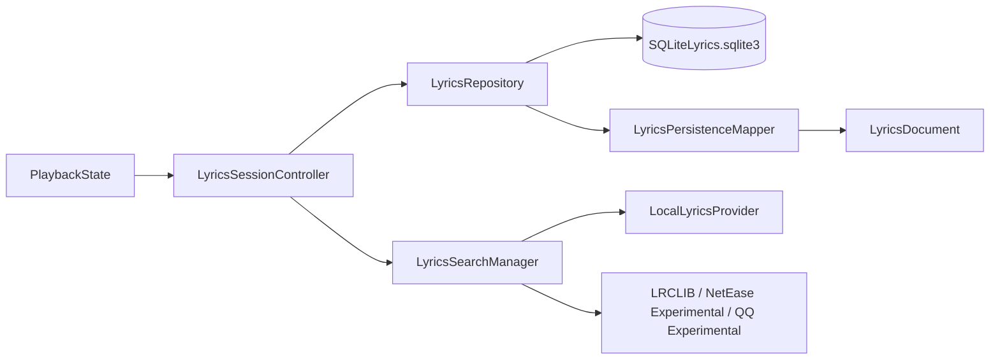

# SQLite 持久化 MVP 验收记录（2026-07-28）

## 范围

本阶段只实现歌词持久化基础层，不接入 Spotify Web/OAuth、在线曲库搜索、AI、完整编辑器、新 Provider、自动排轴算法或 UI 重构。

当前基线：`ui-redesign-phase-1`，实现前 HEAD 为 `d3b30d6`。

## 架构

- `SQLiteLyricsRepository` 是独立 actor；SQL、迁移和事务不在 MainActor 执行。
- `PlaybackState` 和 UI 不直接接触 SQL。
- Session 先查 SQLite；只有没有可用缓存时才运行现有 Provider 链。
- Provider 的高置信度结果在 Session 正式 apply 后写入数据库。
- noMatch、failed、空歌词、候选、低置信度结果不写入。
- 读取缓存保留原始 `LyricsSource` 和 `providerSourceID`，纯文本仍进入 `alignmentQueued`，不伪造时间轴。

## 数据库

路径：`~/Library/Application Support/SpotifyLyrics/SpotifyLyrics.sqlite3`

迁移版本：**1**。启动时创建父目录、打开数据库、设置 `PRAGMA foreign_keys = ON`，再执行 forward-only migration。写入使用 `BEGIN IMMEDIATE` 事务。

表：

- `schema_migrations(version, applied_at)`
- `tracks(stable_key, spotify_id, spotify_uri, isrc, title, artist_display, album, duration, artwork_url, created_at, updated_at)`
- `track_aliases(track_stable_key, field, kind, value, language, script, source, confidence, is_official)`
- `lyrics_versions(id, track_stable_key, source, provider_source_id, language, is_synced, raw_text, content_hash, created_at, updated_at, is_machine_generated, is_manually_edited, is_locked, confidence)`
- `lyric_lines(lyrics_version_id, line_index, start_time, end_time, original_text, kana_text, romaji_text, translation_text)`

`lyrics_versions` 有 `(track_stable_key, source, provider_source_id, content_hash)` 唯一索引；歌词三层文本分别存储。外键为 cascade，但本地 LRC 文件不会被写入或修改。

## 合同测试

通过：

- `Tests/sqlite_persistence_contract.sh`
  - migration v1、foreign keys、42 行同步歌词、32 行纯文本、三层文本、重复去重、空/低置信拒绝、locked 阻止竞争版本、损坏数据库错误。
- `Tests/sqlite_session_contract.sh`
  - 首次 Provider 命中写入、重启离线恢复、纯文本 `alignmentQueued`、noMatch 不缓存、快速切歌不会把 A 写入 B。
- 全部既有 `Tests/*.sh` 合同脚本：通过。

编译器仍会报告既有的 Swift 6 Sendable warning（`AVAudioPCMBuffer` 和测试 fixture），没有新增 build error。

## 真实 App 验收

构建 App：

`/Users/apple/backup/sptifylyrics/DerivedData/Build/Products/Debug/SpotifyLyrics.app`

最终使用该绝对 `.app` 启动，并通过 `ps` 观察到进程来自：

`/Users/apple/backup/sptifylyrics/DerivedData/Build/Products/Debug/SpotifyLyrics.app/Contents/MacOS/SpotifyLyrics`

### A：恋風 / Lilas

- Spotify ID：`spotify:track:6QGuDk8tY8Lan39gTWtXWK`
- 时长：`182.029s`
- 清空数据库后，LRCLIB 返回并采用 **42 行同步歌词**，`providerSourceID=lrclib:18558378`。
- 日志顺序为 `SESSION apply loaded` → `SESSION persistence save ... inserted`。
- 退出并重新打开 App，使用 `SPOTIFYLYRICS_DISABLE_LRCLIB=1` 模拟 LRCLIB 不可用。
- 日志为 `SESSION persistence hit ... lines=42 sync=true`，没有 Provider 诊断请求。
- 重启前后 Spotify 播放位置均为 `0.830999...`，数据库读取没有 seek。

证据日志：`/tmp/spotifylyrics-final-A-online.log`、`/tmp/spotifylyrics-final-A-offline.log`。

### B：水曜日の約束 / Kawasaki.Rio

- Spotify ID：`spotify:track:5MqkkCSrUjqyaKVOlvEn0w`
- Spotify 时长：`171.177s`
- 首次运行 QQ 返回正确的 **32 行纯文本**，`providerSourceID=qq:004YkjHH0g5pRt`，`sync=false`。
- Session 实际进入 `alignmentQueued`；数据库中的 `start_time/end_time` 均为空。
- 退出并重开 App，禁用 LRCLIB、网易和 QQ 后命中 SQLite：`lines=32 sync=false`，仍为 `alignmentQueued`。
- 重启前后 Spotify 播放位置均为 `1.481999...`，没有被持久化读取改变。

证据日志：`/tmp/spotifylyrics-final-B-online.log`、`/tmp/spotifylyrics-final-B-offline.log`。

### C：あやふや / みさき

- Spotify ID：`spotify:track:4l6XKftR34zrUw0bTnwoVv`
- Spotify 时长：`119.16s`
- Local、LRCLIB、网易实验 Provider、QQ 实验 Provider 均未提供可采用歌词正文。
- 网易只返回候选目录结果；QQ 日志明确为 `no body candidates`，没有把歌曲页面误记为歌词正文。
- Session 最终为 `noMatch`，没有生成空 `LyricsVersion`。
- 重启后再次记录 `persistence miss` 并重新运行 Provider 链，证明 noMatch 没有被永久缓存。
- 数据库最终只有恋風和水曜日の約束两条歌词版本，あやふや 版本数为 0。

证据日志：`/tmp/spotifylyrics-final-C-online.log`、`/tmp/spotifylyrics-final-C-restart.log`。

## 最终数据库现场检查

- `user_version = 1`
- `tracks = 2`
- `lyrics_versions = 2`
- LRCLIB：42 行同步歌词
- QQ：32 行纯文本歌词
- 每首歌曲均写入 Track alias；三张歌词表均存在外键定义。

## 构建与签名

- 正常签名 Debug `xcodebuild`：`** BUILD SUCCEEDED **`，退出码 `0`。
- `codesign --verify --deep --strict`：valid on disk，满足 Designated Requirement。
- 签名身份：`Sign to Run Locally`（本机 ad-hoc Debug 签名，TeamIdentifier 未设置）。
- App bundle：约 `7.2M`，最终构建时间为 2026-07-28 23:06:09 +0800。

## 当前结论

SQLite 持久化 MVP 已完成真实验收：**首次联网获取 → Session 正式采用 → 写入 SQLite → 退出重启 → 禁用网络 Provider → 离线恢复** 已在恋風和水曜日の約束上成立；无歌词歌曲不会被空缓存阻塞。

自动排轴仍保持此前的实验性、未用真实歌曲验收状态；本阶段没有修改它。
