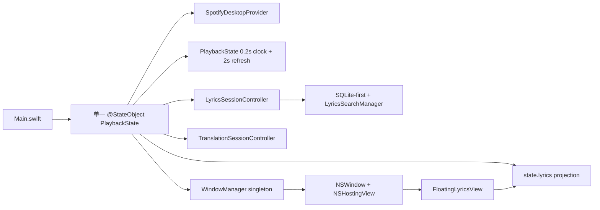

# 桌面悬浮歌词最终版 V1 Implementation Plan

> **For agentic workers:** REQUIRED SUB-SKILL: Use superpowers:subagent-driven-development (recommended) or superpowers:executing-plans to implement this plan task-by-task. Steps use checkbox (`- [ ]`) syntax for tracking.

**Goal:** 将早期悬浮歌词窗口收敛为当前架构下的正式桌面悬浮歌词版本，直接消费唯一的 `PlaybackState → LyricsSessionController → TranslationSessionController` 数据链，不创建第二套歌词、搜索、翻译或播放时钟。

**Architecture:** 保留 `WindowManager` 作为窗口模式兼容门面，但把悬浮窗口的生命周期、NSPanel 行为、位置持久化和交互模式抽到独立的 `FloatingLyricsWindowController`。悬浮 View 只观察同一个 `PlaybackState`，使用现有 `LyricLineView`、`DisplayPreferences`、`LyricsTimeline` 和已投影的 `state.lyrics`，同步歌词只渲染当前行附近的小窗口，纯文本歌词只做静态滚动阅读。`PlaybackState` 仍是唯一播放时钟和当前行来源；任何 UI 更新都不启动新的 Provider、Timer、歌词缓存或 TranslationSession。

**Tech Stack:** Swift 5 / SwiftUI、AppKit `NSPanel`、Combine、现有 `PlaybackState` / `LyricsSessionController` / `TranslationSessionController`、现有 SQLite/Provider/读音/翻译模型、`UserDefaults`（仅通过 `AppSettingsStore`）。

## Global Constraints

- 基线为 `8aea61f8764b2b0f8cca61224db418df558710c1`，分支为 `ui-redesign-phase-1`。
- 本轮只规划悬浮歌词最终版；计划确认前不得修改业务源码，不新增 Provider，不修改 QueryPlanner、SafeMatcher、AI HTTP、自动排轴、SQLite migration、V2/V3 主窗口视觉。
- 不参考 LyricsX、TaskbarLyrics、Lyricify、Dynamic Lyrics 的 UI、布局、代码或内部实现；视觉只沿用本项目现有 Apple Music 风格语言。
- 悬浮歌词不得创建第二套 `LyricsSessionController`、`TranslationSessionController`、歌词搜索、歌词缓存、播放计时器或独立歌词模型。
- 所有显示内容必须来自当前 live `TrackIdentity` 和当前共享 session；搜索预览不能把临时歌曲投影到 live 悬浮窗口。
- 纯文本无时间轴时禁止伪造当前行、自动滚动或按歌曲总时长平均切行。
- 切歌、取消、网络恢复、编辑保存、TXT/LRC 导入、翻译版本切换、读音显示模式切换和 SQLite 重启恢复必须通过现有共享状态自然反映到悬浮窗。
- 顶部胶囊、全屏歌词、沉浸分栏和主窗口 V2/V3 不在本轮重做；其源码保留并冻结兼容行为。
- 所有窗口行为测试必须在正常签名 Debug App 和真实 Spotify Desktop 上完成；合同测试不得用 Mock 结果替代 live-path 验收。

---

## 1. 当前仓库审计结论

### 1.1 当前真实调用路径



实际路径如下：

1. `/Users/apple/backup/sptifylyrics/SpotifyLyrics/Main.swift` 创建唯一的 `PlaybackState`，通过 `environmentObject` 注入主窗口。
2. `/Users/apple/backup/sptifylyrics/SpotifyLyrics/Services/PlaybackState.swift` 持有唯一的 `PlaybackProvider`、live `LyricsSessionController`、搜索预览 session、唯一 `TranslationSessionController` 和一个 0.2 秒 `Timer`。Spotify 刷新结果通过 `PlaybackSnapshot.position/isPlaying` 校准 `playbackAnchor`，不由悬浮窗自己计时。
3. `PlaybackState.currentLineIndex` 使用 `LyricsTimeline.activeLineIndex` 从当前播放位置和当前同步歌词行计算当前行；纯文本 `lyricsAreSynchronized == false` 时返回 `nil`。
4. `PlaybackState.lyrics` 选择当前 live session 或搜索预览 session，并通过共享 `TranslationSessionController.project(onto:)` 投影当前选中的翻译层；当前 session 已经由 `LyricsLayerEnricher` 提供 kana、romaji、Ruby token。
5. `/Users/apple/backup/sptifylyrics/SpotifyLyrics/Windows/WindowManager.swift` 创建 borderless `NSWindow`，把同一个 `PlaybackState` 作为 `environmentObject` 传给 `FloatingLyricsView`；没有第二个播放或歌词对象。
6. `/Users/apple/backup/sptifylyrics/SpotifyLyrics/Views/LyricsViews.swift` 的 `FloatingLyricsView` 在同步歌词时只显示一个当前行，在纯文本时显示 `PlainLyricsListView`；加载、无词和失败只显示状态文字。
7. 主窗口菜单入口来自 `/Users/apple/backup/sptifylyrics/SpotifyLyrics/Views/MainWindow/MainLyricsWindowView.swift` 和 `AppleMusicImmersiveV3WindowView.swift`；两者都调用 `WindowManager.shared.toggleFloatingWindow(state:)`。

### 1.2 文件逐项标记

| 文件 | 当前状态 | 真实调用路径 | 本阶段处理计划 |
|---|---|---|---|
| `/Users/apple/backup/sptifylyrics/SpotifyLyrics/Windows/WindowManager.swift` | 已进入 App target；悬浮/胶囊/全屏窗口的唯一入口；早期实现 | 主窗口和 V3 的窗口模式菜单 | 保留兼容门面；悬浮分支改为调用独立 controller；胶囊/全屏保持冻结 |
| `/Users/apple/backup/sptifylyrics/SpotifyLyrics/Views/LyricsViews.swift` | 已进入 target；`FloatingLyricsView`、`CapsulePlayerView`、`FullScreenLyricsView` 仍可运行；渲染器较早 | `WindowManager` 的 NSHostingView | 拆出正式悬浮 View；保留胶囊/全屏兼容 View，不让它们成为悬浮新路径 |
| `/Users/apple/backup/sptifylyrics/SpotifyLyrics/Views/Components/LyricLineView.swift` | 当前 V2/V3/歌词专注模式的主渲染器 | `LyricsCanvasView`、V3 | 直接复用，统一 Ruby、三种假名模式、罗马音、翻译、远处辅助层显隐和景深；不复制 `LineDisplayView` 逻辑 |
| `/Users/apple/backup/sptifylyrics/SpotifyLyrics/Views/Components/LyricsCanvasView.swift` | 当前歌词专注模式真实滚动路径 | `LyricsViewport` → `MainLyricsWindowView` | 只复用状态/时间/行点击语义；悬浮窗不直接嵌套其整页 ScrollView |
| `/Users/apple/backup/sptifylyrics/SpotifyLyrics/Services/PlaybackState.swift` | 当前唯一播放状态、唯一时钟、唯一 live/search-preview session 组合 | App 主路径和所有现有控件 | 最小修改：提供悬浮所需的 live-only 投影边界、缓存失效点和高效当前行计算；不新增时钟或 session |
| `/Users/apple/backup/sptifylyrics/SpotifyLyrics/Services/LyricsSessionController.swift` | 当前歌词搜索、SQLite 恢复、候选、切歌 revision、编辑/排轴采用的真实 session | `PlaybackState` | 优先不改；如需暴露 live-only 状态，只增加只读访问，不创建悬浮副本 |
| `/Users/apple/backup/sptifylyrics/SpotifyLyrics/Services/TranslationSessionController.swift` | 当前唯一翻译状态和版本选择源 | `PlaybackState.syncTranslationSession` | 复用，不创建悬浮翻译状态；修正只允许在共享 projection 失效时重算 |
| `/Users/apple/backup/sptifylyrics/SpotifyLyrics/Lyrics/LyricsModels.swift` | 当前 `LyricsTimeline`、`LyricsLoadState`、`LyricLine` 和版本来源模型 | 所有歌词 View/session | 复用；可把 `activeLineIndex` 的线性扫描改成单调时间轴二分查找，不改变语义 |
| `/Users/apple/backup/sptifylyrics/SpotifyLyrics/Models/Models.swift` | 当前 `DisplayPreferences`、`KanaDisplayMode`、`LyricRubyToken` | 主窗口/V3/旧窗口 | 复用；不新增一套悬浮显示设置或模型 |
| `/Users/apple/backup/sptifylyrics/SpotifyLyrics/Settings/AppSettingsStore.swift` | 当前唯一 UserDefaults 配置边界 | Settings 和 PlaybackState | 增加悬浮窗口行为/Frame 的 key，仍只通过此 store 持久化 |
| `/Users/apple/backup/sptifylyrics/SpotifyLyrics/Settings/WindowStatePersistence.swift` | 只绑定主窗口 frame、主窗口置顶和设置窗口行为 | `WindowStateAccessor` | 保持主窗口路径；不把单窗口 weak 引用强行复用到悬浮窗，新增窗口专用 persistence helper |
| `/Users/apple/backup/sptifylyrics/SpotifyLyrics/Views/Settings/SettingsRootView.swift` | 正式 Sidebar 设置窗口；当前没有悬浮行为设置 | Settings Scene | 只在现有“通用/高级”增加悬浮行为项；不新建设置窗口或 UserDefaults 系统 |
| `/Users/apple/backup/sptifylyrics/SpotifyLyrics/Main.swift` | 唯一 App/Scene 入口 | App 启动和命令 | 只增加必要的悬浮窗命令/恢复钩子；不新增主窗口模式 |
| `/Users/apple/backup/sptifylyrics/SpotifyLyrics/Views/MainWindow/MainLyricsWindowView.swift` | 歌词专注和沉浸分栏入口、窗口模式菜单 | 主窗口 | 复用现有菜单；加入悬浮锁定/穿透的可见入口，不改变 V2/V3 布局 |
| `/Users/apple/backup/sptifylyrics/SpotifyLyrics/Views/MainWindow/AppleMusicImmersiveV3WindowView.swift` | V3 当前真实入口，包含窗口模式工具菜单 | V3 | 只接入悬浮行为控制，保持当前 V3 视觉和业务接线 |
| `/Users/apple/backup/sptifylyrics/SpotifyLyrics/Views/Components/LyricsPreferencesPopover.swift` | 已进入 target，但没有发现任何当前调用点 | 无真实运行路径；兼容代码 | 冻结，不作为正式悬浮设置入口；后续清理另开范围 |
| `/Users/apple/backup/sptifylyrics/SpotifyLyrics/Search/SpotifyCurrentTrackProvider.swift` | 只剩 `typealias SpotifyCurrentTrackProvider = CurrentTrackResolver` 的兼容文件 | 无独立 runtime call site | 冻结；不因悬浮阶段删除 |
| `/Users/apple/backup/sptifylyrics/SpotifyLyrics/Search/LRCLIBProvider.swift` | 已进入 target，但当前歌曲目录搜索使用 SpotifySearchProvider，歌词 LRCLIB 走 `LRCLIBLyricsProvider` | 无当前自由文本目录主路径 | 冻结；不改 Provider |
| `/Users/apple/backup/sptifylyrics/SpotifyLyrics/Providers/MockPlaybackProvider.swift`、`Services/MockData.swift` | Mock/诊断能力，非默认真实播放路径；主菜单可显式进入 Mock Preview | 只有用户主动进入 Mock Preview 时使用 | 保留为显式诊断；悬浮验收不得用 Mock 代替真实歌曲 |
| `/Users/apple/backup/sptifylyrics/SpotifyLyrics/Views/LyricsViews.swift` 中的 `CapsulePlayerView` / `FullScreenLyricsView` | 仍由 `WindowManager` 菜单真实创建，但不属于本阶段目标 | 旧辅助窗口路径 | 保留并冻结，不能因为重构悬浮而改变它们 |

### 1.3 当前实现的主要缺口

1. `WindowManager` 使用普通 `NSWindow`，没有 `NSPanel` 的非激活行为、窗口 delegate 生命周期、关闭同步、释放策略和安全恢复。
2. 悬浮窗始终 `.floating`，没有读取 `AppSettingsStore` 的窗口级设置；`DisplayPreferences.alwaysOnTop` 只被 `PlaybackState` 镜像，实际主窗口置顶由 `keepMainWindowOnTop` 负责，悬浮窗行为完全独立且不可配置。
3. 悬浮窗 frame/size 没有持久化；`WindowStatePersistence` 只保存 `mainWindowFrame`，拔掉屏幕后不会把悬浮窗安全移回可见屏幕。
4. 没有“用户拖动 / 锁定展示 / 鼠标穿透”三种明确状态，没有 `ignoresMouseEvents` 控制，也没有在穿透后可靠解除的主菜单或键盘入口。
5. 悬浮窗同步时只显示一个当前行，没有相邻行层级；使用旧的 `LineDisplayView`，与当前 `LyricLineView` 的动态字号、Ruby、辅助层隐藏和景深能力重复实现且不完全一致。
6. `FloatingLyricsView` 对 `state.lyricsAreSynchronized == true` 但当前行不存在、候选、加载、失败等状态没有逐一设计；候选/加载状态可能退化为“歌词已加载”或单行状态文字。
7. `PlainLyricsListView` 是全歌词 ScrollView，但悬浮窗尺寸固定为 600×180；纯文本长歌词容易被裁切，且需要明确“纯文本模式”而不是同步滚动。
8. `PlaybackState.lyrics` 每次读取都会从当前 session 重新投影翻译行；`currentLineIndex` 每次从头扫描时间戳。0.2 秒状态更新会使所有观察 `PlaybackState` 的 View 重算，悬浮窗需要限制重绘范围，但不能引入第二个时钟或歌词副本。
9. `currentMode` 和 `showFloatingWindow` 是兼容状态而非统一窗口状态：当前切换悬浮窗没有把 `currentMode` 作为正式来源，也没有通过 `NSWindowDelegate` 处理用户关闭/窗口消失。
10. 搜索预览复用 `PlaybackState.lyrics` 的返回值；悬浮窗目前没有 live-only 边界，搜索预览激活时可能拿到预览歌词但 `currentLineIndex` 被强制为 `nil`，最终显示不准确的状态文字。

---

## 2. 正式 V1 设计

### 2.1 窗口管理边界

新增窗口层文件：

- `SpotifyLyrics/Windows/FloatingLyricsWindowController.swift`
- `SpotifyLyrics/Windows/FloatingLyricsWindowPersistence.swift`
- 可选地在 `WindowManager.swift` 中保留 façade，不再把悬浮细节和胶囊/全屏混在同一方法体。

拟定接口：

```swift
@MainActor
public enum FloatingLyricsInteractionMode: String, CaseIterable, Codable, Sendable {
    case interactive       // 可拖动、可调整、可点击
    case locked            // 保持展示，但禁止移动和调整尺寸
    case passThrough       // 鼠标事件穿透；解除必须走主菜单/快捷键
}

@MainActor
public final class FloatingLyricsWindowController: NSObject, NSWindowDelegate, ObservableObject {
    @Published public private(set) var isVisible = false
    @Published public private(set) var interactionMode: FloatingLyricsInteractionMode = .interactive

    public func toggle(state: PlaybackState, settings: AppSettingsStore)
    public func setInteractionMode(_ mode: FloatingLyricsInteractionMode)
    public func close()
    public func restoreIfConfigured(state: PlaybackState, settings: AppSettingsStore)
}
```

实现规则：

- 使用 `NSPanel` 而不是普通 `NSWindow`；style mask 为无标题栏、可调整尺寸、非激活面板所需组合。面板保留 `isReleasedWhenClosed = false`，关闭只 `orderOut` 并回写 `isVisible`，不得退出 App。
- 初始大小建议 600×220，最小 360×120，最大 960×640；创建和恢复后都以当前屏幕 `visibleFrame` 做 clamp。
- `collectionBehavior = [.canJoinAllSpaces, .fullScreenAuxiliary]`，确保跨 Space 和全屏辅助显示；不使用 `.modalPanel`、`.statusBar` 等会抢占过强层级的旧辅助窗口等级。
- `interactive`：`ignoresMouseEvents = false`、允许拖动/缩放；`locked`：保留点击显示但禁止移动/缩放；`passThrough`：`ignoresMouseEvents = true`，不允许依赖悬浮窗自身点击解除。
- 置顶采用独立悬浮配置，不复用主窗口 `keepMainWindowOnTop` 的语义。默认保留现有悬浮行为（`.floating`），设置关闭后降为 `.normal`；不改变 V2/V3 主窗口置顶设置。
- 穿透解除提供两个不依赖悬浮窗命中的入口：主窗口窗口模式菜单中的“关闭鼠标穿透”，以及 App 命令快捷键（建议 `⌥⌘L`）。第一版不注册全局事件监听、不要求辅助功能权限；是否需要全局热键作为产品决策保留在计划末尾。
- 处理 `NSWindowDelegate.windowDidMove/windowDidResize/windowWillClose`；每次写入 frame 前记录窗口屏幕坐标，不保存歌词或 Track 数据。
- 监听 `NSApplication.didChangeScreenParametersNotification`，若当前 frame 与所有屏幕 `visibleFrame` 无交集，则 clamp 到主屏或最近屏幕；不会把窗口恢复到已拔出的显示器坐标。
- WindowManager 继续持有 controller，避免每次切换创建新的面板；controller 不持有新的 PlaybackState，面板内容只通过 `NSHostingView(rootView: FloatingLyricsView(state: state))` 引用 App 已有状态。

### 2.2 共享歌词数据边界

正式 `FloatingLyricsView` 接口只接受现有状态：

```swift
struct FloatingLyricsView: View {
    @ObservedObject var state: PlaybackState
}
```

它不得持有：

- `LyricsSessionController`
- `TranslationSessionController`
- `LyricsProvider`
- 网络任务
- 播放 `Timer`
- 独立 `[LyricLine]` 持久副本
- 独立 UserDefaults key

它只读取：

- `state.currentTrack`、`state.hasLiveTrack`、`state.providerStatus`
- `state.lyricsState`、`state.lyrics`、`state.lyricsAreSynchronized`
- `state.currentTime`、`state.isPlaying`、`state.currentLineIndex`
- `state.preferences`、`state.translationState`、`state.lyricsStatusMessage`
- 现有 `state.selectedTranslation`、编辑/排轴状态派生信息（只读）

搜索结果预览不进入 live 悬浮窗：悬浮 View 应读取 live session 的只读边界；主窗口可以继续显示 `searchPreviewSession`，但不能让悬浮窗口在 live Spotify 歌曲上闪现预览歌。

为避免每个 0.2 秒 tick 重新投影完整歌词，优先在现有 `PlaybackState`/`TranslationSessionController` 内增加“按歌词 session revision + selected translation version ID 失效”的派生 projection 缓存。它只是共享 session 的 UI 投影缓存，不是第二套歌词缓存；切歌、session 采用/编辑保存、翻译版本选择、翻译删除和设置切换时失效，播放进度变化不失效。

`LyricsTimeline.activeLineIndex` 改为对单调时间戳使用二分查找；对外 API 和纯文本 `nil` 语义不变。若保留 `currentLineIndex` 计算属性，则同步增加只读 `activeLineIndex` 访问或兼容别名，确保所有 View 仍使用同一个索引结果。

### 2.3 显示策略

正式悬浮渲染器使用现有 `LyricLineView`，不再用旧 `LineDisplayView` 作为悬浮主路径：

- 同步歌词：取当前行前后最多各 2 行，当前行使用 `distance = 0`，邻行使用现有 `distance` 层级；只在当前行索引变化时做短暂 `.easeInOut` 切换，不在每次时间 tick 上做动画。
- 开头/结尾：索引窗口自然限位，不用假的空行或回到第一行。
- 暂停：`state.isPlaying == false` 时不启动滚动或过渡；当前行保持清晰。
- seek：`PlaybackState.seek` 已立即更新 `currentTime`/anchor；悬浮窗下一次状态更新直接使用新索引，不调用第二个 seek、不把时间重置为 0。
- 原文、翻译、罗马音、Ruby 假名的组合全部由 `DisplayPreferences` 控制；`KanaDisplayMode`、`hideDistantAuxiliary` 和已确认 Ruby token 直接复用。
- `LyricLineView` 已处理 `distinctRomaji`、片假名平假名辅助读音、Ruby 长注音宽度和独立假名/汉字上方/假名替换三种模式；悬浮窗不重新实现这些规则。
- 纯文本 `alignmentQueued`：显示完整可滚动歌词、`纯文本 · 待对齐时间轴` 小标签和来源/状态，不设置当前行、不自动滚动、不按总时长切行。
- `loading`：显示克制的加载状态，不保留上一首歌词。
- `noLyrics/noMatch/failed`：显示当前歌曲和简短状态；保留“自动补全/导入/编辑”等动作在主窗口，不把复杂表单塞进悬浮窗。
- `candidates`：悬浮窗显示“候选待确认”状态，候选列表和选择动作仍在主窗口；选定后共享 session 更新，悬浮窗自动显示。
- `alignmentRunning/alignmentPreview`：保留当前纯文本或预览行，显示小型进度/未确认状态；确认后 session 采用自动排轴子版本，悬浮窗自然转为同步。
- `mockPreview`：只显示显式 Mock Preview 状态；真实验收禁止把 Mock 当作 Provider/SQLite/Spotify 结果。

### 2.4 窗口位置、尺寸和配置

继续使用现有 `AppSettingsStore`，新增 key，不创建第二套设置系统：

- `general.floatingWindowFrame`
- `general.floatingWindowAlwaysOnTop`
- `general.floatingWindowInteractionMode`
- `general.floatingWindowWasVisible`

`general.restoreWindowState` 继续作为 frame 恢复总开关。设置页在“通用”或“高级”增加简短的悬浮行为区；主窗口窗口模式菜单同时提供临时切换。位置、尺寸、置顶和交互模式不写入歌词数据库，不写入 LRC/sidecar。

恢复顺序：

1. App 启动创建唯一 `PlaybackState` 和主窗口；
2. Spotify/Provider 正常启动后由 `WindowManager` 只恢复 frame 和交互配置；
3. 如果允许恢复可见性，面板显示 loading/当前 live 状态，数据仍由 PlaybackState 后续更新；
4. 屏幕坐标越界时 clamp；无 live Track 时可以显示等待状态，但不得创建 Mock 歌词。

### 2.5 生命周期和性能

- 不添加悬浮窗口 Timer；窗口完全依赖 `PlaybackState` 的现有 0.2 秒时钟和 2 秒 Spotify refresh。
- `FloatingLyricsView` 只显示少量邻近行；纯文本使用懒加载 ScrollView，避免大歌词文档一次生成大量 View。
- `Equatable` 的行窗口输入或 `EquatableView` 保护行布局；播放位置没有跨行时不重做行窗口/动画。
- 当前行索引计算使用现有时间轴数据；session revision、translation version ID、display preference 变化才重新计算投影和布局。
- 隐藏悬浮窗时 `orderOut`，不销毁共享 session；窗口不可见时不启动滚动动画、不做窗口专用渲染任务。
- 关闭/切歌时取消窗口专用动画和 controller 任务；不取消 PlaybackState 的 live Provider/lyrics task。
- `WindowManager`/controller 清理 `NotificationCenter` observers、Combine subscriptions 和 delegate；`NSPanel` 复用但不形成 `WindowManager → state → WindowManager` 强引用环。
- A→B→A 由 `LyricsSessionController.revision` 和 `TrackIdentity` 保证；悬浮 View 不自行缓存旧歌曲，也不接受 Provider/翻译/排轴的迟到结果。

---

## 3. 拟修改文件与职责

### 新建

- `SpotifyLyrics/Windows/FloatingLyricsWindowController.swift`：NSPanel 创建、delegate、可见性、层级、三种交互模式、关闭和生命周期。
- `SpotifyLyrics/Windows/FloatingLyricsWindowPersistence.swift`：frame/size、屏幕 clamp、显示器变化和 `AppSettingsStore` key 的窗口层读写。
- `SpotifyLyrics/Views/Floating/FloatingLyricsView.swift`：正式悬浮状态映射、同步邻近行、纯文本阅读和小型状态栏；只接收 `PlaybackState`。
- `SpotifyLyrics/Views/Floating/FloatingLyricsStatusView.swift`：loading/no lyrics/candidate/plain/alignment/failed 等克制状态组件；不包含 Provider 请求。
- `Tests/floating_lyrics_contract.sh`：target membership、共享状态、不新增 Timer/Provider/session、NSPanel 行为和旧窗口冻结合同。
- `Tests/floating_lyrics_contract.swift`：纯数据/时间轴/显示层组合合同。
- `Tests/floating_window_behavior_contract.sh`：frame clamp、Screen 变化、穿透解除、delegate 生命周期合同。

### 修改

- `SpotifyLyrics/Windows/WindowManager.swift`：悬浮入口委托给 controller；保留 capsule/full-screen 原方法和兼容状态。
- `SpotifyLyrics/Views/LyricsViews.swift`：移出或标记旧 `FloatingLyricsView`，保留 `CapsulePlayerView`/`FullScreenLyricsView` 兼容实现，不让正式悬浮路径继续使用旧 renderer。
- `SpotifyLyrics/Services/PlaybackState.swift`：仅增加 live-only 只读边界、共享 projection 失效、二分索引所需接线；不创建第二个时钟/歌词 session。
- `SpotifyLyrics/Lyrics/LyricsModels.swift`：只优化 `LyricsTimeline.activeLineIndex` 查找，不改变时间轴和纯文本语义。
- `SpotifyLyrics/Settings/AppSettingsStore.swift`：新增悬浮窗口配置 key 和 typed properties，复用既有 UserDefaults 边界。
- `SpotifyLyrics/Views/Settings/SettingsRootView.swift`：增加悬浮窗口的置顶、恢复和交互模式入口，不新增窗口或设置系统。
- `SpotifyLyrics/Main.swift`：注册关闭穿透/恢复交互的 App 命令快捷键；不新增歌词业务状态。
- `SpotifyLyrics/Views/MainWindow/MainLyricsWindowView.swift`：窗口模式菜单显示悬浮可见、锁定、穿透和解除入口。
- `SpotifyLyrics/Views/MainWindow/AppleMusicImmersiveV3WindowView.swift`：复用同一 `WindowManager` 行为入口，不改 V3 视觉。
- `SpotifyLyrics.xcodeproj/project.pbxproj`：加入新窗口/视图/合同文件，确认都进入 `SpotifyLyrics` target。

### 明确不修改/不扩展

- `LyricsSearchManager`、Local/LRCLIB/网易/QQ Provider、`QueryPlanner`、`SafeMatcher`。
- `AITranslationService`、`OpenAICompatibleClient`、`TranslationSessionController` 的请求协议。
- `AlignmentService`、Speech/DP 对齐算法、SQLite migration、AlignmentProvenance sidecar。
- `AppleMusicImmersiveV3WindowView` 的背景和排版规则；只添加必要窗口菜单动作。
- 顶部胶囊、全屏歌词和沉浸分栏的视觉实现；保留其旧代码，不删除。
- `LyricsPreferencesPopover.swift`、`SpotifyCurrentTrackProvider.swift`、`LRCLIBProvider.swift`、`MockPlaybackProvider.swift` 等兼容/诊断代码；不在本阶段清理。

---

## 4. 分阶段实施任务

### Task 1: 建立悬浮显示与窗口行为红色合同

**Files:**
- Create: `Tests/floating_lyrics_contract.swift`
- Create: `Tests/floating_lyrics_contract.sh`
- Create: `Tests/floating_window_behavior_contract.sh`
- Modify: none in production

- [ ] **Step 1: 写纯数据失败合同。**
  合同先定义 `synchronized` 输入在 `currentIndex = 3` 时只能选择行 1…5 的邻近窗口，`plain` 输入必须返回 `currentIndex == nil` 且 `autoScroll == false`；暂停不产生时钟推进；相同时间轴行的 active index 与 `LyricsTimeline` 一致。
- [ ] **Step 2: 运行红色合同并确认失败原因是缺少 V1 presentation helper，而不是编译路径错误。**
  Run: `bash Tests/floating_lyrics_contract.sh`。
  Expected: 新的纯显示选择 API 尚不存在；当前旧 `FloatingLyricsView` 只渲染单行/整页，合同不能被旧实现误通过。
- [ ] **Step 3: 写窗口源代码合同。**
  检查 `NSPanel`、`ignoresMouseEvents`、`NSWindowDelegate`、`didChangeScreenParametersNotification`、`isReleasedWhenClosed = false`、唯一 `PlaybackState` 注入、没有 `Timer`/`LyricsProvider`/第二 session；同时确认胶囊/全屏仍为冻结兼容路径。

### Task 2: 优化共享 PlaybackState 的只读投影和当前行查找

**Files:**
- Modify: `SpotifyLyrics/Services/PlaybackState.swift`
- Modify: `SpotifyLyrics/Services/TranslationSessionController.swift`（只有在 projection cache 仍需集中在翻译状态源时）
- Modify: `SpotifyLyrics/Lyrics/LyricsModels.swift`
- Test: `Tests/floating_lyrics_contract.swift`, existing timeline/display contracts

**Interfaces:**
- Consumes: 现有 `LyricsSessionController` 的 active document/revision、现有 `TranslationSessionController.selectedVersion` 和 `PlaybackState.currentTime`。
- Produces: `PlaybackState` 的 live-only read-only accessors；`LyricsTimeline.activeLineIndex` 保持既有签名和 nil 语义；投影按 session revision + translation version ID 失效。

- [ ] **Step 1: 为 session revision/translation version 改变增加失败断言。**
  证明播放位置每 0.2 秒变化不会让翻译 projection 重复从头构造；切歌、编辑保存、翻译版本选择后必须重新投影。
- [ ] **Step 2: 将时间轴查找改为单调二分查找并运行现有/新增纯 Swift 合同。**
  覆盖首行前、首行、行间、最后一行、相同 timestamp 和纯文本 nil。
- [ ] **Step 3: 实现最小共享投影缓存并在 session/translation 变化处失效。**
  缓存只属于现有 `PlaybackState`/`TranslationSessionController` 的派生值，不新增数据库、Provider、歌词对象或计时器；用 A→B→A identity/revision 断言避免旧投影回流。
- [ ] **Step 4: 运行回归。**
  Run: `bash Tests/lyrics_display_regression_contract.sh`、`bash Tests/sqlite_session_contract.sh`、`bash Tests/translation_session_contract.sh`、`bash Tests/floating_lyrics_contract.sh`。

### Task 3: 用共享 `LyricLineView` 建立正式悬浮渲染器

**Files:**
- Create: `SpotifyLyrics/Views/Floating/FloatingLyricsView.swift`
- Create: `SpotifyLyrics/Views/Floating/FloatingLyricsStatusView.swift`
- Modify: `SpotifyLyrics/Views/LyricsViews.swift`
- Modify: `SpotifyLyrics.xcodeproj/project.pbxproj`
- Test: `Tests/floating_lyrics_contract.swift`, `Tests/lyrics_display_regression_contract.sh`

**Interfaces:**
- Consumes: `@ObservedObject var state: PlaybackState`、现有 `LyricLineView`、`DisplayPreferences`、`LyricsLoadState`、`TranslationSessionController` 投影。
- Produces: 同步邻近行/纯文本全文/状态分支，所有 layer 组合和 Ruby 读音来自既有显示设置。

- [ ] **Step 1: 让合同覆盖六种显示组合。**
  `showOriginal/showTranslation/showRomaji/kanaDisplayMode` 的每种组合只能影响 View 层，不得改变 `state.lyrics`、时间轴或 session；假名三种模式和 `hidden` 均使用当前设置。
- [ ] **Step 2: 实现同步歌词行窗口。**
  以 `state.currentLineIndex` 为中心选择最多 ±2 行，传入 `LyricLineView` 的 `distance/isSynchronized/preferences`；只在行索引变化时切换动画，不对 0.2 秒 currentTime 做动画。
- [ ] **Step 3: 实现纯文本和状态视图。**
  `alignmentQueued` 显示完整静态 ScrollView 和小型“纯文本/待对齐时间轴”状态；loading/noLyrics/noMatch/candidates/failed/alignmentRunning/alignmentPreview/mockPreview 分别显示明确短状态，不调用任何业务方法。
- [ ] **Step 4: 让旧 `FloatingLyricsView` 退出正式路径。**
  `WindowManager` 只创建新 View；旧 capsule/full-screen 保持编译和原行为。不得删除旧代码或改变其视觉。
- [ ] **Step 5: 运行显示回归和构建。**
  Run: `bash Tests/floating_lyrics_contract.sh`、`bash Tests/lyrics_display_regression_contract.sh`、`xcodebuild -project SpotifyLyrics.xcodeproj -scheme SpotifyLyrics -configuration Debug -derivedDataPath /Users/apple/backup/sptifylyrics/DerivedData build`。

### Task 4: NSPanel 生命周期、交互模式和多显示器安全

**Files:**
- Create: `SpotifyLyrics/Windows/FloatingLyricsWindowController.swift`
- Create: `SpotifyLyrics/Windows/FloatingLyricsWindowPersistence.swift`
- Modify: `SpotifyLyrics/Windows/WindowManager.swift`
- Modify: `SpotifyLyrics/Settings/AppSettingsStore.swift`
- Test: `Tests/floating_window_behavior_contract.sh`

**Interfaces:**
- Consumes: `PlaybackState`、`AppSettingsStore`、`FloatingLyricsView(state:)`。
- Produces: `toggle(state:settings:)`、`setInteractionMode(_:)`、`close()`、`restoreIfConfigured(state:settings:)` 和持久化 frame/mode/level。

- [ ] **Step 1: 写 NSPanel 生命周期失败合同。**
  断言创建一次、重复开关复用同一 controller、windowWillClose 只更新可见性、不退出 App；合同不允许新 Timer 或新的 `LyricsSessionController`。
- [ ] **Step 2: 实现 panel 创建和 delegate。**
  使用 `.borderless` + `.resizable` + 非激活面板配置；设置最小/最大尺寸、透明材质承载、shadow、collection behavior、`isReleasedWhenClosed = false` 和 `WindowManager` 持有。
- [ ] **Step 3: 实现三种交互状态。**
  `interactive` 可拖动/调整/点击；`locked` 禁止拖动/调整但仍可从主菜单解除；`passThrough` 设置 `ignoresMouseEvents = true`，仅由 App 菜单/快捷键解除。
- [ ] **Step 4: 实现 frame 保存、恢复和屏幕 clamp。**
  覆盖移动、缩放、重启、主屏/副屏拔除和所有窗口不可见的 frame；只写 `AppSettingsStore`，不写 SQLite。
- [ ] **Step 5: 运行窗口行为合同。**
  Run: `bash Tests/floating_window_behavior_contract.sh`。

### Task 5: 设置和主窗口入口接线

**Files:**
- Modify: `SpotifyLyrics/Views/Settings/SettingsRootView.swift`
- Modify: `SpotifyLyrics/Main.swift`
- Modify: `SpotifyLyrics/Views/MainWindow/MainLyricsWindowView.swift`
- Modify: `SpotifyLyrics/Views/MainWindow/AppleMusicImmersiveV3WindowView.swift`
- Test: settings/floating contracts

- [ ] **Step 1: 增加现有 Settings Sidebar 的悬浮行为区。**
  只绑定 `AppSettingsStore` 的 typed properties：悬浮置顶、重启恢复、交互模式和恢复窗口位置；说明“不会改变歌词数据/播放状态”。
- [ ] **Step 2: 增加主窗口菜单的即时控制。**
  在歌词专注和 V3 的窗口模式菜单中显示悬浮窗状态、锁定、开启/关闭鼠标穿透、恢复交互；不把复杂编辑操作放入悬浮窗。
- [ ] **Step 3: 注册 app-level 快捷键。**
  建议 `⌥⌘L` 作为“关闭鼠标穿透/切回可操作模式”；快捷键只在 App 命令层，不添加全局事件监听或辅助功能权限。
- [ ] **Step 4: 运行设置和窗口合同。**
  Run: `bash Tests/settings_contract.sh`、`bash Tests/floating_lyrics_contract.sh`、`bash Tests/phase2_layout_contract.sh`。

### Task 6: 真实 App 回归、性能和签名构建

**Files:**
- Modify: only acceptance notes and test artifacts after verification; no new business behavior beyond Tasks 1–5
- Test: all `Tests/*contract.sh` with correct shebang

- [ ] **Step 1: 清理并正常签名 Debug 构建。**
  Use: `/Users/apple/backup/sptifylyrics/DerivedData/Build/Products/Debug/SpotifyLyrics.app`；确认 `codesign --verify --deep --strict` 通过，进程命令行来自该绝对路径。
- [ ] **Step 2: 验收恋風 / Lilas。**
  真实同步歌词：切换原文、Ruby 假名、独立假名、罗马音、翻译；暂停后当前行保持；seek 后立即切行；外部切歌后悬浮窗清空旧内容并加载新版本。
- [ ] **Step 3: 验收水曜日の約束 / Kawasaki.Rio。**
  32 行纯文本显示完整内容和“纯文本/待对齐时间轴”；等待和手动滚动不产生当前行或自动滚动；不得伪造同步效果。
- [ ] **Step 4: 验收人工导入和自动排轴子版本。**
  对 Forever 或あやふや 先使用用户实际导入的人工纯文本，验证编辑器保存/TXT/LRC 导入即时刷新；随后采用真实排轴子版本时自动转同步。没有匹配商业音频时只记录 `real commercial-song acceptance: UNVERIFIED`。
- [ ] **Step 5: 验收共享状态。**
  编辑器保存、AI 翻译版本选择、SQLite 重启恢复、Provider 恢复、A→B→A 快速切歌都不需要关闭重开悬浮窗，也不能闪回旧歌词/翻译/封面。
- [ ] **Step 6: 验收窗口行为。**
  多显示器拔除后安全回位；交互/锁定/穿透可切换；关闭悬浮窗不退出主 App；主窗口 V2/V3 仍保持现有布局；CPU/线程采样没有悬浮专用高频 Timer 或不断增长的 NSWindow/Task。
- [ ] **Step 7: 运行全量合同并记录。**
  按脚本 shebang 选择 `bash/zsh/sh`，记录 35 个既有合同加新增悬浮合同的总数和每个退出码；更新独立 acceptance 文档，不把截图或 Mock 结果当作真实歌词证据。

---

## 5. 合同测试与真实验收矩阵

| 场景 | 数据源 | 主要断言 |
|---|---|---|
| 恋風 / Lilas | SQLite/LRCLIB 真实同步歌词 | 当前行、邻行层级、暂停、seek、翻译/Ruby/罗马音切换 |
| 水曜日の約束 / Kawasaki.Rio | SQLite/QQ 32 行纯文本 | 全文静态显示、无自动滚动、无平均铺轴、状态明确 |
| Forever / VILLSHANA 或 あやふや / みさき | 用户实际 TXT/LRC/人工版本 | 编辑器保存后立即刷新、锁定保护、切歌防串歌 |
| 自动排轴子版本 | 用户提供匹配完整本地音频后的 SQLite child version | 从纯文本到同步子版本，provenance/identity/revision 正确；未提供音频时不宣称成功 |
| A→B→A | Spotify Desktop 外部切歌 | 旧行、旧翻译、旧封面不会短暂回流 |
| 网络恢复 | Spotify Desktop + lyrics failure/retry | 恢复后共享 session 更新，悬浮窗不自行重试 |
| 多显示器 | 真实多屏拔除 | frame clamp 到可见屏幕 |
| 鼠标穿透 | 真实 NSPanel | 穿透后主菜单/快捷键可解除，不会永久失去控制 |
| App 重启 | SQLite + UserDefaults | frame/mode 按设置恢复，歌词从共享 session 恢复 |

合同额外检查：

- 目标 App target 中包含新建 Floating window/controller/View 文件。
- 新悬浮文件不包含 `Timer.scheduledTimer`、`LyricsProvider` 初始化、`LyricsSessionController(`、`TranslationSessionController(`、Spotify 网络请求或独立歌词 UserDefaults key。
- 纯文本分支不调用 `LyricsTimeline.activeLineIndex` 作为高亮或滚动输入。
- 同步分支只使用 `PlaybackState.currentTime/currentLineIndex`，不创建新的播放 position。
- 关闭悬浮窗只 `orderOut`，不会调用 `NSApp.terminate` 或销毁 live session。

---

## 6. 需要确认的产品行为

以下不影响架构，给出默认建议；若用户不特别指定，执行实现时采用建议值：

1. **重启后是否自动显示悬浮窗：** 建议复用现有 `restoreWindowState`；如果上次悬浮窗可见则恢复可见，否则只恢复位置和尺寸。若不希望启动时自动出现，可只恢复 frame，`floatingWindowWasVisible` 默认关闭。
2. **鼠标穿透解除方式：** 建议第一版使用主窗口菜单 + `⌥⌘L` App 命令，不申请辅助功能权限、不注册全局热键；如果要求主窗口完全不可见时也能解除，再单独评估全局热键。
3. **悬浮窗是否跟随搜索预览：** 建议不跟随。悬浮窗只展示当前 Spotify live TrackIdentity；搜索预览只存在主窗口，避免悬浮窗显示未播放歌曲。
4. **悬浮置顶默认值：** 建议保留现有悬浮窗口的 `.floating` 默认，但新增独立开关；不联动主窗口的 `keepMainWindowOnTop`。
5. **候选选择入口：** 建议悬浮窗只显示“候选待确认”状态，候选列表仍在主窗口，避免小窗口变成第二个歌词搜索 UI。

---

## 7. 计划自检

- 覆盖了现有悬浮入口、NSWindow/NSPanel、View、当前行、播放进度、层级、拖动、缩放、位置、Mock/兼容代码和 V2/V3 冲突。
- 所有歌词/翻译/读音/时间轴切换均沿用 `PlaybackState`、`LyricsSessionController`、`TranslationSessionController` 和 `DisplayPreferences`，没有第二套业务状态。
- 纯文本和同步歌词分支分别定义，未把纯文本伪装为同步。
- 计划包含窗口生命周期、多屏、鼠标穿透、恢复、性能、合同和真实 App 验收。
- 计划未包含新 Provider、AI HTTP、排轴算法、migration、主窗口视觉重做或参考项目 UI。
- 计划中的 production file 变更均列出职责；未开始执行，所有任务均保持 unchecked。
