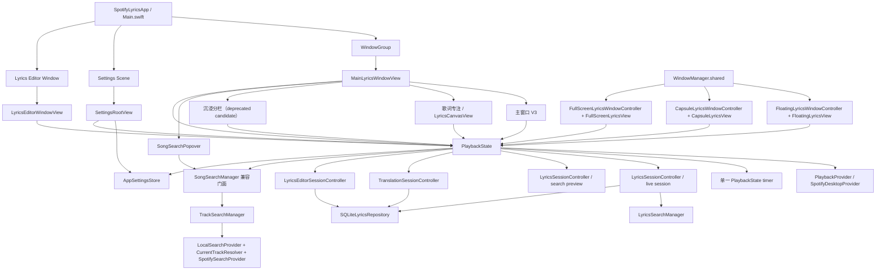

# Lyric-Island 第二阶段产品架构与统一 UI 总规划

> 审计日期：2026-08-01  
> 当前分支：`ui-redesign-phase-1`  
> 当前基线：`1ea554610084af867df41d6f10b0fd4ae76331f3`  
> 本文性质：只读产品架构与 UI 总规划，不是实现提交。

## 0. 审计边界与资料说明

本轮只读取当前仓库源码、Xcode target 配置和已有规划文档，未修改 Swift 业务源码、数据库或 UI，未构建，也未提交 commit。

用户指定的真实需求文件：

/Users/apple/backup/sptifylyrics/docs/product/Lyric-Island-第二阶段-产品功能与UI想法.md

本次读取时该绝对路径在当前工作区仍未出现，且没有发现同名替代文件。为避免再次自行归纳，本次修订严格采用用户消息中按原始编号列出的 12 项需求语义，并在第 8 节逐条标记；需求文件实际可见后只需做文本一致性复核，不得再用工程工作包替换它。

本规划的依据是：

1. 当前 HEAD 的真实源码；
2. UI_LAYOUT_AUDIT_PHASE2.md；
3. 已完成的窗口、歌词、翻译、编辑器和 v4 迁移规划；
4. 用户消息给出的真实 12 项需求原始编号和语义。

本轮仍不修改 Swift、数据库或 UI，不构建，也不提交 commit。

---

## 1. 当前真实产品架构

### 1.1 总体调用与状态路径

当前 App 的真实共享状态路径如下：



### 1.2 状态所有权

| 状态 | 当前唯一主要所有者 | 说明 |
|---|---|---|
| Spotify 当前曲、播放位置、播放状态 | `PlaybackState` | 由 `SpotifyDesktopProvider` 提供数据和播放控制；播放 tick 只有一个 `PlaybackState` timer。 |
| 当前正式歌词 | `LyricsSessionController` | `PlaybackState.liveLyrics`、`liveLyricsState`、`liveCurrentLineIndex` 是辅助窗口正式读取入口。 |
| 搜索预览歌词 | `PlaybackState.searchPreviewSession` | 只能在主窗口预览；不能泄露到浮动、胶囊或全屏。 |
| 当前翻译及翻译版本 | `TranslationSessionController` | 由 `PlaybackState` 转发操作；通过 source hash、行数和 identity 保护。 |
| 编辑草稿与版本保存 | `LyricsEditorSessionController` | 编辑器不直接执行 SQL，由 Repository 接口保存。 |
| 用户设置 | `AppSettingsStore` | UserDefaults 的单一边界；API Key 另存 Keychain。 |
| 窗口生命周期 | `WindowManager.shared` 和各自 WindowController | WindowManager 不拥有播放或歌词业务状态。 |
| 数据库与迁移 | `LyricsRepository` / `SQLiteLyricsRepository` / `DatabaseMigrator` | 当前正式数据库已经完成 redirect-first v4；第二阶段不得把 v4 重用为新业务迁移。 |

### 1.3 关键真实边界

当前代码已经区分：

- `state.liveLyrics`：当前正在播放歌曲的正式歌词；
- `state.lyrics`：为了搜索预览保留的兼容投影，可能来自 `searchPreviewSession`；
- `state.liveCurrentLineIndex`：正式共享当前行；
- `state.currentLineIndex` / `state.lyricsAreSynchronized`：旧主窗口渲染路径仍在使用的兼容属性。

浮动歌词、顶部胶囊、全屏歌词已经读取 live projection。**Apple Music Immersive V3 仍在 `AppleMusicImmersiveV3LyricsViewport` 中读取 `state.lyrics`、`state.lyricsState` 和旧的 current index。** 这会让搜索预览与主窗口 V3 的真实播放职责发生耦合，是第二阶段首先应修复的正确性问题，而不是重新创建另一套状态。

---

## 2. 界面逐项审计

### 2.1 主窗口：Apple Music Immersive V3

**入口**

- `/Users/apple/backup/sptifylyrics/SpotifyLyrics/Main.swift` 的 `WindowGroup`
- `/Users/apple/backup/sptifylyrics/SpotifyLyrics/Views/MainWindow/MainLyricsWindowView.swift`
- 当 `AppSettingsStore.mainWindowLayoutStyle == .appleMusicImmersiveV3` 时进入 `AppleMusicImmersiveV3WindowView`

**当前职责**

- 展示封面、歌曲元数据、播放控制、主歌词；
- 提供搜索、主窗口布局、歌词显示、Provider 状态、翻译和排轴入口；
- 作为用户执行歌词候选选择、编辑和人工恢复的主要工作区。

**当前读取的数据**

- `PlaybackState.currentTrack/currentTime/isPlaying/preferences`
- V3 歌词视图目前使用 `state.lyrics`、`state.lyricsState` 和旧同步属性；
- `AppSettingsStore.mainWindowLayoutStyle`
- `TranslationSessionController` 经 `PlaybackState` 暴露的版本和状态；
- `WindowManager` 的浮动窗口、胶囊和全屏可见性入口。

**当前可执行操作**

- 播放、暂停、上一首、下一首、seek；
- 搜索歌曲；
- 查看或加载搜索预览；
- 选择主窗口布局；
- 自动补全歌词、候选选择、手动创建/导入；
- 翻译、重新翻译、切换和锁定翻译；
- 自动排轴预览；
- 打开编辑器、设置、浮动歌词、顶部胶囊、全屏歌词。

**重复部分**

- 播放控制与胶囊、全屏有重复入口；
- 翻译、自动补全、排轴状态在歌词专注和 V3 中重复呈现；
- 窗口模式菜单在主窗口多个视图中重复；
- 搜索 popover 仍承担一部分授权状态展示；
- V3 自己有一套歌词滚动、current index 和行投影逻辑。

**当前问题**

1. V3 使用搜索兼容投影，不满足正式主窗口也完全 live-only 的最终边界。
2. V3 内部歌词行列表、Ruby、翻译、状态按钮与 `LyricsCanvasView` 有重复逻辑。
3. 状态面板、翻译工具、排轴工具在沉浸画布中仍可能占据较大空间。
4. V3 的 seek 和普通歌词点击需要继续统一到 PlaybackState 的显式操作语义。
5. 工具栏、窗口菜单、搜索、显示设置的入口层级尚未统一。

**响应式现状**

- V3 设计了宽窗口 45/55 分栏、紧凑分栏和堆叠布局；
- 主窗口最低约 800×600；
- 旧 token 的默认尺寸和 V3 内部尺寸仍同时存在；
- 当前没有统一的“完整沉浸 / 紧凑 / 歌词专注 / 最小可用”策略对象。

**可复用**

- `AppleMusicImmersiveV3BackdropView`
- `AppleMusicImmersiveV3BackdropCache`
- `ArtworkView`、`TrackMetadataView`、`PlaybackControlsView`
- `LyricLineView` 和 Ruby token layout
- `LyricsDesignTokens`、`BackdropPalette`
- live projection 和现有状态渲染组件

**处置**

- V3 视觉方向保留；
- 先修正其读取 live projection 和共享 current index；
- 不在第二阶段同时创造 V4；
- 内部重复的行渲染、状态和翻译操作逐步收敛到共享 projection/command API。

---

### 2.2 主窗口：歌词专注模式

**入口**

- `MainLyricsWindowView.layoutBody`
- `LyricsViewport` → `LyricsCanvasView`

**当前职责**

- 以歌词为主的主窗口布局；
- 显示同步、纯文本、loading、noMatch、failed、candidates、alignment 等状态；
- 承担手动歌词创建、TXT/LRC 导入、翻译操作和候选选择。

**数据与操作**

- 当前仍主要读取 `state.lyrics/state.lyricsState`；
- 通过 `PlaybackState` 执行 seek、翻译、重试、候选采用、编辑和排轴；
- 使用 `ManualLyricsActionsView`、`AlignmentPreviewView` 等现有组件。

**问题**

- 同一业务动作与 V3 重复；
- status/recovery 组件在不同布局中样式和尺寸不一致；
- 当前主窗口和辅助窗口对“纯文本不可伪同步”的边界已经不完全一致；
- 仍需要明确主窗口可以显示搜索预览，而辅助窗口只显示 live。

**处置**

- 保留为明确的“歌词专注”布局；
- 作为低宽度和纯阅读场景的稳定降级；
- 不与已弃用的沉浸分栏混合；
- 后续将共用 lyric state renderer 和操作命令，而不是删除整个布局。

---

### 2.3 主窗口：沉浸分栏旧模式

**文件**

`/Users/apple/backup/sptifylyrics/SpotifyLyrics/Views/MainWindow/ImmersiveSplitWindowView.swift`

**当前事实**

- 已进入 App target；
- 仍可由 `MainWindowLayoutStyle.immersiveSplit` 选择；
- 使用封面列、Divider、`LyricsViewport` 的旧分栏结构；
- 用户已经决定不再继续开发。

**处置**

- 标记为 **deprecated candidate**；
- 在第二阶段早期从推荐菜单和新用户默认路径隐藏，但不立即删除；
- 保留兼容读取既有 UserDefaults 值的能力；
- 等 V3 与歌词专注模式完成统一验收后，再单独删除或迁移旧布局值；
- 不把其组件作为新浮动或全屏 UI 模板。

---

### 2.4 搜索 popover

**文件**

- `/Users/apple/backup/sptifylyrics/SpotifyLyrics/Views/Components/SongSearchPopover.swift`
- `/Users/apple/backup/sptifylyrics/SpotifyLyrics/Search/SongSearchManager.swift`
- `/Users/apple/backup/sptifylyrics/SpotifyLyrics/Search/TrackSearchManager.swift`
- `/Users/apple/backup/sptifylyrics/SpotifyLyrics/Search/SpotifySearchProvider.swift`

**当前职责**

- 输入任意文本、Spotify URL、URI 或 Track ID；
- 通过 `TrackSearchManager` 调用本地索引、`CurrentTrackResolver` 和 Spotify 在线目录；
- 结果只携带歌曲 metadata，不携带歌词正文；
- 点击结果后交给 `PlaybackState.loadSearchResult`，进入独立搜索预览 session。

**当前可执行操作**

- 输入防抖、取消旧请求；
- 显示结果、无结果、错误和未授权；
- 在 Spotify 打开；
- 选择歌曲并查看歌词预览；
- 跳转设置进行授权。

**重复与问题**

- Spotify Web 授权状态同时出现在搜索 popover 和设置中心；
- popover 同时承载搜索、在线授权提示和歌词入口，产品职责略混；
- 搜索结果的“查看歌词”与“当前播放”边界需要更明确；
- 不应在这里直接执行 Provider HTTP 或 SQL；
- `SongSearchManager` 只是兼容门面，不应继续扩大职责。

**处置**

- 保留为轻量快速搜索入口；
- 未来可升级为独立搜索工作区，但不是第二阶段最先重做的窗口；
- 授权完整管理归设置中心，popover 只保留简短状态和设置跳转；
- 结果选择继续不改变 Spotify 播放位置。

---

### 2.5 歌词编辑器

**入口**

- `Main.swift` 的 `Window("歌词编辑", id: "lyrics-editor")`
- `/Users/apple/backup/sptifylyrics/SpotifyLyrics/Views/Editor/LyricsEditorWindowView.swift`

**当前职责**

- 编辑当前已采用歌词版本或创建人工版本；
- 逐行编辑原文、翻译和时间；
- 行拆分、合并、插入、删除、移动；
- 导入/导出 LRC、导入 TXT/粘贴；
- 重新生成读音、锁定读音；
- 保存人工版本和锁定版本；
- 试听和显式 seek。

**数据**

- `PlaybackState.lyricsEditorSession`
- `LyricsEditorSessionController`
- `LyricsEditingRepository`
- `LyricsSessionController` 的当前 source revision；
- 共享 `TranslationSessionController` 的翻译版本。

**问题**

- 顶部操作较密集，版本、翻译、导入导出和保存动作都集中在一行；
- 版本选择、翻译选择和播放试听的说明不够层次化；
- 需要继续强化“编辑 A 歌时切到 B 歌不能保存到 B”的状态提示；
- 编辑器应是版本写入唯一入口之一，不应让其他窗口直接改 SQLite。

**处置**

- 作为正式歌词内容工作台保留；
- 不把完整编辑器塞进 V3、浮动窗、胶囊或全屏；
- 后续只改善信息层级和共享命令，不重建第二套编辑模型。

---

### 2.6 设置窗口与设置 popover

**设置中心文件**

- `/Users/apple/backup/sptifylyrics/SpotifyLyrics/Views/Settings/SettingsRootView.swift`
- `/Users/apple/backup/sptifylyrics/SpotifyLyrics/Settings/AppSettingsStore.swift`
- `/Users/apple/backup/sptifylyrics/SpotifyLyrics/Settings/SettingsDataController.swift`

**当前职责**

- 原生 `Settings` Scene + `NavigationSplitView` Sidebar；
- 分类已有：通用、歌词显示、Spotify、歌词来源、数据与存储、AI、高级；
- 管理 UserDefaults、Spotify Client ID、Provider 顺序、AI 配置、窗口恢复和数据库操作；
- API Key 使用 Keychain，不进入 UserDefaults、日志或诊断。

**当前操作**

- 主窗口布局、连接 Spotify、自动搜索、置顶和恢复；
- 原文/翻译/罗马音、三种假名模式、字号和透明度；
- Spotify Desktop/Web 状态、Client ID、动态 loopback 地址说明、授权和断开；
- Provider 启用和顺序；
- SQLite 统计、备份、缓存清理和索引重建；
- AI Base URL、Model、目标语言、提示词、测试连接和 Keychain；
- 高级日志与诊断。

**设置 popover**

`/Users/apple/backup/sptifylyrics/SpotifyLyrics/Views/Components/LyricsPreferencesPopover.swift` 仍在 target 中，并提供语言层和浮动窗口入口，但当前源码搜索没有发现其被正式主路径调用；它是旧的兼容/实验入口。其说明仍存在“显示设置”和窗口开关混在一起的问题。

**处置**

- 设置中心是唯一的长期配置入口；
- `LyricsPreferencesPopover` 冻结为兼容源，后续确认无引用后删除；
- 主窗口只提供快捷显示菜单或 `SettingsLink`，不再维护另一套显示偏好；
- 所有设置继续通过同一个 `AppSettingsStore` 广播给 `PlaybackState` 和各窗口。

---

### 2.7 悬浮歌词

**文件**

- `/Users/apple/backup/sptifylyrics/SpotifyLyrics/Windows/FloatingLyricsWindowController.swift`
- `/Users/apple/backup/sptifylyrics/SpotifyLyrics/Windows/FloatingLyricsWindowPersistence.swift`
- `/Users/apple/backup/sptifylyrics/SpotifyLyrics/Views/Floating/FloatingLyricsView.swift`
- `/Users/apple/backup/sptifylyrics/SpotifyLyrics/Lyrics/FloatingLyricsPresentation.swift`

**当前职责**

- 桌面多行字幕；
- synchronized 时只投影当前行附近；
- plain/alignmentQueued/alignmentRunning 时显示纯文本/状态，不伪造同步；
- 支持 interactive、locked、passThrough；
- 支持透明度、位置、尺寸、屏幕回位和 App 菜单恢复穿透。

**数据**

- 使用 `state.liveLyrics`、`liveLyricsState`、`liveLyricsAreSynchronized`、`liveCurrentLineIndex` 和 `state.preferences`；
- 不使用搜索预览；
- 不创建播放器计时器或歌词缓存。

**重复部分**

- 播放状态和歌词层显示与主窗口/全屏重复；
- 但多行桌面字幕这一职责是独立且合理的；
- 当前与胶囊的“展开多行”存在产品重叠。

**处置**

- 保留为独立窗口；
- 第二阶段只做职责收敛、可用性和共享投影，不重做其视觉；
- 多行歌词应只在此窗口和全屏主画布出现。

---

### 2.8 顶部胶囊

**文件**

- `/Users/apple/backup/sptifylyrics/SpotifyLyrics/Windows/CapsuleLyricsWindowController.swift`
- `/Users/apple/backup/sptifylyrics/SpotifyLyrics/Windows/CapsuleLyricsWindowPersistence.swift`
- `/Users/apple/backup/sptifylyrics/SpotifyLyrics/Views/Capsule/CapsuleLyricsView.swift`
- `/Users/apple/backup/sptifylyrics/SpotifyLyrics/Lyrics/CapsuleLyricsPresentation.swift`

**当前职责**

- collapsed：歌曲信息、封面、播放状态和最多一行歌词；
- hover：轻量播放控制和短句；
- expanded：更多播放信息、显式 seek、跳转主窗口/浮动窗/编辑器；
- 位置固定在目标屏幕顶部，只有 expanded 允许水平拖动；
- 外部点击收起，恢复状态和屏幕身份持久化。

**数据**

- 同样使用 live projection、共享 preferences 和 `PlaybackState` 播放命令；
- `CapsuleLyricsPresentation` 明确阻止纯文本/排轴中/候选/无歌词状态显示第一行作为当前句。

**当前问题**

- 当前 expanded 仍显示当前行和下一行，和浮动歌词多行职责发生重叠；
- 胶囊应更明确地定位为“歌曲状态和控制”，而不是第二个歌词窗；
- 胶囊窗口和浮动窗口虽然共用 WindowManager，但需要保持独立 frame key、visibility 和 screen observer。

**处置**

- 保留独立窗口；
- 将多行歌词职责归还浮动歌词/全屏；
- 胶囊 expanded 只保留一行当前歌词、播放控制和快捷入口，是否保留“下一行”需要产品确认；本规划推荐不保留。

---

### 2.9 全屏歌词

**文件**

- `/Users/apple/backup/sptifylyrics/SpotifyLyrics/Windows/FullScreenLyricsWindowController.swift`
- `/Users/apple/backup/sptifylyrics/SpotifyLyrics/Views/Fullscreen/FullScreenLyricsView.swift`
- `/Users/apple/backup/sptifylyrics/SpotifyLyrics/Lyrics/FullScreenLyricsPresentation.swift`

**当前职责**

- 独立无边框 NSPanel 覆盖目标屏幕；
- 复用 V3 backdrop cache、ArtworkView、LyricLineView；
- synchronized 使用 live current index 和有限 projection；
- plain text 显示全文和“未排轴”；
- Esc、控件隐藏、显式 seek、播放控制；
- 全屏期间由 WindowManager 暂时隐藏之前可见的胶囊/悬浮歌词，退出时按快照恢复。

**处置**

- 作为全屏专注阅读窗口保留；
- 不增加版本选择、候选管理或复杂编辑；
- 不与系统全屏路径混用；
- 未来只做统一状态、快捷键、辅助窗口协同和可读性校准。

---

### 2.10 WindowManager

**文件**

`/Users/apple/backup/sptifylyrics/SpotifyLyrics/Windows/WindowManager.swift`

**当前职责**

- 懒创建并保留一个 Floating、一个 Capsule、一个 Fullscreen controller；
- 统一显示/隐藏/恢复入口；
- 处理全屏期间辅助窗口可见性快照；
- 处理悬浮窗穿透恢复。

**不应承担**

- 播放轮询；
- 歌词搜索；
- 翻译状态；
- SQL；
- 窗口以外的业务决策。

**当前问题**

- 主窗口由 SwiftUI WindowGroup 管理，辅助窗口由 WindowManager 管理，生命周期边界需要在文档和合同中固定；
- 主窗口菜单、V3 菜单和命令菜单存在重复入口；
- 未来应由 WindowManager 提供稳定 façade，各 View 只调用 façade，不直接创建 NSPanel。

---

### 2.11 PlaybackState、LyricsSession、TranslationSession 和 AppSettingsStore

**PlaybackState**

- 当前真实核心编排器；
- 拥有一个播放器 provider、一个 0.2 秒播放 tick、live session、preview session、translation session、editor session 和 track search 门面；
- 负责切歌、连接恢复、播放控制、seek、状态投影和任务取消；
- 仍存在兼容的 `state.lyrics`/preview 属性，第二阶段必须明确 live-only 读取边界。

**LyricsSessionController**

- 负责当前歌词 session 生命周期、Provider 链、SQLite 恢复、取消、revision、source hash、alignment 状态；
- 不应被窗口直接构造；
- 候选采用、人工版本采用和重试均应通过 PlaybackState 转发。

**TranslationSessionController**

- 负责同一歌词版本的翻译版本加载、选择、重新翻译、锁定、删除、source hash 校验和任务合并；
- 各窗口只读其 projection 或调用 PlaybackState command；
- 不允许每个窗口创建自己的 controller。

**AppSettingsStore**

- 当前是单一 UserDefaults 边界；
- 已有 display/provider/AI/window/Spotify 相关 key；
- 新增设置应先进入此 store 的领域分组，不得在 View 中直接 `UserDefaults.standard`；
- 数据库、token、API key 等不应混入显示偏好。

---

## 3. 胶囊与悬浮歌词：产品体验、代码风险与第三种方案

### 3.1 三种方案

| 方案 | 产品形态 | 用户看到的关系 | 主要优点 | 主要风险 |
|---|---|---|---|---|
| A：合并自适应窗口 | 一个窗口从 collapsed 胶囊、hover 控制、expanded 多行歌词切换 | 一个“浮动歌词”入口 | 最容易理解，不会出现两个看起来相同的窗口 | 顶部锚定、自由移动、穿透、锁定和多行阅读被迫共用一个生命周期；状态和 frame 复杂 |
| B：两个独立窗口 | 胶囊负责歌曲状态/控制；悬浮歌词负责多行桌面字幕 | 两个独立工具 | 多行字幕和顶部控制各自清晰；当前两个 controller 保留率最高 | 如果文案、图标和内容边界做不好，用户会认为是同一功能的一大一小两个版本 |
| C：统一浮动系统、两个表面 | 一个“浮动系统”入口，内部可唤出胶囊控制中心和独立字幕层 | 一个产品概念、两个可见表面 | 兼顾发现性、独立生命周期和不同交互语义；可同时使用 | 需要 WindowManager 提供统一编排，不能让两个窗口互相复制状态或抢持久化 |

### 3.2 只从产品体验判断

如果完全不考虑当前实现：

- A 最适合希望“只有一个浮动窗口”的用户：展开就是更多内容，心智模型最短。
- B 最适合明确需要桌面字幕和播放控制分离的高级用户，但单独暴露两个按钮会增加理解成本。
- C 最适合本产品当前的目标：用户只理解一个“浮动系统”，默认先看到胶囊；需要多行歌词时由胶囊唤出字幕层。字幕层仍是独立窗口，避免把自由桌面字幕强行塞进顶部控件的状态机。

因此，产品体验最佳方案推荐 C。C 不是把两个窗口做成同一个 panel，而是把它们组织为一个有明确入口和分工的浮动系统：

- 胶囊：歌曲、播放控制、最多一行当前歌词；
- 字幕层：多行同步/纯文本歌词、锁定、鼠标穿透和自由位置；
- WindowManager：统一显示、隐藏、唤出和全屏临时隐藏编排；
- 两个 controller：独立生命周期、frame、screen ID、visibility 和交互状态。

### 3.3 只从当前代码判断

最低风险方案是 B 的底层实现。

当前已经存在并进入 App target：

- CapsuleLyricsWindowController / Persistence / View / Presentation；
- FloatingLyricsWindowController / Persistence / View / Presentation；
- WindowManager.shared；
- live-only projection 和三种浮动交互状态。

如果直接选择 A，需要保留和迁移：

1. PlaybackState、live projection、TranslationSessionController、AppSettingsStore；
2. LyricLineView、ArtworkView、背景缓存和状态 projection；
3. CapsuleLyricsPresentation、FloatingLyricsPresentation 中可复用的纯值投影逻辑；
4. 两个 Persistence 中的 screen clamp、safe area 和可见区域计算。

同时需要新建一个统一的自适应 WindowController，把两套 panel 的顶部锚定与自由拖动、collapsed/hover/expanded 状态、鼠标穿透与可编辑、frame/screen ID/visibility、外部点击与控制显隐合并成一套状态机。现有两个 controller 不能原样并存为正式入口，迁移风险高。

如果选择 B，必须用产品规则避免“大窗口/小窗口”的重复感：

- 菜单分组名称使用“播放胶囊”和“桌面歌词”，不使用两个相似的“悬浮歌词”；
- 胶囊 collapsed、hover、expanded 始终最多显示一行歌词，expanded 只增加播放控制和入口；
- 多行歌词、自由位置、锁定和鼠标穿透只属于桌面歌词；
- 胶囊的主动作是播放控制，桌面歌词的主动作是阅读；
- 胶囊按钮明确写“打开桌面歌词”，桌面歌词不再显示播放控制面板；
- 两者共享同一 live session，但不能共享 frame key、visibility key 或局部状态；
- 全屏期间由 WindowManager 以“浮动系统”快照统一临时隐藏和恢复。

### 3.4 推荐落地方式

第二阶段采用 C 的产品概念 + B 的代码实现：

1. 先保留两个正式 NSPanel controller，不合并窗口；
2. 由 WindowManager 提供统一的浮动系统 façade 和入口文案；
3. 先把胶囊收敛为控制中心，把多行歌词从胶囊 expanded 中移出；
4. 胶囊可以一键唤出/隐藏桌面歌词；
5. 桌面歌词继续独立支持锁定、穿透、位置和尺寸；
6. 经过真实使用反馈后，再决定是否把 A 作为实验性单窗口模式。

这样既不因为已有代码而假定 B 是最佳产品，也不在尚未验证用户理解前重写两个已完成的窗口生命周期。

## 4. 统一窗口职责与操作归属

| 界面 | 唯一职责 | 允许的操作 | 明确不负责 |
|---|---|---|---|
| 主窗口 | 当前歌曲的主要浏览、歌词阅读和工作流入口 | 搜索、候选选择、歌词来源/版本操作、翻译、编辑器入口、排轴入口、播放控制 | 不直接 SQL/HTTP，不创建第二个 session |
| 浮动歌词 | 桌面多行歌词展示 | 浏览、锁定、穿透、显示层切换的快捷入口 | 不搜索、不选候选、不编辑正文、不管理翻译版本 |
| 顶部胶囊 | 紧凑歌曲状态与播放控制 | 播放控制、显式 seek、查看主窗口/浮动窗/编辑器入口、最多一行歌词 | 不展示多行歌词、不管理候选和版本 |
| 全屏歌词 | 全屏沉浸阅读 | 阅读、有限播放控制、显式 seek、Esc、打开主窗口 | 不编辑、不选候选、不管理 Provider |
| 搜索 | 歌曲 metadata 目录搜索和选择 | 文本/URL 搜索、结果选择、在 Spotify 打开、进入歌词预览 | 不抓歌词正文、不改播放位置、不管理 OAuth 全部流程 |
| 编辑器 | 歌词和翻译版本编辑/导入导出 | 逐行编辑、拆分合并、时间、读音、LRC/TXT、保存锁定 | 不搜索在线目录、不直接改变当前 Spotify 曲 |
| 设置中心 | 持久化配置、账号、Provider、AI、数据和窗口行为 | 修改设置、授权、备份、诊断、Provider 顺序 | 不承载当前歌曲的临时版本选择，不执行歌词编辑 |
| WindowManager | 辅助窗口生命周期编排 | 显示/隐藏/恢复/屏幕回位/全屏辅助窗口快照 | 不持有业务数据和业务状态 |

### 4.1 统一命令边界

所有窗口按钮必须调用 `PlaybackState` 或 `WindowManager` 的公开 command：

- 播放/暂停/上一首/下一首/seek：`PlaybackState`
- 当前歌词重试、候选采用、版本恢复、翻译：`PlaybackState` → session controller
- 打开/关闭/模式：`WindowManager`
- 编辑保存：`LyricsEditorSessionController` → Repository
- 设置：`AppSettingsStore`

任何 View 不得自己创建：

- `Timer`
- `LyricsSessionController`
- `TranslationSessionController`
- Provider
- Repository SQL 连接
- 独立 UserDefaults key

---

## 5. 设置中心与当前歌曲就地操作

### 5.1 两层信息架构

#### 独立设置中心：长期、全局、跨歌曲

保留 `SettingsRootView` Sidebar，建议分组为：

1. **通用**
   - 主窗口布局和响应式策略；
   - 启动连接、切歌自动搜索；
   - 恢复窗口状态、主窗口置顶；
   - 辅助窗口恢复策略。
2. **歌词显示**
   - 原文、翻译、罗马音；
   - 假名模式；
   - 字号、Ruby、辅助透明度；
   - 远处辅助层显示。
3. **Spotify**
   - Desktop 状态；
   - Web OAuth、Client ID、授权/断开；
   - Dashboard 回环地址和当前动态监听地址。
4. **歌词来源**
   - Provider 启用、顺序、实验状态和说明。
5. **AI 与提示词**
   - Base URL、Model、目标语言、风格、temperature、timeout；
   - API Key 的 Keychain 管理；
   - 提示词预设的保存、选择和测试。
6. **数据与存储**
   - 数据库路径、schema、统计、备份、导入导出；
   - 本地索引；
   - sidecar/provenance 状态。
7. **同步与排轴**
   - 本地音频预检策略；
   - 对齐引擎版本和低置信行为；
   - 仅配置，不把任务操作塞进设置。
8. **快捷键与窗口行为**
   - 胶囊、浮动、全屏快捷键；
   - 穿透恢复；
   - 屏幕和恢复规则。
9. **高级**
   - 日志目录、脱敏诊断、Build/schema 信息；
   - 开发/实验能力明确隔离。

现有 Settings V1 已经覆盖其中大部分，但 AI、提示词预设、同步、快捷键和窗口行为仍需要分组整理；这不是本轮实现。

#### 当前歌曲就地操作：短期、针对当前 session

在主窗口歌词工具菜单或当前歌曲上下文菜单中提供：

- 当前 LyricsVersion；
- 当前 TranslationVersion；
- 没有版本时的粘贴、TXT、LRC、创建；
- 显示原文/翻译/假名/罗马音；
- 编辑；
- 重新搜索；
- 翻译/重新翻译/切换翻译；
- 自动排轴；
- 单曲偏移；
- 恢复 Provider 原版或人工锁定版。

这些操作只调用 `PlaybackState` 和 session controller：

```
就地菜单
  -> PlaybackState command
  -> LyricsSessionController / TranslationSessionController / EditorSession
  -> Repository
  -> shared objectWillChange
  -> 主窗口、浮动、胶囊、全屏统一刷新
```

就地菜单不写 UserDefaults，不执行 SQL，不创建局部翻译 controller。

### 5.2 单一设置存储规则

当前可复用的 key 边界：

- `AppSettingsStore.Key.display.*`：所有显示层；
- `AppSettingsStore.Key.general.*`：启动、窗口和播放行为；
- `AppSettingsStore.Key.lyrics.providers.*`：来源；
- `AppSettingsStore.Key.ai.*`：AI 配置；
- Spotify Client ID 可在设置 store，token 仅 Keychain；
- 窗口 frame/screen ID 继续由对应 persistence 使用已有 key。

第二阶段不允许：

- 在 View 中新增 `@AppStorage` 作为另一份真相；
- 为胶囊、浮动、全屏各自存一份语言层设置；
- 把当前歌曲版本选择写成全局 UserDefaults；
- 把 API Key 或 token 写 SQLite。

---

## 6. 主窗口响应式布局

### 6.1 三层自动布局

主窗口保留“用户选择的布局家族”，在布局家族内部自动响应 Geometry：

| 条件 | 模式 | 处理 |
|---|---|---|
| 宽窗口，建议宽度 ≥ 1080 | 完整沉浸 | V3 45/55，封面和歌词均完整显示，工具栏轻量显示。 |
| 中等窗口，约 800–1079 | 紧凑 | 减小封面、压缩边距和字号，保留播放控制、当前歌词和必要工具。 |
| 最小可用，约 800×600 | 受限 | 优先保证歌词可读；隐藏次要元数据、装饰和非必要按钮。 |
| 用户主动选择歌词专注 | 歌词专注 | 使用 `LyricsCanvasView`，歌词是主内容，封面/工具收缩到状态入口。 |
| 沉浸分栏 | 兼容 | 不再作为推荐项，后续隐藏。 |

当前 V3 已有宽/紧凑/堆叠分支，下一阶段应把阈值和 token 统一；不能让每个窗口各自定义一套断点。

### 6.2 是否允许关闭自动响应

推荐：

- 不新增“关闭所有自动响应”的设置；
- 保留现有 `mainWindowLayoutStyle` 作为用户对布局家族的选择；
- V3 在家族内部自动进入紧凑/堆叠；
- 歌词专注作为明确的手动模式；
- 如果用户确实需要固定视觉尺寸，后续只增加一个“响应式布局：自动/固定”设置，不在第二阶段第一批引入。

状态持久化：

- 持久化用户选择的布局家族；
- 不持久化每次窗口缩放产生的临时子模式；
- 不因调整窗口尺寸重置歌词 session、翻译选择或播放位置；
- 浮动歌词、胶囊和全屏属于独立窗口，不随主窗口布局自动互相切换。

---

## 7. 统一设计系统规划

### 7.1 当前已有资产

| 领域 | 当前实现 | 结论 |
|---|---|---|
| Design Tokens | `LyricsDesignTokens.swift` | 已有颜色、圆角、间距、字体和 lyric emphasis，但 V3 仍有局部硬编码；需要统一语义 token。 |
| 字体 | SwiftUI system rounded、monospaced time | 可保留；主歌词、Ruby、辅助文本需要统一层级。 |
| 圆角 | 20、12、10 等多处局部值 | 需要收敛为 surface/control/capsule 三档，而不是强行全部同值。 |
| 材质 | ultraThinMaterial、透明背景、局部 control background | 设置/编辑器可用材质；沉浸画布避免大灰色面板。 |
| 背景 | `BackdropPalette`、`AppleMusicImmersiveV3BackdropCache` | 复用；key 只依赖 TrackIdentity/artwork，不依赖播放位置。 |
| 动画 | easeInOut、0.18–0.42 秒、有限 Task | 统一为无回弹、短、可取消的 transition。 |
| SF Symbols | 各 View 已使用 | 建立语义表：播放、窗口、来源、编辑、同步、状态。 |
| 空状态/错误 | `LyricsLoadState` 和多个 StatusView | 统一文案、图标、严重等级和操作。 |
| 歌词渲染 | `LyricLineView`、RubyTokenFlowLayout | 作为唯一共享行渲染器；不在新窗口复制 Ruby/翻译排版。 |

### 7.2 建议语义系统

后续实现前先建立设计系统契约，而不是先改颜色：

- **Surface**：canvas、material、control、controlProminent、danger；
- **Text**：primary、secondary、muted、status；
- **Spacing**：4/8/12/16/24/32；
- **Radius**：control、surface、window；
- **Typography**：lyricPrimary、lyricRuby、lyricAssistant、metadata、status、caption；
- **Motion**：stateChange、windowReveal、backgroundCrossfade、controlsFade；
- **Backdrop**：palette、artwork snapshot、readability veil、vignette/noise；
- **Status**：loading、synced、plain、candidate、failed、disconnected；
- **Accessibility**：每个图标按钮要有 label，每个状态要有可读文案，低对比度不能只靠颜色。

### 7.3 视觉原则

- Apple Music 式沉浸感只作为方向，不逐像素复制；
- 画布优先，面板仅用于确实需要编辑/选择的工作流；
- 主歌词、Ruby、罗马音、翻译按层级排列，不固定 36/24；
- 当前行以清晰度、字重和少量透明度建立焦点，邻近行不粗暴模糊；
- 背景取色和封面预处理异步缓存；
- 不使用大块灰色半透明调试面板；
- 空状态是可执行的恢复入口，不展示诊断日志全文；
- 同一语义在主窗口、浮动、胶囊、全屏使用同一 token 和文案。

---

## 8. 真实需求文件中的 12 项需求

> 以下严格按用户给出的真实需求文件原始编号和语义整理。它们不是工程工作包，也不能被之前的“12 项工作包”替代。

### 8.1 需求 1：男女声 / 多角色歌词显示区别

- **用户原始目标**：歌词能够区分男女声或多个角色/演唱者，让用户知道当前行由谁演唱。
- **当前是否部分实现**：未实现。当前歌词行只有原文、翻译、kana、romaji、时间和 Ruby token，没有 speaker/role/voice 字段。
- **相关源码和状态**：Models/Models.swift 的 LyricLine；Lyrics/LyricsModels.swift 的 LyricsDocument；Persistence/DatabaseModels.swift 的 LyricLineRecord；Views/Components/LyricLineView.swift 不读取角色信息；各 Provider 没有统一角色标注契约。
- **产品未决问题**：角色来自 Provider、用户手工标注、AI 辅助还是音频分析；“男声/女声”是否只是显示标签还是需要颜色/头像；未知角色是否显示中性样式；一行多人合唱如何表示。
- **技术依赖**：新增逐行 speaker/role annotation 模型；编辑器编辑入口；Provider/导入格式映射；LyricLineView 和所有 projection 的渲染；AI 标注必须可审查、可撤销。
- **数据库 migration**：需要。建议新建独立 line annotation/role 表或版本化字段，另开 migration，不修改 Track Identity v4，不把角色信息塞入 originalText。
- **系统权限**：基础人工标注不需要；若使用本地音频分析，沿用用户主动选择文件的权限边界。
- **对 Playback/Lyrics/Translation 影响**：高。角色属于歌词版本/行层，必须随 sourceContentHash 和版本一起读取；不能改变播放时间和翻译行映射。
- **风险**：高。错误标注会误导用户，性别推断有隐私和偏见风险。
- **推荐阶段**：Phase 2.8，先做明确来源的角色标签，再评估音频/AI 辅助。
- **验收标准**：有可靠角色证据的行显示稳定标签/样式；未知行保持中性；重复切歌、版本切换、翻译切换不串角色；锁定后不会被自动标注覆盖。
- **不应修改的边界**：不得根据艺人姓名、头像或歌词语气猜测性别；不得修改原文、时间轴、kana、romaji；不得把未经确认的 AI 推断自动显示为事实。

### 8.2 需求 2：日语假名和罗马音只对日语歌词显示

- **用户原始目标**：中文、英语等非日语歌词不显示日语假名和罗马音；日语歌词继续显示现有独立层。
- **当前是否部分实现**：部分实现。已有 JapaneseReadingPipeline、JapaneseKanaGenerator、JapaneseRomanizer、DisplayPreferences 和 LyricLineView，但渲染层主要依据 line.kanaText/romajiText 和开关，没有统一的歌词语言 gate。
- **相关源码和状态**：Lyrics/JapaneseReadingPipeline.swift；Lyrics/JapaneseKanaGenerator.swift；Lyrics/JapaneseRomanizer.swift；Models/Models.swift 的 DisplayPreferences；Views/Components/LyricLineView.swift；Persistence/DatabaseModels.swift 的 LyricsVersionRecord.language；TrackMetadata.swift 的 ScriptDetector。
- **产品未决问题**：混合语言歌曲如何处理；包含日文艺人名但英文歌词是否显示；用户是否可以对单首歌曲强制开启；片假名原文是否仍显示平假名辅助层；language=und 时是否 fail-closed。
- **技术依赖**：以 LyricsVersion.language、原文脚本检测和 Provider 语言声明组成确定性 gate；读音生成和显示共用 gate；所有窗口共用 DisplayPreferences，不复制状态。
- **数据库 migration**：基础修复不需要。只有未来要持久化逐行语言/用户 override 才另开 migration。
- **系统权限**：不需要。
- **对 Playback/Lyrics/Translation 影响**：中高。需要防止错误辅助层投影，但不能清空已保存的原文/读音层。
- **风险**：中。语言误判会让读音消失或错误显示，未知语言必须宁可不显示。
- **推荐阶段**：Phase 2.1。
- **验收标准**：中文、英文、韩文和纯音乐歌词不显示 kana/romaji；日语歌词显示并尊重三种假名模式；混合行按明确规则处理；切换窗口仍一致；旧版本重启不出现错误读音。
- **不应修改的边界**：本阶段不重写日语词典/形态分析，不把罗马音重新从汉字猜测生成，不改变原始歌词正文。

### 8.3 需求 3：两种设置与操作模式

- **用户原始目标**：把长期全局设置与当前歌曲的即时操作区分开，同时保持操作结果作用于同一业务状态。
- **当前是否部分实现**：部分实现。已有 Sidebar SettingsRootView/AppSettingsStore，也有主窗口的翻译、重试、导入、排轴和窗口菜单，但入口仍分散；旧 LyricsPreferencesPopover 仍在 target 中。
- **相关源码和状态**：Settings/AppSettingsStore.swift；Views/Settings/SettingsRootView.swift；Views/Components/LyricsPreferencesPopover.swift；MainLyricsWindowView.swift；PlaybackState.swift。
- **产品未决问题**：哪些操作必须就地可见；哪些只在设置中心出现；当前歌曲版本/翻译版本是否允许在胶囊和浮动窗中快捷切换；设置窗口是否允许同时打开编辑器。
- **技术依赖**：统一 command façade；AppSettingsStore 作为唯一 UserDefaults 边界；PlaybackState → LyricsSessionController/TranslationSessionController；WindowManager 只管窗口。
- **数据库 migration**：不需要。若设置 key 改名，使用 settings version，不使用 SQLite migration。
- **系统权限**：不需要；Spotify OAuth 和 Keychain 继续使用现有边界。
- **对 Playback/Lyrics/Translation 影响**：高。重复入口必须调用同一 command，不能各自创建 session 或直接 SQL。
- **风险**：中。
- **推荐阶段**：Phase 2.0 先冻结边界，Phase 2.4 整理 UI。
- **验收标准**：设置中心改显示/Provider/AI/窗口行为后所有窗口即时更新；当前歌曲的版本、翻译、重试、排轴只通过共享状态变化；旧 popover 不再作为第二真相；重启后全局设置保留、当前歌曲临时选择不被错误写入全局。
- **不应修改的边界**：不得创建第二套 UserDefaults、第二个 TranslationSessionController 或 View 私有设置。

### 8.4 需求 4：歌词 / 翻译版本允许“不选择任何版本”

- **用户原始目标**：用户可以明确选择“无歌词版本”或“无翻译版本”，而不是被系统强制采用某个最新版本。
- **当前是否部分实现**：部分实现。TranslationSessionController 的 selectedVersion 可为空，但 UI主要提供已有版本选择；LyricsSessionController 有 activeLyricsVersionID 可为空，但没有明确的“取消当前歌词版本”产品操作。
- **相关源码和状态**：Services/LyricsSessionController.swift；Services/TranslationSessionController.swift；Services/PlaybackState.swift；Views/Components/LyricsCanvasView.swift；Views/MainWindow/AppleMusicImmersiveV3WindowView.swift；Persistence/LyricsRepository.swift。
- **产品未决问题**：选择“无歌词”后是否停止自动 Provider 重试；无歌词是否只清空当前显示还是创建一个本地选择记录；“无翻译版本”与设置中隐藏翻译是否必须完全区分；重启是否恢复“无”选择。
- **技术依赖**：增加显式 selection state；区分 noSelection、noMatch、failed、hidden；版本选择命令要通过 session/repository；投影层需支持 original-only 和 empty lyric surface。
- **数据库 migration**：运行时支持不需要；若要跨重启保存每首歌曲的“无选择”偏好，需独立 selection 表或 migration，不能把空 UUID 当特殊值。
- **系统权限**：不需要。
- **对 Playback/Lyrics/Translation 影响**：高。清空显示不能清空或删除锁定版本，不能让旧网络结果重新覆盖用户的“无”选择。
- **风险**：高。很容易把“没有歌词”“用户不选择”“隐藏翻译”混成一个状态。
- **推荐阶段**：Phase 2.1。
- **验收标准**：歌词版本菜单可选“无”；选择后不显示旧正文、不触发隐式采用；翻译版本可独立选“无”；重新打开窗口状态一致；显式重新搜索/恢复版本才重新采用；锁定版本仍保留。
- **不应修改的边界**：不得删除 SQLite 版本、不得把空白版本当成 noMatch、不得影响 Spotify 播放位置和当前 TrackIdentity。

### 8.5 需求 5：AI 上游模型列表与提示词预设

- **用户原始目标**：用户可以查看/选择 AI 上游模型，并使用可复用的翻译提示词预设。
- **当前是否部分实现**：部分实现。AI V1 支持 OpenAI-compatible Base URL、手填 Model、目标语言、style、custom prompt、temperature 和 timeout；没有模型列表同步，也没有正式的 preset 管理。
- **相关源码和状态**：AI/AITranslationConfiguration.swift；AI/OpenAICompatibleClient.swift；AI/AITranslationPromptBuilder.swift；Services/TranslationSessionController.swift；Views/Settings/SettingsRootView.swift。
- **产品未决问题**：模型列表来自上游 endpoint、用户手工输入还是本地清单；不同 Base URL 的模型能力如何展示；预设是否只保存 prompt，还是同时保存目标语言/style/temperature；模型下线如何处理。
- **技术依赖**：兼容 endpoint 的 models 读取适配；模型列表缓存和失败隔离；PromptPreset 数据模型；Keychain API Key 访问；TranslationSession 仍负责任务合并、取消和严格逐行校验。
- **数据库 migration**：基础 preset 不需要，优先 UserDefaults 或独立配置文件；若将预设快照与 TranslationVersion 建立追溯关系，再设计独立 translation migration。
- **系统权限**：网络访问和现有 Keychain；不新增系统权限。
- **对 Playback/Lyrics/Translation 影响**：高。更换模型/预设只影响新翻译；不能覆盖锁定翻译、原文、读音或时间轴。
- **风险**：高。模型列表和自定义反代接口能力不一致，且提示词可能包含敏感内容。
- **推荐阶段**：Phase 2.5。
- **验收标准**：不同 Base URL 不会重复拼接 endpoint；模型列表失败不影响手动 Model；预设可保存、编辑、复制和删除；翻译请求记录 model/host/prompt hash，不记录 API Key/整首歌词全文；重新翻译生成新版本。
- **不应修改的边界**：不把完整 prompt/API Key/响应写入日志或数据库；AI 不得修改 original/kana/romaji/timing。

### 8.6 需求 6：听歌历史、播放百分比与统计

- **用户原始目标**：记录真实播放历史、歌曲完成百分比和可读统计。
- **当前是否部分实现**：未实现正式历史。PlaybackState 有 currentTime、duration、isPlaying 和切歌事件基础；SQLite 有 Track 元数据，但没有播放事件/历史表和统计 UI。
- **相关源码和状态**：Services/PlaybackState.swift；Providers/PlaybackProvider.swift；Persistence/SQLiteLyricsRepository.swift；Settings/SettingsDataController.swift；当前没有 HistoryRepository。
- **产品未决问题**：一次播放何时计入；暂停是否累计；百分比按自然播放还是 seek 后有效播放；是否记录搜索预览、Mock、无歌词和重复循环；统计按日/周/歌曲/艺人还是只做最近列表。
- **技术依赖**：从现有 PlaybackState transition/tick 派生事件，不能增加第二个 polling timer；去重、seek 处理、崩溃恢复、隐私清理；统计查询放后台。
- **数据库 migration**：需要独立 history migration，建议 v5；不改 v4 redirect、LyricsVersion 或 TranslationVersion。
- **系统权限**：不需要。
- **对 Playback/Lyrics/Translation 影响**：中。历史只读当前播放事件，不改变歌词 session；必须排除 search preview。
- **风险**：中高。百分比口径和隐私预期容易不一致，频繁写库可能影响性能。
- **推荐阶段**：Phase 2.6。
- **验收标准**：真实播放 A→B 产生正确顺序；seek 不伪造完成度；搜索预览不进入历史；统计与数据库查询一致；清除历史有确认；关闭历史记录不影响歌词和播放。
- **不应修改的边界**：不接 Spotify 账号完整历史 API，不把播放历史当作 Spotify 云端同步，不新增播放器轮询。

### 8.7 需求 7：自己的翻译曲库与同步

- **用户原始目标**：建立属于用户自己的翻译曲库，并在设备间或指定存储之间同步。
- **当前是否部分实现**：部分实现。TranslationVersion/TranslationLine、AI 翻译、人工编辑、SQLite 保存、LRC/TXT 导入导出已经存在；没有个人曲库工作区、同步账户、冲突合并或远端备份。
- **相关源码和状态**：Persistence/TranslationRepository.swift；Persistence/SQLiteLyricsRepository.swift；Services/TranslationSessionController.swift；Services/LyricsEditorSessionController.swift；Editor/LRCImportExport.swift；当前没有 sync service。
- **产品未决问题**：私人本机、私人云端还是公开社区；同步哪些层（原文、翻译、读音、时间轴、角色）；冲突以版本、锁定、时间还是人工选择解决；是否允许公开分享。
- **技术依赖**：稳定 TrackIdentity/redirect；sourceContentHash；TranslationVersion parent/lock；增量同步协议、冲突 UI、加密和导入导出。
- **数据库 migration**：需要。建议在 Phase 2.7 另开 v6+ 或独立 sync metadata migration，不触碰 v4。
- **系统权限**：本机导入导出使用用户选择的文件；云同步需要网络、Keychain 账号凭据；不默认申请额外权限。
- **对 Playback/Lyrics/Translation 影响**：高。同步结果必须经过当前 track、source hash、行集合和锁定版本校验，不能迟到覆盖当前 session。
- **风险**：高。隐私、冲突、数据丢失、版权和云端服务成本都需要先决定。
- **推荐阶段**：Phase 2.7；Phase 2.5 只准备个人风格配置。
- **验收标准**：本地版本可导出/导入且 UUID/parent/hash 可追溯；同步冲突不静默覆盖 locked/manual 版本；离线可用；失败可重试；主窗口和辅助窗口始终显示同一选定版本。
- **不应修改的边界**：本阶段不默认公开社区、不接未授权歌词分享、不把同步实现成 Provider、不删除本地原始版本。

### 8.8 需求 8：左侧歌词进度视觉优化

- **用户原始目标**：优化主窗口左侧播放器/歌词进度的视觉表达，使歌曲进度、歌词状态和当前播放位置更易读。
- **当前是否部分实现**：部分实现。V3 已有左侧封面、TrackMetadata、TransportControls 和 Slider；PlaybackState 已提供 currentTime/duration；但还没有独立且统一的“歌词进度”视觉 token/投影。
- **相关源码和状态**：Views/MainWindow/AppleMusicImmersiveV3WindowView.swift；Views/Components/PlaybackControlsView.swift；Lyrics/FullScreenLyricsPresentation.swift；Design/LyricsDesignTokens.swift；PlaybackState.currentTime。
- **产品未决问题**：要优化的是歌曲进度条、当前歌词行进度、未排轴状态还是三者组合；是否显示已完成百分比；是否在纯文本时隐藏歌词进度，避免伪同步。
- **技术依赖**：共享 currentTime/liveCurrentLineIndex；V3 artwork/backdrop cache；统一进度、状态和控件 token；明确 Slider 只有用户拖动完成才 seek。
- **数据库 migration**：不需要，纯视觉/投影调整。
- **系统权限**：不需要。
- **对 Playback/Lyrics/Translation 影响**：低到中。只读播放状态；不能改变 seek 或歌词时间轴。
- **风险**：中。视觉上容易把纯文本误导成同步歌词，或让播放控件抢过歌词焦点。
- **推荐阶段**：Phase 2.3；Phase 2.1 先修纯文本状态。
- **验收标准**：同步歌曲显示清晰进度且与 Spotify 位置一致；纯文本不出现伪造歌词进度；窗口缩放不跳动；点击/拖动规则不改变；V3、全屏和浮动的进度层级一致。
- **不应修改的边界**：不得新增 timer、不得平均铺轴、不得在视觉优化中改 PlaybackProvider 或 seek 语义。

### 8.9 需求 9：小窗口自动进入“只显示歌词”

- **用户原始目标**：窗口变小时自动收起封面和非必要控制，进入只显示歌词的可读布局。
- **当前是否部分实现**：部分实现。V3 有宽/紧凑/堆叠断点，LyricsFocus 作为独立布局存在，但 Geometry 变化不会自动切换到 LyricsFocus，也没有统一的小窗口状态。
- **相关源码和状态**：Views/MainWindow/MainLyricsWindowView.swift；Views/MainWindow/AppleMusicImmersiveV3WindowView.swift；Design/MainWindowLayoutStyle.swift；Design/LyricsDesignTokens.swift。
- **产品未决问题**：触发阈值；自动模式是否覆盖用户手动选择；只隐藏左栏还是切换布局家族；小窗口恢复时是否回到原布局；是否提示用户。
- **技术依赖**：统一 responsive policy；稳定 layout family 与临时 submode；避免切换造成 session/scroll/translation 重建；与浮动歌词职责不重复。
- **数据库 migration**：不需要；如加入响应式策略，使用 AppSettingsStore/settings version。
- **系统权限**：不需要。
- **对 Playback/Lyrics/Translation 影响**：中。仅改变窗口布局，不改变状态；必须保持当前行和手动滚动。
- **风险**：中高。自动切换可能让用户感觉布局被夺走，也可能与用户主动打开的悬浮歌词重复。
- **推荐阶段**：Phase 2.2 先定义行为，Phase 2.3 实现统一视觉。
- **验收标准**：达到阈值时只显示歌词且仍可访问搜索/设置/播放必要操作；恢复宽度后返回原布局；不重置播放位置、歌词版本、翻译和显示偏好；纯文本仍不伪同步。
- **不应修改的边界**：不得把小窗口自动模式变成新主窗口模式，不得关闭或创建浮动窗口，不得增加第二套设置。

### 8.10 需求 10：歌手和专辑信息可点击

- **用户原始目标**：点击歌手或专辑信息可以进入相应的 Spotify/外部页面。
- **当前是否部分实现**：部分实现。搜索结果可打开 Spotify Track URL；TrackMetadataView 目前只是文本；Track 模型没有持久化 artist/album URL，Spotify catalog metadata 有 artist ID 但映射后没有统一展示命令。
- **相关源码和状态**：Models/Models.swift 的 Track；Search/TrackSearchModels.swift 的 TrackSearchMetadata/TrackArtistMetadata；Search/SpotifyTrackMapper.swift；Views/Components/TrackMetadataView.swift；Views/Components/SongSearchPopover.swift。
- **产品未决问题**：打开 Spotify App、浏览器还是应用内搜索；多艺人点击如何拆分；没有 ID 时是否按标题搜索；专辑点击是否进入 album 页面。
- **技术依赖**：保留 catalog artist/album IDs 或生成可靠 URL；NSWorkspace 外部打开；无 URL 时安全 fallback；可访问性 label。
- **数据库 migration**：初版不需要，可由已有 Spotify ID/搜索 metadata 生成；若要持久化 artist/album IDs，再独立扩展 Track metadata schema。
- **系统权限**：不需要。
- **对 Playback/Lyrics/Translation 影响**：低；只打开外部页面，不改变播放、歌词和翻译。
- **风险**：低到中。错误链接比无链接更糟，不能用字符串拼接伪造身份。
- **推荐阶段**：Phase 2.1。
- **验收标准**：有可靠 ID 时打开正确页面；无 ID 时显示不可用或安全搜索；多艺人入口不误指向主艺人；点击不 seek、不切歌、不关闭歌词 session。
- **不应修改的边界**：不借此新增在线曲库 Provider，不把点击行为变成自动播放。

### 8.11 需求 11：Spotify 登录直接跳转浏览器

- **用户原始目标**：用户点击登录后直接使用系统浏览器完成 Spotify 授权，而不是在 App 内嵌登录页面。
- **当前是否部分实现**：已部分/基本实现。SpotifyAuthorizationManager 生成 PKCE、动态 loopback redirect 和 state，并用 NSWorkspace.shared.open 打开授权 URL；设置页提供 Client ID、授权、断开和回调地址说明。
- **相关源码和状态**：Spotify/SpotifyAuthorizationManager.swift；Spotify/SpotifyCatalogService.swift；Views/Settings/SettingsRootView.swift；Views/Components/SongSearchPopover.swift；Main.swift SettingsLink。
- **产品未决问题**：使用默认浏览器还是用户指定浏览器；授权失败/取消后如何回到 App；是否在登录后自动重新执行原搜索；授权入口在搜索 popover 只保留状态还是允许一键跳设置。
- **技术依赖**：现有 PKCE/state 校验、动态 loopback callback、Token Keychain、未授权错误隔离；不把回调或 token 暴露到 UI。
- **数据库 migration**：不需要。
- **系统权限**：不需要额外权限；回环监听使用现有本机网络边界。
- **对 Playback/Lyrics/Translation 影响**：中。在线目录状态变化不能影响 Spotify Desktop、live lyrics 或 Provider 链。
- **风险**：低到中。浏览器返回异常、端口被占用和用户取消需要明确状态。
- **推荐阶段**：Phase 2.1。
- **验收标准**：点击授权后打开系统浏览器；Dashboard 仍只需注册 127.0.0.1/callback；授权请求和 token exchange 使用同一动态 redirect URI；成功/取消/拒绝状态清晰；token/API key 不进日志；Spotify Desktop 播放不受影响。
- **不应修改的边界**：不引入 Client Secret、不在 App 内嵌密码页、不使用私有 Spotify 接口、不修改歌词 Provider。

### 8.12 需求 12：根据当前歌曲动态替换桌面

- **用户原始目标**：根据当前播放歌曲自动改变桌面表现，例如背景、桌面层或小组件，让桌面与歌曲/封面联动。
- **当前是否部分实现**：未实现。当前 AppleMusicImmersiveV3BackdropView 只作用于 App 窗口；Floating/Capsule/Fullscreen 是浮动 panel，不是桌面壁纸或桌面层。
- **相关源码和状态**：Views/Components/AppleMusicImmersiveV3BackdropView.swift；Providers/ArtworkImageLoader.swift；Design/BackdropPalette.swift；Windows/WindowManager.swift；AppSettingsStore 目前没有桌面替换配置。
- **产品未决问题**：动态桌面究竟是替换系统壁纸、位于桌面层的无边框窗口、桌面 Widget，还是菜单栏/桌面小组件；是否允许动图/视频；多屏分别处理吗；退出/暂停时恢复什么；是否默认开启。
- **技术依赖**：复用 artwork snapshot/cache；桌面壁纸 API、独立桌面层 panel 或 WidgetKit extension 三者是不同架构；当前 Track 切换 stale protection；CPU/GPU 限制；撤销和恢复原壁纸。
- **数据库 migration**：基础开关和效果配置可用 AppSettingsStore；若保存每首歌的壁纸历史或缓存索引，再另开数据设计，不占用 v4。
- **系统权限**：静态系统壁纸通常不需要额外权限；桌面层窗口需评估窗口管理/辅助功能边界；WidgetKit 需要 extension/app group；涉及录屏或桌面采集时才可能需要 Screen Recording，不能默认申请。
- **对 Playback/Lyrics/Translation 影响**：高。动态替换必须只读 live currentTrack/artwork，不能读 search preview；切歌、网络恢复和 artwork 迟到结果不能闪回旧桌面。
- **风险**：高。系统侵入感、耗电、多显示器、Spaces、原壁纸恢复和权限提示都可能影响用户体验。
- **推荐阶段**：Phase 2.8，先做静态壁纸/桌面层实验，再评估动态视频或 Widget。
- **验收标准**：用户明确开启后，真实切歌只替换当前目标；暂停/退出可恢复；A→B→A 不闪回；多屏策略明确；无权限时优雅降级；不影响主窗口、浮动歌词、胶囊、全屏、播放位置和歌词 session；关闭后不留后台任务。
- **不应修改的边界**：不下载歌曲/歌词，不修改用户文件而不经确认，不使用私有 API，不把桌面功能当成歌词 Provider 或新的播放链路。

## 9. 修订后的第二阶段路线图

### Phase 2.0：产品架构、设计方向与需求差异复核

**目标**

- 读取并逐条确认真实需求文件的 12 项原始编号和语义；
- 固定 live state、preview state、translation state、settings state 和 window lifecycle 的所有权；
- 确定胶囊与悬浮歌词是 A、B 还是“C：统一浮动系统、两个表面”；
- 固定主窗口、搜索、编辑器、设置、浮动、胶囊和全屏的唯一职责；
- 建立统一设计 token、状态文案和响应式术语。

**本阶段纳入的真实需求**

- 需求 3 的“设置中心 vs 当前歌曲就地操作”；
- 需求 4 的“无版本”语义；
- 需求 9 的小窗口触发定义；
- 需求 12 的桌面功能边界；
- 胶囊/悬浮产品关系的差异复核。

**前置依赖**

- 当前 HEAD；
- 真实需求文件可读性；
- 现有窗口和共享状态审计。

**预计修改模块**

- 主要是规划、合同和公开 projection 边界；
- 可能审计 PlaybackState、WindowManager、AppSettingsStore 的命名；
- 不先扩展数据库。

**不应修改**

- Swift 业务源码、Provider、QueryPlanner/SafeMatcher；
- v4 数据；
- AI HTTP、自动排轴和主窗口视觉实现。

**验收标准**

- 12 项需求逐项可追溯到后续阶段；
- 每个窗口只有一个职责；
- 没有第二个 timer、歌词搜索、翻译状态或设置存储；
- 产品推荐与最低风险实现分别记录；
- 需求文件与本规划不再存在编号语义差异。

**Migration**

- 不需要。

---

### Phase 2.1：正确性与低风险小交互

**目标**

- V3 和歌词专注切换到 live-only 读取；
- 中文/英语/韩语歌词不再错误显示日语假名和罗马音；
- 歌词版本和翻译版本允许选择“无”，并与隐藏显示严格区分；
- Spotify 授权直接打开系统浏览器；
- 歌手和专辑信息可安全点击；
- 处理其他不涉及新数据模型的正确性问题。

**对应真实需求**

- 需求 2、需求 4、需求 10、需求 11；
- 需求 3 的 command/store 边界先落地；
- 需求 8/9 的状态前置规则。

**前置依赖**

- Phase 2.0；
- PlaybackState.liveLyrics/liveCurrentLineIndex；
- LyricsVersion.language/source hash；
- 现有 PKCE/loopback/Keychain 授权。

**预计修改模块**

- Services/PlaybackState.swift；
- Services/LyricsSessionController.swift；
- Services/TranslationSessionController.swift；
- Views/MainWindow/AppleMusicImmersiveV3WindowView.swift；
- Views/Components/LyricLineView.swift；
- Views/Components/TrackMetadataView.swift；
- Spotify/SpotifyAuthorizationManager.swift；
- SongSearchPopover/SettingsRootView；
- 共享状态合同。

**不应修改**

- Provider 正文实现；
- SafeMatcher；
- SQLite v4；
- 自动排轴算法；
- 主窗口大范围视觉。

**验收标准**

- 搜索预览不会出现在 V3、浮动、胶囊或全屏；
- 中文/英语/韩语不显示 kana/romaji；
- 日语仍支持三种假名模式；
- 选择歌词“无”不会删除版本或触发伪造空版本；
- 选择翻译“无”只移除翻译投影，不删除翻译版本；
- 点击授权后打开系统浏览器；
- 点击艺人/专辑不改变播放位置和 session；
- A→B→A 无旧数据闪回。

**Migration**

- 默认不需要；若要跨重启持久化“无选择”，另行设计 selection migration。

---

### Phase 2.2：胶囊/悬浮结构与小窗口歌词专注

**目标**

- 实现“统一浮动系统、两个表面”的产品入口；
- 代码层保留两个单例 controller，胶囊负责控制中心，悬浮负责多行字幕；
- 小窗口自动进入只显示歌词的临时布局；
- 不让小窗口自动打开/关闭浮动歌词。

**对应真实需求**

- 需求 9；
- 需求 3 的就地入口；
- 胶囊/悬浮产品关系决策。

**前置依赖**

- Phase 2.1 live-only；
- 胶囊和浮动现有 controller/persistence；
- 用户确认 C 方案或明确选择 A/B。

**预计修改模块**

- Windows/WindowManager.swift；
- Windows/CapsuleLyricsWindowController.swift；
- Views/Capsule/CapsuleLyricsView.swift；
- Lyrics/CapsuleLyricsPresentation.swift；
- Floating 相关 projection/view；
- MainWindow 响应式 policy。

**不应修改**

- PlaybackState timer；
- LyricsSession/TranslationSession；
- SQLite；
- Provider、AI HTTP、排轴；
- 主窗口最终视觉重构。

**验收标准**

- 用户只从一个“浮动系统”入口理解胶囊和字幕层；
- 胶囊最多一行歌词，字幕层显示多行；
- 胶囊和字幕层可同时存在且不互相覆盖 frame/visibility；
- 小窗口进入只显示歌词后，播放、搜索和设置仍可访问；
- 放大窗口返回原布局；
- 不创建第二个 polling timer 或歌词 session。

**Migration**

- 不需要；若增加响应式策略只更新 AppSettingsStore/settings version。

---

### Phase 2.3：主窗口统一 UI 与左侧歌词进度

**目标**

- 收敛 V3、歌词专注、状态、播放控制和设计 tokens；
- 优化左侧播放器/歌词进度视觉，让播放位置清楚但不把纯文本伪装成同步；
- 统一宽、紧凑、最小窗口的字体、材质、背景、间距和动画；
- 隐藏沉浸分栏 deprecated candidate 的推荐入口。

**对应真实需求**

- 需求 8；
- 需求 9 的视觉落地；
- 统一设计系统。

**前置依赖**

- Phase 2.1 状态正确性；
- Phase 2.2 小窗口行为；
- V3 backdrop/artwork cache 和 LyricLineView。

**预计修改模块**

- Views/MainWindow/MainLyricsWindowView.swift；
- Views/MainWindow/AppleMusicImmersiveV3WindowView.swift；
- Views/Components/PlaybackControlsView.swift；
- Views/Components/LyricsCanvasView.swift；
- Design/LyricsDesignTokens.swift；
- Views/Components/AppleMusicImmersiveV3BackdropView.swift；
- ImmersiveSplitWindowView（仅隐藏/兼容）。

**不应修改**

- PlaybackProvider、seek 语义；
- LyricsProvider、TranslationSession；
- 自动排轴；
- v4 数据。

**验收标准**

- 默认、紧凑和最小尺寸均可读；
- 左侧进度与真实 Spotify currentTime 一致；
- 纯文本没有伪造歌词进度；
- 窗口缩放不重置歌词、翻译或播放；
- 背景只随 Track/artwork 改变；
- 原文/Ruby/罗马音/翻译层级在所有主窗口一致。

**Migration**

- 不需要；布局 raw value 若调整必须兼容旧值。

---

### Phase 2.4：设置中心与歌曲页就地操作

**目标**

- 完成需求 3 的双层信息架构；
- 设置中心承载 Spotify、Provider、AI、提示词、数据库、导入导出、排轴、快捷键和窗口行为；
- 当前歌曲页面承载歌词/翻译版本、无版本、读音层、编辑、重新搜索、重新翻译、排轴和单曲偏移；
- 删除旧设置 popover 的第二真相。

**对应真实需求**

- 需求 3；
- 需求 4 的入口；
- 为需求 5、7、9、12 提供设置容器。

**前置依赖**

- Phase 2.1 command 边界；
- AppSettingsStore；
- WindowManager façade；
- Editor/Translation/Lyrics session APIs。

**预计修改模块**

- Views/Settings/SettingsRootView.swift；
- Settings/AppSettingsStore.swift；
- Settings/SettingsDataController.swift；
- Views/Components/LyricsPreferencesPopover.swift；
- MainWindow 和 SongSearchPopover；
- 必要的 command façade。

**不应修改**

- 不创建新 UserDefaults；
- 不把 SQL/HTTP 写进 View；
- 不改 v4；
- 不新增 Provider。

**验收标准**

- 设置项只有一份持久化状态；
- 歌曲就地操作不改变全局设置；
- 选择“无”有明确状态；
- Spotify Web 授权和 Desktop 连接彼此隔离；
- 危险数据操作仍有备份和确认；
- 所有辅助窗口立即得到设置变化。

**Migration**

- 默认不需要；设置 key 变更只走 settings version。

---

### Phase 2.5：AI 上游模型列表、提示词预设与个人风格准备

**目标**

- 增加 OpenAI-compatible 上游模型列表/手动模型兼容；
- 增加提示词预设；
- 准备个人翻译风格、目标语言和风格数据；
- 保持当前 TranslationVersion、source hash、锁定和严格逐行校验。

**对应真实需求**

- 需求 5；
- 需求 7 的个人风格准备，不在此阶段做跨设备同步。

**前置依赖**

- AI Translation V1；
- Settings V1；
- Keychain、Base URL 规范化和响应校验。

**预计修改模块**

- AI/AITranslationConfiguration.swift；
- AI/OpenAICompatibleClient.swift；
- AI/AITranslationPromptBuilder.swift；
- Services/TranslationSessionController.swift；
- Views/Settings/SettingsRootView.swift；
- 独立 prompt preset store（优先 UserDefaults/配置文件）。

**不应修改**

- originalText/kanaText/romajiText/startTime/endTime；
- LyricsProvider、自动排轴；
- 不把 API Key/prompt/完整响应放入数据库或日志。

**验收标准**

- 上游模型列表失败不影响手动输入 Model；
- 预设可创建、复制、切换和删除；
- 重新翻译允许新版本，不覆盖锁定；
- 切歌取消旧请求；
- 翻译层切换即时传播到主窗口、浮动、胶囊和全屏。

**Migration**

- 基础功能不需要；若保存翻译与预设关联，再另开 translation migration。

---

### Phase 2.6：听歌历史、播放百分比与统计

**目标**

- 记录真实播放历史；
- 计算播放百分比和有效听歌时长；
- 提供最近播放和基础统计；
- 明确本机观察历史与 Spotify 账号历史不混合。

**对应真实需求**

- 需求 6。

**前置依赖**

- PlaybackState transition/tick；
- Track Identity v4 redirect resolver；
- 用户确认本机历史口径。

**预计修改模块**

- 新 History model/repository；
- Services/PlaybackState.swift；
- Persistence/DatabaseMigrator.swift；
- SQLite repository；
- 历史统计 View/SettingsDataController。

**不应修改**

- 不新增播放器 timer；
- 不把 search preview、Mock 或未播放的 catalog result 写入历史；
- 不改变 live lyrics。

**验收标准**

- 播放、暂停、seek、切歌的百分比符合定义；
- 崩溃/重启不产生重复长播放记录；
- 统计与数据库实际查询一致；
- 可清除本机历史；
- 账号未授权时历史仍可工作。

**Migration**

- 独立 v5，迁移前备份、事务、回滚和幂等；不碰 v4 redirect。

---

### Phase 2.7：自己的翻译曲库、导入导出与同步

**目标**

- 建立个人翻译曲库；
- 支持本地版本整理、导入导出和可选同步；
- 保留 original/kana/romaji/timing 与翻译的独立版本；
- 处理冲突、锁定、source hash 和 parent 关系。

**对应真实需求**

- 需求 7。

**前置依赖**

- Phase 2.5 的个人风格配置；
- Phase 2.6 的历史和稳定 Track identity；
- TranslationRepository、Editor、LRC/TXT 现有能力；
- 用户决定私人同步还是公开社区。

**预计修改模块**

- TranslationRepository / SQLite mapper；
- 独立 sync service/metadata；
- 翻译曲库工作区；
- 导入导出和冲突 UI。

**不应修改**

- 不把同步实现为歌词 Provider；
- 不删除本地人工/锁定版本；
- 不把公开分享默认打开；
- 不改变 v4 redirect-first 语义。

**验收标准**

- 离线本地曲库可用；
- 导出后可重新导入且 hash/行集合一致；
- 同步冲突可见、可选、可回滚；
- locked/manual 版本不被静默覆盖；
- 主窗口和辅助窗口共享同一选定翻译。

**Migration**

- 独立 v6+ 或 sync metadata migration；迁移前备份、幂等、回滚；不复用 v4。

---

### Phase 2.8：男女声/多角色与动态桌面等实验功能

**目标**

- 先实现有明确来源的男女声/多角色标签；
- 在用户明确选择后试验动态桌面；
- 评估壁纸、桌面层和 Widget 三种产品形态；
- 所有实验都与稳定歌词链路隔离。

**对应真实需求**

- 需求 1、需求 12；
- 以及尚未确定来源的长期实验。

**前置依赖**

- 需求 1 的角色数据来源决定；
- 需求 12 的桌面形态和权限决定；
- Phase 2.1 stale/live protection；
- Phase 2.7 版本/provenance 模型。

**预计修改模块**

- line role annotation model/editor/rendering；
- WindowManager 或独立 desktop surface controller；
- artwork snapshot/cache；
- AppSettingsStore 的 opt-in 设置；
- 若做 Widget，再建立独立 extension/app group。

**不应修改**

- 不把 AI/音频猜测直接当作事实；
- 不下载歌曲/歌词；
- 不使用私有 API；
- 不改变 Provider、QueryPlanner、SafeMatcher、自动排轴；
- 不把动态桌面变成新的播放轮询链。

**验收标准**

- 角色未知时中性显示；
- 角色和桌面结果均绑定当前 live TrackIdentity；
- A→B→A 无迟到闪回；
- 用户关闭后任务和 panel 全部停止；
- 多屏、Spaces、权限拒绝和恢复原桌面均有安全行为；
- 主窗口、浮动、胶囊、全屏和播放位置不受影响。

**Migration**

- 角色标签需要独立 annotation migration；
- 桌面开关优先 settings version；
- 桌面历史/缓存若持久化，另开 migration，不占用 v4。

## 10. 推荐路线与原因

推荐顺序：

1. Phase 2.0：先完成真实 12 项需求的编号复核、窗口职责和浮动系统产品决策；
2. Phase 2.1：先修 live-only、中文误显示日语读音、版本“无”、浏览器授权和艺人/专辑点击；
3. Phase 2.2：落实“统一浮动系统、两个表面”，并实现小窗口只显示歌词；
4. Phase 2.3：再做 V3 主窗口、左侧歌词进度和统一设计系统；
5. Phase 2.4：整理设置中心与歌曲页就地操作；
6. Phase 2.5：增加 AI 模型列表、提示词预设和个人翻译风格准备；
7. Phase 2.6：独立设计听歌历史、播放百分比和统计 migration；
8. Phase 2.7：在私人范围内实现翻译曲库、导入导出与可选同步；
9. Phase 2.8：最后评估男女声/多角色和动态桌面。

原因：

- 需求 2、4、10、11 是低风险但会直接改变用户对“当前歌词是否真实”的判断，应先修；
- 需求 9 依赖主窗口断点和浮动系统关系，先定义行为再做 UI；
- 需求 8 属于视觉优化，必须在纯文本不伪同步、live-only 已稳定后进行；
- 需求 5 的模型列表和提示词预设会影响 TranslationVersion 追溯，但不应提前把 prompt/API key 混入数据库；
- 需求 6 和 7 都是新的持久化/隐私系统，应在 Track Identity v4 稳定后使用独立 migration；
- 需求 1 和 12 的数据来源、权限和用户预期尚未确定，最适合最后做 opt-in 实验；
- 胶囊和悬浮的产品最佳方案是 C，但最低风险实现是保留 B 的两个 controller，因此先采用“C 的入口与概念、B 的底层窗口”。

---

## 11. 需要用户决定的产品问题

以下问题决定后续数据模型和 UI 行为；本轮只记录，不自行实现。

1. 胶囊与悬浮歌词的产品关系  
   是否接受推荐的第三种方案：一个“浮动系统”入口，胶囊作为控制中心，悬浮歌词作为可由胶囊唤出的独立多行字幕层？若不接受，才在 A/B 中二选一。

2. 胶囊 expanded 的内容边界  
   是否完全只保留一行歌词和控制？推荐不在胶囊显示下一行或多行歌词。

3. “无翻译版本”和“隐藏翻译”是否相同  
   推荐严格区分：无翻译版本是当前 session 没有选择翻译版本；隐藏翻译是显示偏好关闭，但已选版本仍保留。

4. “无歌词版本”的语义  
   选择“无”后是否只清空当前显示，还是在重启后也记住每首歌曲的选择？推荐先做 session 级选择，不删除版本。

5. 小窗口只显示歌词的触发方式  
   是按宽度自动触发、用户手动开启，还是自动触发并允许恢复？推荐按宽度自动进入临时模式，恢复宽度后返回原布局，且不改变用户布局偏好。

6. 听歌历史范围  
   是本机观察历史，还是要同步 Spotify 账号的完整历史？推荐第二阶段先做本机真实播放历史，不声称等同 Spotify 账号历史。

7. 播放百分比口径  
   以播放到末尾、累计有效播放时长、还是不含 seek 的自然播放计算完成度？需要确定统计口径后再设计 v5。

8. 翻译曲库是私人同步还是公开社区  
   推荐先做私人本地/私人同步，不默认公开社区；公开分享会引入版权、账号、审核和冲突成本。

9. 动态桌面的具体形态  
   是替换系统壁纸、桌面层无边框窗口，还是 Widget？三者的权限、生命周期和多屏行为不同，不能用一个“动态桌面”开关混合实现。

10. 男女声/角色数据来源  
    来自 Provider 明确标注、用户手工标注、AI 辅助、音频分析，还是组合？推荐明确证据优先，AI/音频只产生待确认标记。

11. AI 模型列表来源  
    是每个 Base URL 查询 models endpoint、用户手动维护，还是应用提供静态列表？推荐 endpoint 可用时读取，失败时保留手动输入。

12. 歌手和专辑点击行为  
    打开 Spotify App、系统浏览器还是应用内页面？推荐可靠 ID 时优先 Spotify URI/URL，无 ID 时提供安全搜索，不自动播放。

13. 实验功能默认状态  
    需求 1 和 12 是否全部 opt-in？推荐默认关闭，关闭后不创建任务、不保留后台监听。

14. 沉浸分栏旧模式  
    推荐 Phase 2.3 前隐藏推荐入口，保留兼容读取；是否在之后单独删除由用户确认。

## 12. 本轮结论

- 本次修订已经把第 8 节从之前自行归纳的工程工作包，替换为真实需求文件/用户消息中的 12 项原始需求：男女声与多角色、日语读音语言门控、设置与就地操作、版本“无”、AI 模型和提示词、听歌历史、个人翻译曲库与同步、左侧进度视觉、小窗口歌词专注、艺人/专辑点击、浏览器授权和动态桌面。
- 每项需求均补充了当前实现、源码状态、产品未决问题、技术依赖、migration、权限、状态影响、风险、推荐阶段、验收标准和不应修改边界。
- 胶囊/悬浮评价已拆成两个结论：产品体验最佳推荐 C“统一浮动系统、两个表面”；基于当前代码的最低风险实现仍是 B 的两个独立 controller。建议用 C 的入口和产品概念，保留 B 的底层生命周期。
- Phase 2 路线已按真实需求重排：2.1 先做 live-only、日语层语言门控、版本“无”、浏览器授权和可点击 metadata；2.2 做浮动系统和小窗口歌词模式；2.3 做主窗口和左侧进度；2.5/2.6/2.7/2.8 分别承载 AI、历史、私人翻译曲库/同步和角色/动态桌面。
- v4 redirect-first 只负责 Track identity logical redirect，不能被历史、翻译曲库、角色标签或动态桌面复用；未来数据变化必须另开 migration。
- 本轮只修订规划文档；没有修改 Swift、数据库或 UI，没有构建，也没有提交 commit。
