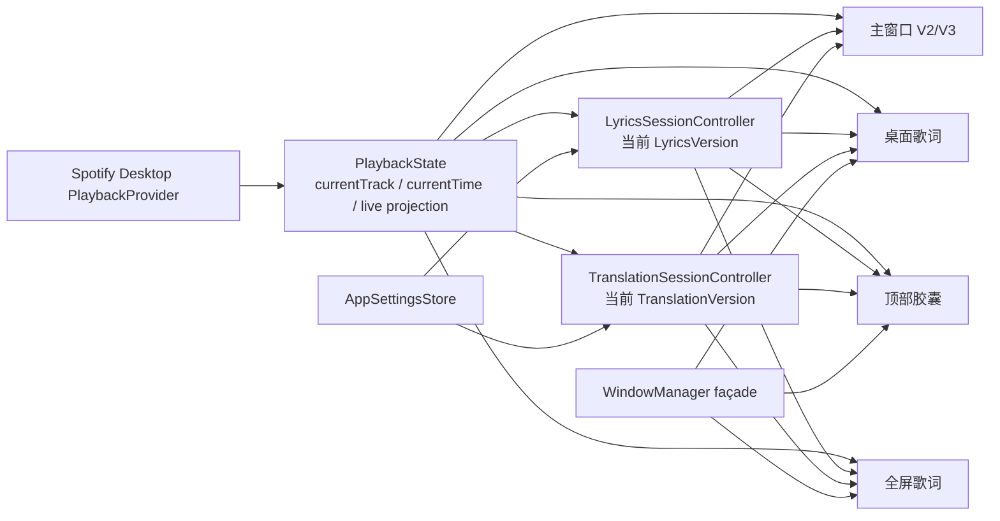

# Lyric Island Phase 2.3：统一 UI 系统实施计划

> 状态：只读审计后的计划，未开始实现。
>
> 本计划建立在 `0b6ccf3e24404375865d900fcaf72b86a07deb67` 及其后的 Phase 2.2 独立提交之上。Phase 2.3 只处理主窗口 UI 系统、响应式布局和展示层抽象；不改变业务数据、播放链路、歌词 Provider、翻译、排轴或窗口产品边界。

### Phase 2.2 当前状态

- 工程与架构：**通过**。
- 合同、构建和签名：**通过**。
- 胶囊与桌面歌词最终视觉：**未定稿**。
- 真实 Spotify 歌曲交互：**待用户验收**。
- 当前胶囊截图只代表结构基线，不是 Phase 2.3 的视觉目标。

当前已知的视觉待修项应进入 presentation 设计，而不是在本计划中提前修改：

- collapsed 过宽，视觉上像横向通知；
- hover 控制键位于最左侧，阅读顺序不自然；
- expanded 面积过大，仍接近迷你主窗口；
- 歌词对比度不足；
- 进度条过长；
- 底部文字入口需要在后续图标化并收紧。

因此，Phase 2.2 的“工程通过”不得被写成“胶囊视觉最终完成”。

## 0. 冻结边界

### 本阶段允许

- 统一 Design Tokens，消除重复的视觉常量和魔法数字。
- 在保持当前行为的前提下，拆分主窗口 V3 的布局、进度、背景和歌词过渡展示层。
- 为现有 V2、歌词专注、V3、浮动歌词、顶部胶囊、全屏歌词建立稳定的 presentation 接口。
- 设计只读 Preview Lab；可以使用当前 live projection 或脱敏 Mock snapshot 进行视觉比较。
- 增加针对 UI projection、尺寸阈值、长句重排和 Reduce Motion 的纯合同测试。

### 已冻结的 Phase 2.3 产品决策

- `760×520` 是技术上可打开的下限，不代表舒适可读尺寸。
- `800×600` 是最低舒适可读尺寸和布局降级参考；两者不再共享同一个 `minimum` 语义。
- `automaticCompactLyricsFocus` 默认关闭，用户可以开启，且不得覆盖手工选择的 layout family。
- 长句和多层歌词的降级顺序为：保留当前行原文完整 → 减少远处上下文 → 适度缩小字号 → 必要时增加纵向空间；不裁掉当前行原文，辅助层可逐级弱化。
- Backdrop preset 固定规划为：`Default`、`Clear`、`Immersive`、`High Contrast`、`Custom`。
- Reduce Motion 禁用弹簧、明显位移和 blur morph，只保留极短的 opacity transition。

### 本阶段禁止

- 修改 `PlaybackState`、`LyricsSessionController`、`TranslationSessionController` 的职责或创建第二套实例。
- 添加第二个 Spotify polling timer、歌词搜索、翻译任务、当前行计算器或缓存。
- 修改 SQLite v4、Track Identity redirect、正式数据库、歌词正文、时间轴和 sidecar。
- 新增 Provider、修改 QueryPlanner/SafeMatcher、AI、编辑器、自动排轴。
- 进入 Phase 2.4 设置中心或任何 Phase 2.5–2.8 功能。
- 删除 `legacy` presentation、V2、歌词专注、悬浮歌词、胶囊或全屏入口。
- 把 Gemini 或其他参考图逐像素照搬成实现规范。

**实施前的硬检查**：每个子阶段必须先有纯函数/视图合同；若需要修改业务状态或正式数据库才能解决视觉问题，则停止该子阶段并记录阻塞，不用 UI 改动掩盖架构问题。

## 1. 当前真实产品结构审计

### 1.1 共享状态与唯一数据源

当前正式链路保持如下关系：



正式播放表面只读 `live*` projection。搜索结果仍属于搜索/预览域，不得通过环境对象或共享数组偶然流入 V3、浮动、胶囊或全屏。

### 1.2 界面职责矩阵

| 界面 | 当前入口/真实文件 | 当前职责和数据 | 当前可执行操作 | 重复/问题 | Phase 2.3 处理 |
|---|---|---|---|---|---|
| 主窗口 V2/V3 | `SpotifyLyrics/Views/MainWindow/MainLyricsWindowView.swift`、`AppleMusicImmersiveV3WindowView.swift` | 读取 `PlaybackState`、live lyrics、`AppSettingsStore`；V3 使用 `AppleMusicImmersiveV3BackdropView` | 播放控制、布局切换、搜索、设置、歌词来源/恢复、浮动/胶囊/全屏入口 | V2/V3 有重复工具栏、状态菜单和间距；V3 内部布局函数很大，视觉常量分散 | 2.3A–F；不改业务入口，不删除 V2 |
| 搜索 popover | `SpotifyLyrics/Views/Components/SongSearchPopover.swift` | 搜索预览 session/候选，不是 live 播放数据 | 搜索、查看/采用候选、授权入口 | 容易被误认为主歌词视图；本阶段只强化 projection 边界和状态说明 | 2.3F 只统一状态样式，不重做搜索功能 |
| 歌词编辑器 | `SpotifyLyrics/Views/Editor/LyricsEditorWindowView.swift` | 当前编辑会话、版本/翻译/时间轴校验 | 编辑、导入导出、保存人工版本、锁定、试听 | 不应被主窗口视觉 token 重构牵连；行表格有自己的密集布局 | 只消费共享 tokens 的安全子集；编辑业务不改 |
| 设置窗口/popover | `SpotifyLyrics/Views/Settings/SettingsRootView.swift`、`LyricsPreferencesPopover.swift` | `AppSettingsStore` 与已有设置状态 | 设置显示层、Provider、AI、窗口和诊断 | 设置窗口与就地 popover 可能重复展示；本阶段不统一信息架构 | 只建立 tokens 约束；不进入 Phase 2.4 |
| 悬浮歌词 | `SpotifyLyrics/Views/Floating/FloatingLyricsView.swift`、`FloatingLyricsWindowController.swift` | live lyrics projection；同步时有限行投影，纯文本全文静态 | 锁定、穿透、拖动、样式/透明度、隐藏/关闭 | 独立 frame/screen/visibility/lock/pass-through 必须保持；样式已有 presentation version | 2.3G 只提供接口，不改本阶段业务或视觉行为 |
| 顶部胶囊 | `SpotifyLyrics/Views/Capsule/CapsuleLyricsView.swift`、`CapsuleLyricsWindowController.swift` | live track、控制和最多一行当前歌词 | 播放控制、展开、开关桌面歌词、打开其他窗口 | 胶囊不能膨胀成主窗口；保留 `capsule.legacy.v1` 与 `capsule.controlFocused.v2` | 2.3G 只稳定 presentation contract |
| 全屏歌词 | `SpotifyLyrics/Views/Fullscreen/FullScreenLyricsView.swift`、`FullScreenLyricsWindowController.swift` | live-only、V3 backdrop、当前行 projection | 播放控制、显隐控件、Esc、显式 seek | 与 V3 共享背景/歌词渲染意图但存在独立布局常量 | 2.3G 接口化；不改全屏行为 |
| WindowManager | `SpotifyLyrics/Windows/WindowManager.swift` | 管理各独立 WindowController、全屏时临时隐藏/恢复 | show/hide/toggle 各表面、fullscreen 协调 | 不能把 frame、screen 或 visibility 合并成一个浮动状态 | 只作为 orchestration 边界；不新增 timer/session |
| PlaybackState | 当前主数据源 | Spotify 当前曲、时间、播放状态、live lyric projection | 播放、seek、切歌、Provider/session 接线 | 高频进度变化不能驱动整棵 UI 文档重建 | 2.3 只读 projection，必要时添加纯 projection 测试，不改所有权 |
| LyricsSessionController | 当前歌词会话 | 当前采用 LyricsVersion、状态、候选/读音层 | 搜索、采用、编辑/导入/排轴版本 | UI 不应直接拼 Provider 结果 | 不改 |
| TranslationSessionController | 当前翻译会话 | 当前 TranslationVersion、翻译任务/锁定选择 | 翻译、选择、锁定、删除 | 不应由 Preview Lab 或其他窗口自行创建 | 不改 |
| AppSettingsStore | `SpotifyLyrics/Settings/AppSettingsStore.swift` | 单一 UserDefaults store | 显示层、窗口行为、Provider、AI 等持久化设置 | token 与行为设置仍有部分硬编码；不能新增第二套 key | 2.3A 只盘点和约束，不迁移 key |

### 1.3 可复用与冻结清单

**直接复用**：

- `LyricsDesignTokens` 作为现有 token 的起点，不另造 `Phase23Tokens`。
- `LyricLineView` 中的 Ruby token flow/baseline/layout 组件，尤其是长读音的 `fixedSize` 和 token 分块逻辑。
- `AppleMusicImmersiveV3BackdropView`、`ArtworkImageLoader`、`BackdropPalette`、`BackdropPaletteCache` 和 `AppleMusicImmersiveV3BackdropCache`。
- `FullScreenLyricsPresentation`、`FloatingLyricsPresentationVersion`、`CapsuleLyricsPresentationVersion` 等稳定 presentation ID 思路。
- `WindowManager` 的独立窗口协调 API和现有 live projection。

**只重新接线/抽取展示层**：

- `AppleMusicImmersiveV3WindowView` 的布局分支、歌词 viewport、transport、状态条。
- `MainLyricsWindowView` 的重复 toolbar/status/actions 视觉部分。
- `TrackBackdropView` 与 V3 backdrop 的公共语义，先不删除旧实现。
- 浮动、胶囊、全屏的视觉参数到统一 style/presentation 输入的映射。

**冻结，不在 Phase 2.3 改业务**：

- `PlaybackState` 的 polling/Spotify 控制和 live index 计算。
- Provider、SafeMatcher、SQLite v4、编辑器保存、翻译 HTTP、排轴算法。
- `ImmersiveSplitWindowView` 及 deprecated layout；只保持可回退。
- 旧 `TrackBackdropView`/legacy panel/legacy capsule renderer；只保留可运行的回退边界。

## 2. Design Tokens 现状审计

### 2.1 已有 token

`SpotifyLyrics/Design/LyricsDesignTokens.swift` 当前集中定义：

- 窗口默认/技术可打开下限：`1040×680`、`760×520`；舒适可读和布局降级参考为 `800×600`，两者语义不同；
- 基本圆角、标题/行间距、画布 padding、封面尺寸和沉浸分栏 breakpoint；
- primary/secondary/muted/accent/control/background 色彩；
- backdrop gradient；
- `lyricEmphasis(isActive:distance:isSynchronized:availableWidth:visibleLayerCount:)` 的动态字号、透明度、blur、vertical padding；
- `lyricRowSpacing` 的宽度和层数响应式规则。

其他现有 token/规则分布在：

- `MainWindowLayoutStyle.swift`：`lyricsFocus`、deprecated `immersiveSplit`、`appleMusicImmersiveV3`；
- `AppleMusicImmersiveV3WindowView.swift`：`MainWindowResponsiveThresholds`（最小尺寸 `800×600`、wide `1080`、自动 compact `900/640`、toolbar reveal `96`）；
- `BackdropPalette.swift` 与 V3 backdrop：颜色、暗幕、纹理、缓存容量、模糊层；
- `FloatingLyricsPresentation.swift`/`CapsuleLyricsPresentation.swift`：presentation IDs 和状态 projection；
- 视图内部的 material、圆角、padding、font、opacity 和 animation 修饰符。

### 2.2 已发现的重复和硬编码

以下是只读审计发现，不是本轮修改清单：

1. **尺寸语义曾经混用**：`LyricsDesignTokens.minimumMainWindowSize` 为技术可打开下限 `760×520`，而 V3 `MainWindowResponsiveThresholds` 的 `800×600` 是舒适可读和布局降级参考。2.3A 必须保留两个明确命名，不能把它们都叫作 `minimum`，也不能因为窗口能打开就承诺在该尺寸下完整舒适展示。
2. **V3 布局常量内嵌**：wide/compact/stacked 分支使用 `64/48`、`32/28`、`24/28` padding，`45/55`、`40/60` 分栏比例、封面比例和最小封面尺寸；这些数字没有统一 token 名称。
3. **V3 歌词行常量内嵌**：`AppleMusicImmersiveV3LyricRow` 附近使用 Ruby/罗马音/翻译 opacity、`lineLimit(2)`、`fixedSize`、动画 duration；部分行为与 `LyricsDesignTokens.lyricEmphasis` 重复但不完全一致。
4. **主窗口 V2/V3 重复控件**：`MainLyricsWindowView` 与 V3 各自有 toolbar、搜索/设置/布局菜单、状态菜单和底部/transport 区域；同一命令的视觉包裹不统一。
5. **背景管线并存**：`AppleMusicImmersiveV3BackdropView` 使用 track identity + artwork URL 的 snapshot/palette/noise cache；`TrackBackdropView` 使用 `BackdropPaletteCache` 和自己的层次。两者都合理但有重复的颜色/暗幕语义，不能在 2.3 中突然删掉其中一条。
6. **浮动/胶囊/全屏参数分散**：圆角、材质透明度、窗口尺寸、控制显隐和动画 duration 分布在各自 View/Controller；presentation ID 已有，但 style contract 尚未统一。
7. **动画规则分散**：V3 工具栏 hover 0.24s、V3 lyric row 0.3s、通用歌词视图有 `.spring(response: 0.3, dampingFraction: 0.7)`，其他行布局还有 0.24s；尚未有统一 Reduce Motion/animation policy。
8. **通用歌词与 V3 可能使用不同的可见性语义**：`LyricLineView` 由 `LyricsDesignTokens` 决定远近层级；V3 viewport/row 又有自己的 projection 和辅助层渲染。需要先明确“projection（业务）”与“emphasis（视觉）”分离。

### 2.3 Phase 2.3 的 token 目标

目标不是把所有数字集中到一个巨型文件，而是建立可解释的层级：

```text
FoundationTokens       // spacing, radius, typography scale, opacity, motion
SurfaceTokens          // material, backdrop veil, shadow, border
LayoutTokens           // window minimum, breakpoints, columns, safe padding
LyricTokens            // line emphasis, ruby/romaji/translation hierarchy
PresentationTokens     // capsule/floating/fullscreen style input
```

每个 token 必须说明适用界面、可响应变量和是否可被用户设置覆盖。颜色取色、播放时长、当前行、窗口 frame 不属于静态 Design Token。Backdrop 的 preset 集合暂定为 `Default`、`Clear`、`Immersive`、`High Contrast`、`Custom`；本阶段只规划其输入输出，不立即增加用户设置。

## 3. V3 背景和 Artwork 管线审计

### 当前事实

- `AppleMusicImmersiveV3BackdropView` 的请求 key 由 TrackIdentity stable key 与 artwork URL 组成，不含 `currentTime`；切歌或 artwork 变化才触发 snapshot。
- `AppleMusicImmersiveV3BackdropCache` 负责缩略图、色板、程序化 noise 和有限容量缓存；视图通过异步 snapshot load/cancel 和 outgoing fade 使用。
- `BackdropPalette`/`BackdropPaletteCache` 负责另一条 legacy/focus backdrop 颜色采样路径；`TrackBackdropView` 使用它。
- `ArtworkImageLoader` 已有图片加载/缓存；不要在 Phase 2.3 再写封面解码器。
- V3 当前层次包括低分辨率封面纹理、blur、linear/radial gradient、dark vignette 和 noise；背景不是随进度重新生成。

### 2.3 处理策略

1. 先给两条管线定义共同的 `BackdropPresentation` 输入/输出语义，而不是立即合并实现。
2. 明确 snapshot key 的生命周期：`trackIdentity + artworkURL + preset`，永远不带播放位置。
3. 对 V3、全屏和未来 Preview Lab 复用 snapshot/palette，不重复解码或取色。
4. 对 legacy/focus 继续保留独立回退；只有在对照验收证明像素和性能一致后，才考虑内部实现去重。
5. 所有 async 任务绑定 snapshot key，切歌时取消旧任务；旧结果不得投影到新 track。

## 4. 长句、短句、Ruby 和多层歌词审计

### 当前真实行为

- `LyricLineView.swift` 已有 Ruby token flow/baseline/block layout，按可用宽度测量词块；`fixedSize` 用于避免长假名被压缩或被邻词遮挡。
- `AppleMusicImmersiveV3LyricRow` 使用可用宽度、层数和当前状态渲染原文/Ruby/罗马音/翻译；部分辅助层限制为 `lineLimit(2)` 并使用 `fixedSize`。
- `LyricsDesignTokens.lyricEmphasis` 根据宽度、可见层数和距离返回字号、opacity、blur、vertical padding；它是当前主要视觉层级来源。
- V3 当前行/附近 projection 读取 `state.liveLyrics` 与 `state.liveCurrentLineIndex`，而不是重新从播放时间推断 index。

### 已知风险

1. 一行从短句变成长句时，SwiftUI intrinsic height 改变会影响行间距和当前行锚点；如果滚动容器没有稳定的行 identity，可能出现跳动。
2. Ruby 词块的宽度与原文宽度不一致时，不能用整体 `scaleEffect` 解决；应保留 token flow 的 overhang/换行策略。
3. 原文、Ruby、罗马音、翻译同时开启时，`lineLimit(2)` 可能裁剪辅助文本，而不是让字号响应式收缩；需要在 2.3B/2.3E 按“当前行原文优先、远处上下文先减、字号其次、纵向空间最后”的顺序处理。
4. 当前行 transition、opacity/blur 和容器 geometry 的动画修饰符分散，可能在进度 tick、设置切换和切歌时发生错误的隐式动画。
5. 纯文本模式必须完全跳过 current-line anchor、自动滚动和远近景深；统一组件不能把 synchronized 行为泄漏到 plain text。

### 计划中的解决方式

- 先把 `LyricDocumentProjection`（可见行、当前 index、同步/纯文本、状态）与 `LyricVisualState`（字号、opacity、blur、层显隐、垂直节奏）分离。
- 行 identity 只使用稳定的歌词版本/行 index 组合；不把 currentTime 放入 identity。
- 长句计算先确定最大主文本宽度，再按“保留当前行原文完整 → 减少远处上下文 → 适度缩小字号 → 增加纵向空间”的顺序降级；不得用平均铺开、强制裁剪或隐藏当前行原文解决布局问题。
- synchronized 只对有限的前后 projection 做动画；plain text 使用静态可滚动全文。
- Reduce Motion 开启时禁用弹簧、明显位移和 blur morph，只保留极短 opacity transition 或无动画更新。

## 5. 稳定 Presentation 接口设计（本阶段只设计）

以下是 Phase 2.3G 的建议接口边界，不在本计划提交中实现。名称和字段可以在 2.3A 评审时微调，但不能绕过共享 live projection。

### 5.1 LyricTransitionStyle

职责：只描述歌词行切换的视觉策略，不计算当前行。

建议输入：

- `isSynchronized`
- `currentIndex`
- `visibleRange`
- `reduceMotion`
- `availableWidth`
- `visibleLayerCount`

建议输出：

- 行的 opacity/font/blur/vertical spacing；
- 是否允许滚动/anchor 动画；
- transition duration/easing；
- plain text 的静态策略。

禁止读取 PlaybackState 或启动任务。

### 5.2 BackdropPresentation

职责：将已有 cached snapshot/palette 转换为背景层配置。

建议输入：

- cached backdrop snapshot；
- presentation preset（V3、fullscreen、focus、preview）；
- reduce motion；
- safe contrast/veil 参数。

建议输出：

- texture layer、gradient、local glow、veil、vignette、noise 的绘制参数；
- artwork transition policy。

禁止自行下载、解码、取色或以 currentTime 作为 key。

### 5.3 ProgressPresentation

职责：只描述播放进度视觉（细线、滑块、时间标签、紧凑/沉浸变体）。

建议输入：

- duration/currentTime/isPlaying；
- available width；
- surface/presentation ID；
- reduce motion。

输出只含绘制和显隐；明确区分 read-only tick 与用户显式 drag/seek。不得产生 seek。

### 5.4 MainLayoutPresentation

职责：从窗口 geometry、布局 family、自动 compact setting 和 safe area 得出主窗口布局计划。

建议输出：

- `wide`/`compactSplit`/`stacked`/`automaticLyricsFocus`；
- padding、column fractions、cover size、lyrics width、minimum content height；
- 哪些次要区域隐藏。

它不得改变 `MainWindowLayoutStyle` 持久化值；自动 focus 只能是临时投影。

### 5.5 CapsulePresentation

职责：胶囊的 presentation version、collapsed/hover/expanded 内容边界和控制显隐。

约束：expanded 仍最多一行当前歌词；不显示 next/multiline；不持有 frame、screen、播放计时器或歌词副本。

### 5.6 FloatingLyricsPresentation

职责：桌面歌词的 `legacyPanel.v1`/`transparent.v2`、Ultra Transparent/Light Material、锁定/穿透状态的展示策略。

约束：不拥有窗口 frame、screen、visibility 或 pass-through 的持久化；这些仍归 `FloatingLyricsWindowController`/`WindowManager`。

## 6. Preview Lab 与 Release Experience Library

未来所有可维护的旧 UI、动画、背景、布局和 presentation version 都应有正式可切换的归档路径，但必须与 Debug 诊断工具分层。两层都只消费 live projection 或明确的 Mock snapshot，不复制业务状态。

### 6.1 Release Experience Library

- 正式用户可从高级次级入口进入；普通设置首页不展示全部版本。
- 支持推荐、经典、历史和实验 presentation 的预览、应用和恢复推荐。
- 不显示开发诊断信息、编译信息、内部 geometry 或调试锚点。
- 应用只改变现有 presentation/style 设置或本地展示选择，不创建歌词版本、不写歌词数据库、不改变播放位置。

### 6.2 Debug Preview Lab

- 仅 Debug 构建可用。
- 支持 A/B 并排、Mock 状态、左/中/右锚点、geometry 读数和诊断数据。
- 不进入 Release UI，也不作为普通用户设置入口。

### 6.3 共同目标和数据边界

两层均用于比较“当前渲染”和候选 presentation，不创建第二套业务状态，不影响播放。

### 数据边界

```text
LiveProjectionSnapshot / MockProjectionSnapshot
        ↓
PreviewLabRenderer(s)
        ↓
只读预览画布
```

snapshot 可以包含脱敏的 track metadata、artwork snapshot 引用、歌词行、当前 index、翻译/读音层开关和窗口尺寸；不包含 token、授权数据或正式数据库句柄。

### 明确禁止

- 创建 `PlaybackState`、`LyricsSessionController` 或 `TranslationSessionController`；
- 创建 polling timer、网络任务、seek 或播放控制；
- 写 `UserDefaults`、SQLite、lyrics cache、frame/visibility 状态；
- 用搜索预览数组伪装 live projection；
- 将 Debug 诊断数据泄漏到 Release Experience Library。

### 应用/取消语义

- “比较”只替换本地 preview selection；
- Release Experience Library 的“应用”只能将 presentation ID/样式写入现有或经评审的展示设置键，且应在外层捕获；Debug Preview Lab 的“应用”只改变本地预览选择，不写持久化设置；
- “取消/关闭”丢弃 preview selection，不产生业务副作用；
- 当前阶段只实现文档和合同，不创建 Release Experience Library 或 Preview Lab View。

## 7. Phase 2.3 分阶段实施路线

每个子阶段独立 commit；前一阶段 build、合同和回归通过后才进入下一阶段。所有阶段默认不需要 SQLite migration，不得写正式数据库。

### 2.3A：Design Tokens 与 motion policy

**目标**：建立 Foundation/Surface/Layout/Lyric/Presentation token 层，统一 Reduce Motion 和窗口尺寸语义。`760×520` 固定为技术可打开下限，`800×600` 固定为舒适可读/布局降级参考；automatic compact focus 默认关闭但可由用户开启。

**前置依赖**：本审计计划；Phase 2.2 presentation IDs；`AppSettingsStore` 现有设置保持不变。

**预计修改模块**：

- `SpotifyLyrics/Design/LyricsDesignTokens.swift`
- 新的 `SpotifyLyrics/Design/*Tokens.swift` 或同目录小型 token 文件（仅当拆分能减少耦合）；
- `SpotifyLyrics/Design/MainWindowLayoutStyle.swift`
- V3、MainLyricsWindowView、LyricLineView 和浮动/胶囊/全屏的视觉引用点；
- 对应 `Tests/phase2_3_*_contract.sh`。

**不应修改**：PlaybackState、session、Provider、数据库、窗口 Controller 行为。

**验收**：最小尺寸/断点/间距/圆角/字号有唯一语义；Reduce Motion 下没有 spring/位移漏网；现有 51 个测试和新合同通过；V2/V3/浮动/胶囊/全屏均能构建。

**migration 风险**：无 schema migration。旧 token 名称若要保留兼容别名，应先标记 deprecated，避免一次性改动所有视图。

### 2.3B：主窗口响应式布局计划落地

**目标**：将 V3 的 wide/compactSplit/stacked/automatic focus 几何计算移到可测试的 `MainLayoutPresentation`，保留布局 family 和手工歌词专注。

**前置依赖**：2.3A；按已冻结的 `760×520` 技术下限与 `800×600` 舒适参考实现；2.2 自动 focus 已验收且默认关闭。

**预计修改模块**：

- `AppleMusicImmersiveV3WindowView.swift`
- `MainLyricsWindowView.swift`
- `MainWindowLayoutStyle.swift`
- `Design` layout token 文件；
- 主窗口合同和尺寸模拟测试。

**不应修改**：窗口恢复持久化、PlaybackState、歌词 session 和浮动窗口 frame。

**验收**：宽→中→小布局可预测；自动 focus 开关关闭时不改变 family；手工 focus 不被自动逻辑关闭；短/长歌词在最小尺寸仍可读；当前 index/translation/reading selection 不丢失。

**migration 风险**：无 DB migration。风险集中在窗口 frame 恢复与最小尺寸行为，必须先用纯 geometry 测试锁定。

### 2.3C：进度视觉 presentation

**目标**：抽出 `ProgressPresentation`，统一主窗口、V3、全屏和浮动可用的进度视觉，保持 seek 仅由明确用户操作触发。

**前置依赖**：2.3A；现有 `PlaybackState` transport API。

**预计修改模块**：

- `AppleMusicImmersiveV3WindowView.swift`
- `MainLyricsWindowView.swift`
- `FullScreenLyricsView.swift`
- 可复用的 transport/progress component；
- progress contract。

**不应修改**：播放时间来源、Spotify seek 实现、胶囊三态和编辑器试听规则。

**验收**：普通 tick 只更新视觉；slider 只有完成 drag 才 seek；暂停/恢复和 Reduce Motion 正确；展开/收起/窗口拖动无隐式 seek。

**migration 风险**：无。属于播放操作回归风险，必须保留显式 seek 测试。

### 2.3D：背景 preset、取色与高亮

**目标**：以现有缓存为唯一数据底座，定义 `BackdropPresentation` 的 `Default`、`Clear`、`Immersive`、`High Contrast`、`Custom` preset 输入，统一 V3 与全屏的纹理/色板/暗幕/噪点层级。

**前置依赖**：2.3A；先完成 V3/legacy 两条缓存路径的 key 和生命周期审计；2.3B 的容器几何。

**预计修改模块**：

- `AppleMusicImmersiveV3BackdropView.swift`
- `TrackBackdropView.swift`
- `BackdropPalette.swift`
- `ArtworkImageLoader.swift`（只可能调整接口，不新增解码器）；
- V3/全屏引用和 backdrop contracts。

**不应修改**：artwork URL/TrackIdentity 业务模型、正式数据库、每秒生成背景的行为。

**验收**：切歌才更新 key；两种明显色调能得到不同但可读的背景；缓存命中/取消/切歌无旧图闪回；高 CPU/GPU blur 不随播放 tick 增长；legacy 可回退。

**migration 风险**：无 DB migration；缓存 key 或容量变化会影响内存/性能，必须设置上限并可回退到旧 preset。

### 2.3E：歌词平滑重排与 Transition

**目标**：实现 `LyricTransitionStyle` 与稳定行 projection/anchor，修复短句→长句、多层文字和 Ruby 变化导致的跳动；纯文本不进入同步动画。

**前置依赖**：2.3A、2.3B；必须先通过 2.3D 的背景生命周期检查，避免把背景重绘和歌词重排混在一起。

**预计修改模块**：

- `AppleMusicImmersiveV3WindowView.swift`
- `LyricLineView.swift`
- `LyricsViews.swift`/共享歌词组件（只在确有公共行为时）；
- `FloatingLyricsPresentation.swift`、`FullScreenLyricsPresentation.swift`（接口消费）；
- lyric transition contracts。

**不应修改**：日语读音生成、翻译文本、时间轴、当前行计算和自动排轴。

**验收**：长 Ruby 不遮挡原文；层数变化不丢行；同步 current index 稳定且只更新邻域；暂停不继续滚动；seek 立即定位；纯文本全文可手动滚动且无伪高亮；Reduce Motion 可读。

**migration 风险**：无。风险是 SwiftUI layout/animation 回归，应使用固定 snapshot/geometry fixture，不能用某一首歌硬编码。

### 2.3F：统一状态页与空状态语言

**目标**：统一 loading/no lyrics/noMatch/candidates/plain text/failed/未排轴在主窗口、搜索预览入口和辅助表面的展示语义；不让搜索预览进入 live surface。

**前置依赖**：2.3A；现有 `LyricsLoadState`、live projection 和 Phase 2.1 no-selection 规则。

**预计修改模块**：

- `MainLyricsWindowView.swift`
- `AppleMusicImmersiveV3WindowView.swift`
- `FloatingLyricsStatusView.swift`
- `CapsuleLyricsStatusView.swift`
- `FullScreenLyricsView.swift`
- `SongSearchPopover.swift`（仅状态/入口，不改搜索职责）。

**不应修改**：Provider 运行顺序、SafeMatcher、SQLite 保存规则、候选选择逻辑。

**验收**：状态字典唯一；no-selection 不等于 noMatch/failed；plain text 不出现当前行；候选只提示回主窗口；切歌先清空旧封面/歌词/翻译；A→B→A 不闪回。

**migration 风险**：无。注意不要新增 UserDefaults key 来代替业务状态。

### 2.3G：Presentation version interface、Experience Library 与 Debug Preview Lab 骨架

**目标**：把 capsule/floating/fullscreen/main layout/backdrop/transition/progress 的展示变体收敛到稳定 ID 和纯配置接口，为 Release Experience Library 与 Debug Preview Lab 提供不同的入口和回退边界。Release 允许正式用户预览/应用/恢复推荐；Debug 才允许诊断数据、Mock 状态和锚点比较。

**前置依赖**：2.3A–F；2.2 的 `capsule.*`、`floatingLyrics.*` 和全屏现有 presentation helper。

**预计修改模块**：

- `SpotifyLyrics/Lyrics/CapsuleLyricsPresentation.swift`
- `SpotifyLyrics/Lyrics/FloatingLyricsPresentation.swift`
- `SpotifyLyrics/Lyrics/FullScreenLyricsPresentation.swift`
- 新的纯 `Presentation`/`PreviewSnapshot` 模型文件；
- Window/Views 只注入 presentation，不在 Controller 内重复业务。

**不应修改**：两个浮动 Controller 的独立生命周期、frame/screen/visibility/lock/pass-through、AppSettingsStore key 语义。

**验收**：旧/新 presentation 可以回退；Release Experience Library 与 Debug Preview Lab 的权限/入口分层清晰；切换只影响展示，不写歌词数据库/不 seek；preview snapshot 无 session/timer/network/DB；胶囊和桌面歌词仍可同时显示且状态一致。

**migration 风险**：无 DB migration。若未来要持久化某个 presentation ID，只能复用/新增经评审的设置 key，不能借用歌词或 Track 表。

## 8. 测试与验收矩阵

### 合同层

- tokens：断点、最小尺寸、Reduce Motion、层数/宽度动态字号；
- geometry：wide/compact/stacked/automatic focus 的纯输入输出；
- backdrop：key 不含 currentTime，缓存取消和旧 track 结果隔离；
- lyric projection：同步只取 live index，纯文本不取第一行伪当前；
- long line：Ruby overhang、换行、行 identity、长翻译层；
- transition：暂停/seek/切歌/设置切换不发生错误隐式 seek；
- status：loading/noSelection/noMatch/plain/candidates/failed 的唯一映射；
- presentation：legacy/new ID 的切换不影响 frame/screen/lock/pass-through；
- Release Experience Library / Debug Preview Lab：不创建 session/timer、不写歌词 DB、不改变播放位置；Debug 诊断数据不出现在 Release。

### 真实/受控验收

Phase 2.3 的 UI 真实验收应继续使用已存在的真实歌曲与人工版本，但不把歌词内容写进合同或截图：

1. 恋風：同步、Ruby/罗马音/翻译、暂停/seek、长句和多层；
2. 水曜日の約束：纯文本与未排轴，不伪同步；
3. あやふや：noMatch，切歌不残留；
4. 人工导入/编辑/automaticAlignment 子版本：只验证当前 live 版本切换；
5. 快速 A→B→A：封面、背景、歌词、翻译和当前 index 无迟到闪回；
6. V2、V3、歌词专注、浮动、胶囊、全屏同时打开/切换：不重复 timer/session；
7. 默认尺寸、最小尺寸、宽中窄布局、Reduce Motion；
8. 多屏/拔屏若环境不可用，使用 geometry/WindowController 模拟并标记 `UNVERIFIED`，不伪称实测。

### 数据安全验收

- 运行前后正式 SQLite SHA-256 相同；
- `PRAGMA user_version`、表数量、UUID、parent 关系不变；
- no migration；
- 预览和视觉设置切换不写 `LyricsVersion`/`TranslationVersion`；
- 敏感扫描不得出现 token、授权 header、完整歌词或私人路径。

## 9. 预计交付顺序和回退

推荐 commit 顺序：

```text
feat(ui): centralize phase 2.3 design tokens
feat(ui): extract responsive main layout presentation
feat(ui): unify progress presentation
feat(ui): unify cached backdrop presentation
feat(ui): stabilize lyric transition and long-line layout
feat(ui): unify lyric state surfaces
feat(ui): add presentation version interfaces and read-only preview contracts
docs: add phase 2.3 validation report
```

每个 commit 都必须可以单独 `git revert <commit>`；不得把 token 重命名、布局重排、背景缓存和歌词动画压在同一提交。任一阶段失败时回退到上一个通过 build/contract 的 commit，保留 legacy presentation，不删除数据。

## 10. 本次只读审计结论

1. 当前 V3 背景已经有 track-bound asynchronous cache，不需要重写背景系统；主要问题是两条背景路径的语义重复和 token 分散。
2. 当前 Ruby/长句排版已有真实自定义布局，2.3 应修复 projection/animation/多层策略，不应换成普通 `Text` 或重新生成读音。
3. 当前 compact focus 已有集中阈值和设置开关，2.3 重点是把 geometry 可测试化，并解决最小尺寸语义不一致。
4. 当前 capsule/floating/fullscreen 已有稳定 presentation 版本或独立 Controller；2.3 应建立统一展示输入，不应合并窗口或复制状态。
5. 未来应同时规划 Release Experience Library 和 Debug Preview Lab：前者是正式用户可用的高级 presentation 归档入口，后者保留诊断和 Mock/A-B 能力；两者都只能是只读 projection renderer，不得复制业务状态。
6. Phase 2.3 全部计划默认不需要数据库 migration；任何要求修改 SQLite 的 UI 诉求都应移出本阶段。

## 11. 仍需用户醒来后决定的产品问题

这些问题不阻塞本只读计划，但在对应子阶段开始前必须确认：

1. `800×600` 舒适可读参考下，哪些次要控件可以进一步隐藏；`760×520` 只保证技术可打开。
2. Release Experience Library 的正式入口名称、推荐/经典/历史/实验四类的默认排序和“恢复推荐”的确认文案。
3. `Custom` backdrop 是否允许用户保存自定义参数，还是第一版只保存 preset 选择。
4. Release Experience Library 是否允许应用 presentation 后立即影响所有窗口，还是先只影响主窗口并提供预览确认。
5. 视觉验收时，胶囊 collapsed/hover/expanded 的最终宽度、控制键顺序、对比度和进度条长度。
6. 当前胶囊截图只作为结构基线；最终视觉目标必须由用户验收后再冻结，不能由 Phase 2.2 合同截图自动决定。

## 12. 完成条件

本文件提交后，Phase 2.3 仍处于“计划完成、实现未开始”。在用户确认并开始 2.3A 之前，不修改 Swift、SQLite、AppSettingsStore 业务行为，不构建新的 UI 版本，不进入 Phase 2.4。
