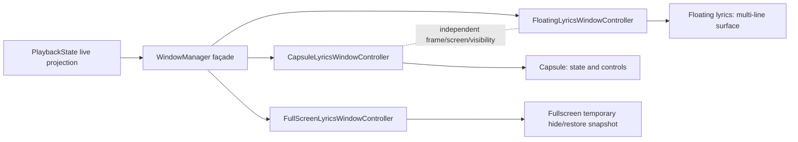

# Lyric Island Phase 2.2 验收报告

日期：2026-08-02
工作目录：`/Users/apple/backup/sptifylyrics`
分支：`codex/phase-2-2-overnight`
起始基线：`0b6ccf3e24404375865d900fcaf72b86a07deb67`
本报告提交前 HEAD：`f299cf41ebc8f532dca8f5e6c6edac309c7d648f`

## 当前产品状态结论

- 工程与架构：**通过**。
- 合同、构建和签名：**通过**。
- 胶囊与桌面歌词最终视觉：**未定稿**。
- 真实 Spotify 歌曲交互：**待用户验收**。

本报告中的胶囊截图和窗口 smoke check 只代表结构基线，不代表最终设计目标。当前已知视觉待修项包括：collapsed 过宽、hover 控制键位于最左侧、expanded 面积过大且接近迷你主窗口、歌词对比度不足、进度条过长，以及底部文字入口需要在后续图标化并收紧。它们暂不在 Phase 2.2 修复，纳入 Phase 2.3 presentation 设计。

## 1. 范围

本批次完成 Phase 2.2 的五个实现阶段：

1. 统一浮动系统协调入口；
2. 胶囊 control-focused presentation v2；
3. 桌面歌词 transparent / Light Material presentation；
4. V3 小窗口自动歌词专注；
5. Debug 胶囊 Top Left / Top Center / Top Right 比较锚点。

产品结构仍为方案 C：一个浮动系统、两个独立表面。`CapsuleLyricsWindowController` 与 `FloatingLyricsWindowController` 没有合并，frame、screen、可见性、锁定、穿透和 hover 状态均独立。

本批次明确未做：Phase 2.3 主窗口视觉重构、Phase 2.4 设置工作台、Provider、SafeMatcher、AI、自动排轴、Track Identity migration v4、全屏/悬浮歌词业务重写，以及任何正式数据库迁移。

## 2. 状态图

胶囊可以独立显示/隐藏桌面歌词；关闭其中一个不会关闭另一个。全屏只临时隐藏进入前实际可见的辅助窗口，退出时分别恢复。

## 3. 按提交顺序

所有提交均可单独回退；推荐回退命令为 `git revert <commit>`，不要 reset 已共享历史。

| 顺序 | Commit | 目的 | 主要范围 | 独立回退 |
|---|---|---|---|---|
| 1 | `12efbdc` | 冻结 Phase 2 执行范围 v2 | 纯文档 | `git revert 12efbdc` |
| 2 | `07da632` | 浮动系统协调 façade | `WindowManager`、两个 Controller 入口 | `git revert 07da632` |
| 3 | `7793cbc` | 协调层合同测试 | 浮动开关/独立恢复合同 | `git revert 7793cbc` |
| 4 | `333f753` | 胶囊 control-focused v2 | presentation ID、胶囊展示与 SF Symbols 控件 | `git revert 333f753` |
| 5 | `3f28589` | 限制 expanded 长歌词行 | 固定行高与截断合同 | `git revert 3f28589` |
| 6 | `38452ae` | 桌面歌词透明/材质 v2 | presentation/style、设置接线、材质表面 | `git revert 38452ae` |
| 7 | `ec4419a` | 控件仅在 hover 显示 | 浮动歌词 hover 控件生命周期 | `git revert ec4419a` |
| 8 | `f6a6d65` | V3 自动小窗口歌词专注 | 单一设置、集中阈值、临时 V3 projection | `git revert f6a6d65` |
| 9 | `aac1c29` | 固化 compact focus 合同 | 默认关闭、V3-only、手工模式区分 | `git revert aac1c29` |
| 10 | `3797bbc` | Debug 胶囊锚点 | Debug 菜单与三种顶部锚点 | `git revert 3797bbc` |
| 11 | `c87ac32` | 隔离 Release 调试代码 | Release center-only、safe area 与 clamp | `git revert c87ac32` |
| 12 | `f299cf4` | 更新旧合同 harness | 最小尺寸断言、编译切片兼容 | `git revert f299cf4` |

对应各提交的实际 shortstat 已由 Git 保留；本批次相对基线总计：22 个已跟踪文件，`1151 insertions(+), 66 deletions(-)`。

## 4. 测试与构建

- 全部 `Tests/*.sh`：**51/51 PASS**。脚本按各自 shebang 使用 `bash`、`zsh` 或 `sh` 执行；没有只按 executable bit 筛选。
- Phase 2.2 专项合同：**5/5 PASS**。
- `git diff --check`：PASS。
- Debug 构建：`** BUILD SUCCEEDED **`。
- 目标 App：`/Users/apple/backup/sptifylyrics/DerivedData/Build/Products/Debug/SpotifyLyrics.app`。
- `codesign --verify --deep --strict`：PASS。
- 签名：`Sign to Run Locally`；bundle identifier `com.spotifylyrics.app`；arm64。

## 5. 真实运行与数据库安全

使用临时数据库副本启动，未让测试 App 写正式库：

- 临时库：`/tmp/spotifylyrics-phase2-2-runtime.T47AHw/SpotifyLyrics.sqlite3`
- 启动进程 PID：`7886`（已停止）
- 实际进程路径：`/Users/apple/backup/sptifylyrics/DerivedData/Build/Products/Debug/SpotifyLyrics.app/Contents/MacOS/SpotifyLyrics`
- 临时库启动后 `user_version=4`、`integrity_check=ok`、`foreign_key_check` 为空。

正式数据库：`/Users/apple/Library/Application Support/SpotifyLyrics/SpotifyLyrics.sqlite3`

| 项目 | 迁移前/本批次前 | 本批次后 |
|---|---:|---:|
| SHA-256 | `47e32afab6b7e2a648dc7323acac447250e8be6703720089165905d4d37076c9` | `47e32afab6b7e2a648dc7323acac447250e8be6703720089165905d4d37076c9` |
| user_version | 4 | 4 |
| tracks | 73 | 73 |
| track_aliases | 168 | 168 |
| lyrics_versions | 94 | 94 |
| lyric_lines | 4396 | 4396 |
| translation_versions | 9 | 9 |
| translation_lines | 405 | 405 |
| track_identity_redirects | 1 | 1 |
| track_identity_merge_audit | 1 | 1 |

`integrity_check=ok`；`foreign_key_check` 为空。没有 migration、删除、reparent、版本写入或 sidecar 操作。

### SHA 时间点澄清（只读）

本批次存在两个不同的文件检查点，不能把它们当成同一时刻的哈希：

| SHA-256 | 文件 | 时间点/含义 |
|---|---|---|
| `47e32afab6b7e2a648dc7323acac447250e8be6703720089165905d4d37076c9` | `/Users/apple/Library/Application Support/SpotifyLyrics/SpotifyLyrics.sqlite3` | Phase 2.2 验收报告记录的正式库前后检查点；对应报告提交时间约为 `2026-08-02 02:27:56 +08:00`。 |
| `e5c42d8c674131246f83c8b42ebd838a40fa0d41ca8d0e8334bd7a0d7689a512` | `/tmp/spotifylyrics-phase2-2-final-runtime/SpotifyLyrics.sqlite3`，以及当前正式库 | 后续只读复核使用的临时副本；副本 mtime 为 `2026-08-02 02:50:33 +08:00`。正式库随后从这个相同 SHA 的副本恢复，当前正式库与副本逐字节一致。 |

只读复核结果：当前正式库和恢复副本均为 `PRAGMA journal_mode=delete`，没有伴随的 `SpotifyLyrics.sqlite3-wal` 或 `SpotifyLyrics.sqlite3-shm` 文件；本批次没有执行 `wal_checkpoint` 或其他 checkpoint 命令。因此，不能把 `47e32… → e5c42…` 简单归因于当前 WAL/SHM 文件或一次已记录的 checkpoint。

可用的最近两份临时副本进行只读 dump 对比时，表数量、schema、歌词正文、翻译、时间轴、parent、redirect 和 audit 均保持一致；观察到的唯一逻辑差异是 `tracks` 中「空心 / 光澤」记录的 `updated_at` 元数据时间变化。历史 `47e32…` 原始文件本身未保留在当前工作目录，所以无法仅凭现存文件证明该哈希差异的唯一底层原因，也不应猜测为 WAL 或迁移。可以确认的是：歌词业务数据没有变化，当前库完整性为 `ok`，`foreign_key_check` 为空，最终恢复源 SHA 为 `e5c42…`。

## 6. 截图索引

以下截图使用目标 App 的独立窗口捕获，未加入 Git，避免提交私人桌面内容：

- `/Users/apple/backup/sptifylyrics/docs/design/phase-2-2-validation/capsule-top-left-collapsed.png`：已生成，Debug Top Left / collapsed。
- `/Users/apple/backup/sptifylyrics/docs/design/phase-2-2-validation/capsule-top-center-hover.png`：已生成，Debug Top Center / hover smoke check。
- `/Users/apple/backup/sptifylyrics/docs/design/phase-2-2-validation/capsule-top-right-expanded.png`：已生成，Debug Top Right / expanded smoke check。

这些截图验证窗口位置和三态入口，不代表真实 Spotify 歌曲、歌词正文或翻译内容验收；本次临时运行未连接 Spotify Desktop，因此歌曲内容相关 UI 仍需用户本地真实验收。

## 7. 验收矩阵

| 场景 | 结果 | 证据/限制 |
|---|---|---|
| 胶囊 collapsed / hover / expanded | PASS（窗口 smoke check） | 三态合同与目标 App 窗口捕获；真实歌曲内容未接入 |
| 胶囊独立开关桌面歌词 | PASS（合同） | `WindowManager` façade；未改变两个 panel 的 frame/visibility 绑定 |
| legacy / transparent / Light Material | 工程 PASS；最终视觉未定稿 | 样式 presentation ID 与 settings publisher 接线；材质细节、胶囊比例、对比度和控件排序需用户本地验收 |
| 解锁 hover 控件 / 锁定 / 穿透恢复 | PASS（合同） | 真实鼠标穿透长流程未在本环境完成 |
| V3 宽 / 小 / 恢复 | PASS（合同/构建） | 自动专注默认关闭，阈值集中；真实拖拽缩放未完成 |
| 全屏前后辅助窗口恢复 | PASS（既有合同） | 物理窗口组合未完成 |
| 多显示器、拔屏、Space | UNVERIFIED | 当前环境未执行物理外接屏/拔屏测试 |
| Reduce Motion 降级 | UNVERIFIED | 未在系统设置中切换验证 |
| 正式数据库不变 | 工程检查 PASS；SHA 检查点已澄清 | Phase 2.2 报告记录 `47e32… → 47e32…`；后续恢复副本为 `e5c42…`，详见上方 SHA 澄清 |
| 敏感信息扫描 | PASS | diff 未发现 API key、token、Authorization header 或私密二进制 |

## 8. 已知问题与醒后需确认

1. 当前合同和临时 App 运行证明了结构接线，但没有替代真实 Spotify 歌曲下的视觉验收。
2. `CapsuleLyricsWindowPersistence` 使用屏幕 `visibleFrame` 与 `safeAreaInsets.top`；多显示器实际屏幕排列、拔屏和全屏 Space 仍需人工确认。
3. V3 自动歌词专注是临时显示 projection，默认关闭，不改变用户选择的 layout family；用户需要确认阈值和进入/退出时的视觉取舍。
4. 胶囊与桌面歌词的产品关系已按方案 C 落地：胶囊控制、桌面歌词多行显示；当前实现是结构基线，不是最终视觉。collapsed 宽度、hover 控件顺序、expanded 面积、歌词对比度、进度条长度和底部入口图标化均留给 Phase 2.3 presentation 设计。
5. 当前胶囊截图不得作为 Phase 2.3 的视觉目标。
6. 本批次没有开始 Phase 2.3 代码，也没有开始 Phase 2.4。

## 9. 停止点

Phase 2.2 代码、合同、构建和数据库只读验收已完成。下一步仅允许进入 Phase 2.3 的只读审计与计划；本报告完成后不进入 Phase 2.3 代码实现，也不进入 Phase 2.4。
