# Real Audio Line Alignment V1 — Acceptance Record

日期：2026-07-30
分支：`ui-redesign-phase-1`
实现基线：`f5c0c9ba8ee26d1e5d9c6cc97aba711711652bd8`（实现尚未提交时记录）

## 结论

- **Code/contracts/build acceptance：PASS**
- **Real commercial-song acceptance：UNVERIFIED**
- 本轮没有用户提供的完整、匹配的商业歌曲人声音频，因此没有声称任何真实歌曲已成功排轴。
- 未使用 TTS、合成朗读或历史 `kawasaki_tts.wav` 作为商业歌曲验收证据。

## 本轮实现边界

输入只接受用户主动选择的本地音频。排轴链路为：

```mermaid
flowchart LR
    A[当前 TrackIdentity + 已知纯文本] --> B[音频预检]
    B --> C[SHA-256 + 时长/标签/格式]
    C --> D[临时 16 kHz 单声道 PCM]
    D --> E[TimedTranscriptProvider]
    E --> F[Speech adapter 或 TEST transcript]
    F --> G[单调 DP 逐行对齐]
    G --> H[逐行 evidence/confidence]
    H --> I[预览/编辑器修正]
    I --> J[SQLite v3 子版本]
    J --> K[AlignmentProvenance sidecar]
```



已冻结的危险路径：

- 删除 `spreadLowConfidence` 及其调用；不使用全局、首尾或按歌曲总时长平均铺轴。
- 前置、尾部或全部无证据的歌词行保持 unresolved；服务层以 `insufficientEvidence` 失败。
- `SPOTIFYLYRICS_AUTO_ALIGN` 自动触发钩子已移除；`SPOTIFYLYRICS_ALIGN_AUDIO` 仅作为 Debug 的显式文件覆盖，仍经过完整预检。
- 排轴开始、进度、取消、完成都不 seek、不暂停、不改变 Spotify 播放位置。

## 生产架构与存储

### 识别和对齐

- `AlignmentService` 继续是 SwiftUI 与识别后端的协议边界。
- `TimedTranscriptProvider` 把识别结果限制为带时间的片段；生产实现为 `SpeechTimedTranscriptProvider`。
- `LineForcedAligner` 使用全局单调 DP，允许跳过插入片段，重复副歌按顺序选择；只允许在两个真实 anchor 之间做 bounded interpolation。
- 每行保存 `startTime`、可选 `endTime`、`confidence`、`status` 和 `evidence`。不产生逐字/音节时间轴。
- `AlignmentSessionGuard` 绑定 TrackIdentity、父 LyricsVersion、源内容 hash 和 session revision，防止切歌/取消后的迟到结果写入新歌曲。

### 音频安全

- 支持 mp3、m4a、wav、flac、aiff（以及系统可读的 aac/caf）。
- 预检读取实际时长、采样率、声道、嵌入标题/艺人和 SHA-256。
- 音频时长超出当前 Track 的容差、内嵌标题/艺人明确冲突、音频不可读或歌词为空时拒绝。
- 缺少内嵌标签时，App 在识别前显示文件名、当前歌曲、音频标签、时长、采样率、声道和 hash 前缀，由用户明确确认继续。
- 原始文件不修改、不复制到 App 数据目录；转换产生的临时 PCM 目录在成功、失败和取消后清理。

### SQLite v3 + provenance sidecar

SQLite schema 不变，继续保存 LyricsVersion、`parent_version_id` 和逐行时间轴。确认排轴时新建：

- `source = automaticAlignment`
- `parent_version_id = 原纯文本 LyricsVersion`
- `is_synced = 1`
- `is_manually_edited = 1`
- 只有明确且满足置信度条件的锁定动作才设置 `is_locked`

sidecar 目录：

```text
~/Library/Application Support/SpotifyLyrics/AlignmentProvenance/<lyricsVersionID>.json
```

sidecar 只保存 version/parent ID、源内容 hash、音频 hash、实际时长、采样率、声道、engine、参数、创建时间、overall confidence 和逐行 evidence/status。它不保存原始音频路径、音频内容、完整 transcript 或第二份歌词正文。写入使用临时文件和原子 rename；删除 LyricsVersion 时清理对应 sidecar；sidecar 缺失或损坏时状态为 `provenance unavailable`，不会猜测为可用。

## 合同与回归结果

在正确 shebang（bash/zsh/sh）下运行全部 35 个 `Tests/*contract.sh`，**35/35 exit 0**。关键新增/回归合同包括：

| 合同 | 结果 | 说明 |
|---|---|---|
| `line_alignment_contract.sh` | PASS | 旧平均铺轴断言已改为安全 unresolved 边界 |
| `real_audio_line_alignment_contract.sh` | PASS | **TEST synthetic timed transcript**；覆盖前奏、插入片段、重复副歌、边界缺词、单调性和时长拒绝 |
| `timed_transcript_contract.sh` | PASS | timed transcript 结构和有效性 |
| `audio_pcm_contract.sh` | PASS | **TEST WAV**；hash、格式、原文件不变、临时目录清理 |
| `alignment_session_contract.sh` | PASS | **TEST guard**；identity、父版本、source hash、revision 防串歌 |
| `alignment_persistence_contract.sh` | PASS | **TEST SQLite**；v3 父子版本、去重、重启恢复、sidecar 缺失、低置信锁定拒绝、删除清理 |
| `alignment_wiring_contract.sh` | PASS | 主路径、预检、取消钩子和 UI 预览接线 |
| `real_track_lyrics_contract.sh` | PASS | 既有歌词/播放/Provider/UI 回归；没有宣称商业音频排轴成功 |
| 其余既有合同 | PASS | 搜索、SQLite、编辑器、读音、翻译、设置、V2/V3 等 |

测试 fixture 明确是 TEST 数据；没有把 synthetic transcript/audio 写入正式数据库。

## 构建与进程验证

- 清理并重建命令：

  ```text
  xcodebuild -project SpotifyLyrics.xcodeproj -scheme SpotifyLyrics -configuration Debug -derivedDataPath /Users/apple/backup/sptifylyrics/DerivedData build
  ```

- 结果：`** BUILD SUCCEEDED **`
- 构建日志：`/tmp/spotifylyrics-alignment-final-verification.log`
- `git diff --check`：PASS
- `codesign --verify --deep --strict`：PASS
- 签名：Xcode `Sign to Run Locally`，arm64，ad hoc Debug signature
- App：`/Users/apple/backup/sptifylyrics/DerivedData/Build/Products/Debug/SpotifyLyrics.app`
- 最新验证时间：2026-07-30 20:02（工作区时区）
- `du -sh`：约 12M（App bundle；Finder 的目录 inode 大小不是 bundle 大小）
- 实测进程来源：

  ```text
  /Users/apple/backup/sptifylyrics/DerivedData/Build/Products/Debug/SpotifyLyrics.app/Contents/MacOS/SpotifyLyrics
  ```

## 尚未完成的真实歌曲验收

用户还未在 App 中选择与当前 Spotify TrackIdentity 完全对应的完整人声音频。因此以下内容留待单独验收：

- 用真实商业歌曲 Speech 识别出带时间片段；
- 逐行时间表与实际演唱起点、前奏、间奏、重复副歌和结尾的对应关系；
- 从头到尾播放时无漂移；
- 真实商业歌曲的 SQLite 子版本和 sidecar 重启恢复。

后续验收必须从 App 的“自动排轴”入口选择匹配音频，并记录音频时长、采样率、声道、hash 前缀、源版本 ID/hash、识别片段数、每行时间/confidence/status/evidence；不得使用 TTS、片段、伴奏或其它发行版本替代。
